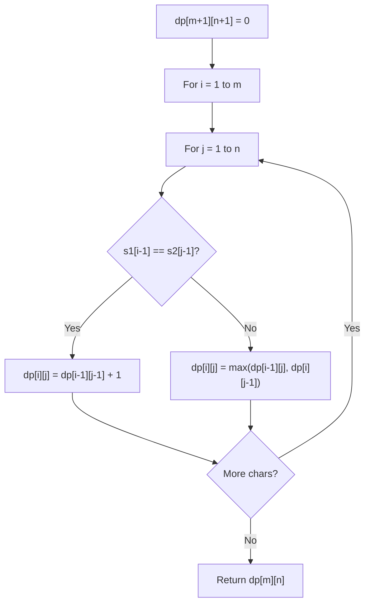

# Problem 2311: Longest Binary Subsequence Less Than or Equal to K

**Difficulty:** Medium  
**Tags:** String, Dynamic Programming, Greedy, Memoization  
**Pattern:** Dynamic Programming (String)  
**Link:** [leetcode.com/problems/longest-binary-subsequence-less-than-or-equal-to-k](https://leetcode.com/problems/longest-binary-subsequence-less-than-or-equal-to-k/)

## Description

You are given a binary string `s` and a positive integer `k`.

Return *the length of the **longest** subsequence of *`s`* that makes up a **binary** number less than or equal to* `k`.

Note:

	- The subsequence can contain **leading zeroes**.
	- The empty string is considered to be equal to `0`.
	- A **subsequence** is a string that can be derived from another string by deleting some or no characters without changing the order of the remaining characters.

 

Example 1:

```

**Input:** s = "1001010", k = 5
**Output:** 5
**Explanation:** The longest subsequence of s that makes up a binary number less than or equal to 5 is "00010", as this number is equal to 2 in decimal.
Note that "00100" and "00101" are also possible, which are equal to 4 and 5 in decimal, respectively.
The length of this subsequence is 5, so 5 is returned.

```

Example 2:

```

**Input:** s = "00101001", k = 1
**Output:** 6
**Explanation:** "000001" is the longest subsequence of s that makes up a binary number less than or equal to 1, as this number is equal to 1 in decimal.
The length of this subsequence is 6, so 6 is returned.

```

 

**Constraints:**

	- `1 <= s.length <= 1000`
	- `s[i]` is either `'0'` or `'1'`.
	- `1 <= k <= 10^9`

## Approach: Dynamic Programming (String)

Compare or match two strings using a 2D DP table. dp[i][j] represents the answer for substrings s1[0..i-1] and s2[0..j-1]. Common patterns: LCS, edit distance, regex matching.

## Pseudocode

```
1. Create dp[m+1][n+1]
2. Initialize base cases
3. For i from 1 to m:
   For j from 1 to n:
     If s1[i-1] == s2[j-1]: dp[i][j] = dp[i-1][j-1] + 1
     Else: dp[i][j] = best of (dp[i-1][j], dp[i][j-1], dp[i-1][j-1])
4. Return dp[m][n]
```

## Algorithm Flow



## Complexity Analysis

- **Time:** O(m * n)
- **Space:** O(m * n)

## Solution (Python3)

```python
class Solution:
    def longestSubsequence(self, s: str, k: int) -> int:
        # String DP - O(m*n) time and space
        m, n = len(s), len(k)
        dp = [[0] * (n + 1) for _ in range(m + 1)]
        for i in range(1, m + 1):
            for j in range(1, n + 1):
                if s[i-1] == k[j-1]:
                    dp[i][j] = dp[i-1][j-1] + 1
                else:
                    dp[i][j] = max(dp[i-1][j], dp[i][j-1])
        return dp[m][n]
```

## Solution (C++)

```cpp
#include <algorithm>
#include <string>
#include <vector>
using namespace std;

class Solution {
public:
    int longestSubsequence(string& s, int k) {
        // String DP - O(m*n) time and space
        int m = s.size(), n = k.size();
        vector<vector<int>> dp(m + 1, vector<int>(n + 1, 0));
        for (int i = 1; i <= m; i++) {
            for (int j = 1; j <= n; j++) {
                if (s[i-1] == k[j-1])
                    dp[i][j] = dp[i-1][j-1] + 1;
                else
                    dp[i][j] = max(dp[i-1][j], dp[i][j-1]);
            }
        }
        return dp[m][n];
    }
};
```
