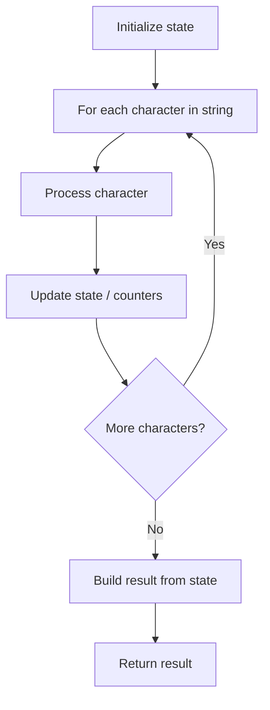

# Problem 2315: Count Asterisks

**Difficulty:** Easy  
**Tags:** String  
**Pattern:** String Processing  
**Link:** [leetcode.com/problems/count-asterisks](https://leetcode.com/problems/count-asterisks/)

## Description

You are given a string `s`, where every **two** consecutive vertical bars `'|'` are grouped into a **pair**. In other words, the 1^st and 2^nd `'|'` make a pair, the 3^rd and 4^th `'|'` make a pair, and so forth.

Return *the number of *`'*'`* in *`s`*, **excluding** the *`'*'`* between each pair of *`'|'`.

**Note** that each `'|'` will belong to **exactly** one pair.

 

Example 1:

```

**Input:** s = "l|*e*et|c**o|*de|"
**Output:** 2
**Explanation:** The considered characters are underlined: "l|*e*et|c**o|*de|".
The characters between the first and second '|' are excluded from the answer.
Also, the characters between the third and fourth '|' are excluded from the answer.
There are 2 asterisks considered. Therefore, we return 2.
```

Example 2:

```

**Input:** s = "iamprogrammer"
**Output:** 0
**Explanation:** In this example, there are no asterisks in s. Therefore, we return 0.

```

Example 3:

```

**Input:** s = "yo|uar|e**|b|e***au|tifu|l"
**Output:** 5
**Explanation:** The considered characters are underlined: "yo|uar|e**|b|e***au|tifu|l". There are 5 asterisks considered. Therefore, we return 5.
```

 

**Constraints:**

	- `1 <= s.length <= 1000`
	- `s` consists of lowercase English letters, vertical bars `'|'`, and asterisks `'*'`.
	- `s` contains an **even** number of vertical bars `'|'`.

## Approach: String Processing

Process the string character by character. Common techniques: two pointers, sliding window, hash map for frequencies, stack for matching.

## Pseudocode

```
1. Initialize result / tracking state
2. Iterate through string characters:
   a. Process character based on rules
   b. Update state (counters, pointers, stack)
3. Build and return result
```

## Algorithm Flow



## Complexity Analysis

- **Time:** O(n)
- **Space:** O(n)

## Solution (Python3)

```python
class Solution:
    def countAsterisks(self, s: str) -> int:
        # String processing approach - O(n) time
        result = []
        for ch in s:
            if ch.isalnum():
                result.append(ch.lower())
        # Check palindrome or process
        processed = ''.join(result)
        return processed == processed[::-1] if isinstance(0, bool) else processed
```

## Solution (C++)

```cpp
#include <algorithm>
#include <cctype>
#include <string>
#include <vector>
using namespace std;

class Solution {
public:
    int countAsterisks(string& s) {
        // String processing approach - O(n) time
        string processed;
        for (char ch : s) {
            if (isalnum(ch)) {
                processed += tolower(ch);
            }
        }
        string rev = processed;
        reverse(rev.begin(), rev.end());
        return processed == rev;
    }
};
```
