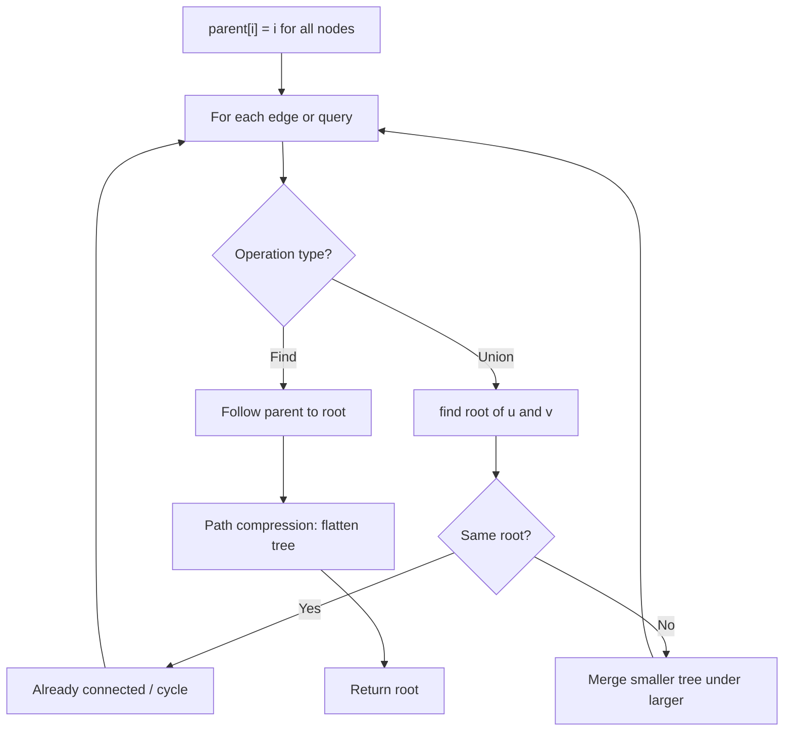
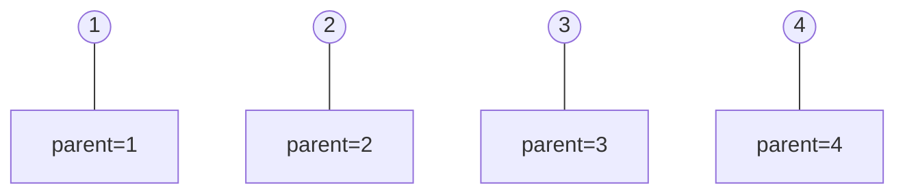
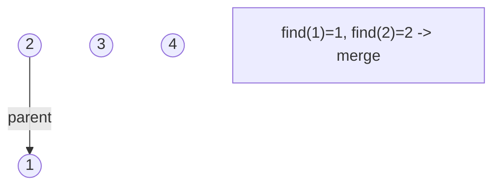
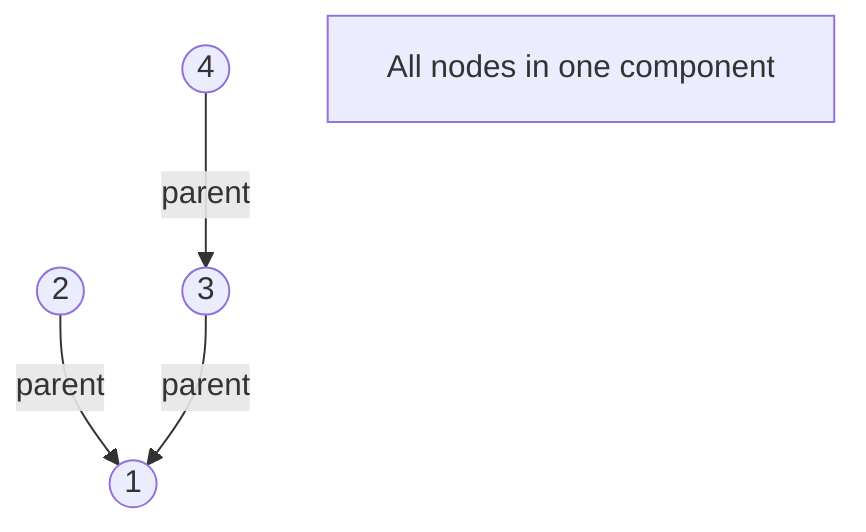
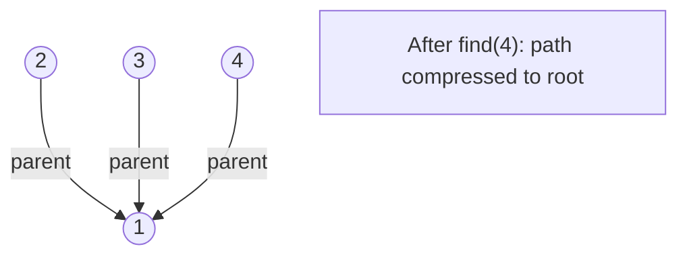

# Problem 2316: Count Unreachable Pairs of Nodes in an Undirected Graph

**Difficulty:** Medium  
**Tags:** Depth-First Search, Breadth-First Search, Union-Find, Graph Theory  
**Pattern:** Union-Find / Disjoint Set  
**Link:** [leetcode.com/problems/count-unreachable-pairs-of-nodes-in-an-undirected-graph](https://leetcode.com/problems/count-unreachable-pairs-of-nodes-in-an-undirected-graph/)

## Description

You are given an integer `n`. There is an **undirected** graph with `n` nodes, numbered from `0` to `n - 1`. You are given a 2D integer array `edges` where `edges[i] = [ai, bi]` denotes that there exists an **undirected** edge connecting nodes `ai` and `bi`.

Return *the **number of pairs** of different nodes that are **unreachable** from each other*.

 

Example 1:

```

**Input:** n = 3, edges = [[0,1],[0,2],[1,2]]
**Output:** 0
**Explanation:** There are no pairs of nodes that are unreachable from each other. Therefore, we return 0.

```

Example 2:

```

**Input:** n = 7, edges = [[0,2],[0,5],[2,4],[1,6],[5,4]]
**Output:** 14
**Explanation:** There are 14 pairs of nodes that are unreachable from each other:
[[0,1],[0,3],[0,6],[1,2],[1,3],[1,4],[1,5],[2,3],[2,6],[3,4],[3,5],[3,6],[4,6],[5,6]].
Therefore, we return 14.

```

 

**Constraints:**

	- `1 <= n <= 10^5`
	- `0 <= edges.length <= 2 * 10^5`
	- `edges[i].length == 2`
	- `0 <= ai, bi < n`
	- `ai != bi`
	- There are no repeated edges.

## Approach: Union-Find / Disjoint Set

Use Union-Find with path compression and union by rank to efficiently manage connected components. Find(x) returns the root of x's component; Union(x,y) merges two components.

## Pseudocode

```
1. parent[i] = i for all nodes (each is its own set)
2. find(x): follow parent pointers to root (with path compression)
3. union(x, y): merge sets of x and y by rank
4. Process edges/operations:
   a. For each edge (u, v): union(u, v)
5. Answer queries using find()
```

## Algorithm Flow



## Visual State Transitions

**Union-Find Step-by-Step:**

**Frame 1: Initial - each node is own parent**


**Frame 2: Union(1,2) - merge components**


**Frame 3: Union(3,4) then Union(2,3)**


**Frame 4: Path compression on find(4)**



## Complexity Analysis

- **Time:** O(n * alpha(n))
- **Space:** O(n)

## Solution (Python3)

```python
class Solution:
    def countPairs(self, n: int, edges: List[List[int]]) -> int:
        # Union Find (Disjoint Set Union) - O(n * alpha(n))
        parent = list(range(len(n) + 1 if isinstance(n, list) else n + 1))
        rank = [0] * len(parent)
        
        def find(x):
            if parent[x] != x:
                parent[x] = find(parent[x])
            return parent[x]
        
        def union(x, y):
            px, py = find(x), find(y)
            if px == py:
                return False
            if rank[px] < rank[py]:
                px, py = py, px
            parent[py] = px
            if rank[px] == rank[py]:
                rank[px] += 1
            return True
        
        components = len(parent)
        # Process edges/connections
        return components
```

## Solution (C++)

```cpp
#include <functional>
#include <numeric>
#include <string>
#include <vector>
using namespace std;

class Solution {
public:
    int countPairs(int n, vector<vector<int>>& edges) {
        // Union Find (DSU) - O(n * alpha(n))
        int n = n.size();
        vector<int> parent(n + 1), rnk(n + 1, 0);
        iota(parent.begin(), parent.end(), 0);
        function<int(int)> find = [&](int x) -> int {
            return parent[x] == x ? x : parent[x] = find(parent[x]);
        };
        auto unite = [&](int x, int y) -> bool {
            int px = find(x), py = find(y);
            if (px == py) return false;
            if (rnk[px] < rnk[py]) swap(px, py);
            parent[py] = px;
            if (rnk[px] == rnk[py]) rnk[px]++;
            return true;
        };
        int components = n;
        return components;
    }
};
```
