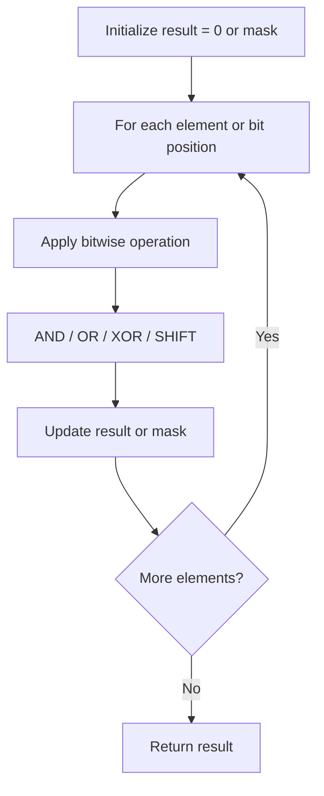

# Problem 2317: Maximum XOR After Operations 

**Difficulty:** Medium  
**Tags:** Array, Math, Bit Manipulation  
**Pattern:** Bit Manipulation  
**Link:** [leetcode.com/problems/maximum-xor-after-operations](https://leetcode.com/problems/maximum-xor-after-operations/)

## Description

You are given a **0-indexed** integer array `nums`. In one operation, select **any** non-negative integer `x` and an index `i`, then **update** `nums[i]` to be equal to `nums[i] AND (nums[i] XOR x)`.

Note that `AND` is the bitwise AND operation and `XOR` is the bitwise XOR operation.

Return *the **maximum** possible bitwise XOR of all elements of *`nums`* after applying the operation **any number** of times*.

 

Example 1:

```

**Input:** nums = [3,2,4,6]
**Output:** 7
**Explanation:** Apply the operation with x = 4 and i = 3, num[3] = 6 AND (6 XOR 4) = 6 AND 2 = 2.
Now, nums = [3, 2, 4, 2] and the bitwise XOR of all the elements = 3 XOR 2 XOR 4 XOR 2 = 7.
It can be shown that 7 is the maximum possible bitwise XOR.
Note that other operations may be used to achieve a bitwise XOR of 7.
```

Example 2:

```

**Input:** nums = [1,2,3,9,2]
**Output:** 11
**Explanation:** Apply the operation zero times.
The bitwise XOR of all the elements = 1 XOR 2 XOR 3 XOR 9 XOR 2 = 11.
It can be shown that 11 is the maximum possible bitwise XOR.
```

 

**Constraints:**

	- `1 <= nums.length <= 10^5`
	- `0 <= nums[i] <= 10^8`

## Approach: Bit Manipulation

Operate on individual bits using bitwise operators (AND, OR, XOR, shift). Common tricks: x & (x-1) removes lowest set bit, x ^ x = 0, XOR all elements to find unique.

## Pseudocode

```
1. Apply bitwise operations:
   - XOR all elements to cancel paired bits
   - Use bitmask to track state
   - Shift and mask to extract/set individual bits
2. Return result
```

## Algorithm Flow



## Complexity Analysis

- **Time:** O(n) or O(log n)
- **Space:** O(1)

## Solution (Python3)

```python
class Solution:
    def maximumXOR(self, nums: List[int]) -> int:
        # Bit manipulation - O(n) time, O(1) space
        result = 0
        for val in nums:
            result ^= val
        return result
```

## Solution (C++)

```cpp
#include <string>
#include <vector>
using namespace std;

class Solution {
public:
    int maximumXOR(vector<int>& nums) {
        // Bit manipulation - O(n) time, O(1) space
        int result = 0;
        for (int val : nums) {
            result ^= val;
        }
        return result;
    }
};
```
