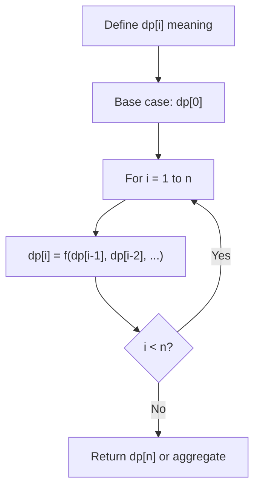
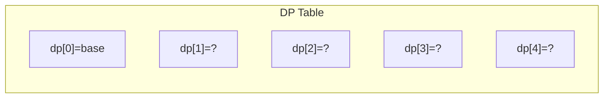
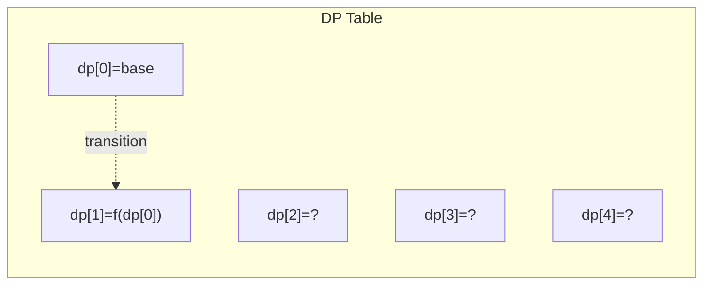
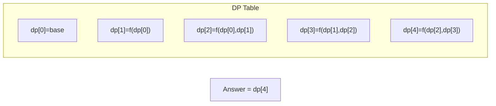

# Problem 2318: Number of Distinct Roll Sequences

**Difficulty:** Hard  
**Tags:** Dynamic Programming, Memoization  
**Pattern:** Dynamic Programming (1D)  
**Link:** [leetcode.com/problems/number-of-distinct-roll-sequences](https://leetcode.com/problems/number-of-distinct-roll-sequences/)

## Description

You are given an integer `n`. You roll a fair 6-sided dice `n` times. Determine the total number of **distinct** sequences of rolls possible such that the following conditions are satisfied:

	- The **greatest common divisor** of any **adjacent** values in the sequence is equal to `1`.
	- There is **at least** a gap of `2` rolls between **equal** valued rolls. More formally, if the value of the `i^th` roll is **equal** to the value of the `j^th` roll, then `abs(i - j) > 2`.

Return *the** total number** of distinct sequences possible*. Since the answer may be very large, return it **modulo** `10^9 + 7`.

Two sequences are considered distinct if at least one element is different.

 

Example 1:

```

**Input:** n = 4
**Output:** 184
**Explanation:** Some of the possible sequences are (1, 2, 3, 4), (6, 1, 2, 3), (1, 2, 3, 1), etc.
Some invalid sequences are (1, 2, 1, 3), (1, 2, 3, 6).
(1, 2, 1, 3) is invalid since the first and third roll have an equal value and abs(1 - 3) = 2 (i and j are 1-indexed).
(1, 2, 3, 6) is invalid since the greatest common divisor of 3 and 6 = 3.
There are a total of 184 distinct sequences possible, so we return 184.
```

Example 2:

```

**Input:** n = 2
**Output:** 22
**Explanation:** Some of the possible sequences are (1, 2), (2, 1), (3, 2).
Some invalid sequences are (3, 6), (2, 4) since the greatest common divisor is not equal to 1.
There are a total of 22 distinct sequences possible, so we return 22.

```

 

**Constraints:**

	- `1 <= n <= 10^4`

## Approach: Dynamic Programming (1D)

Break the problem into overlapping subproblems. Define dp[i] as the optimal value for the subproblem ending at or considering index i. Build the solution bottom-up, using previously computed dp values.

## Pseudocode

```
1. Define dp[i] = optimal value for subproblem i
2. Base case: dp[0] = initial value
3. For i from 1 to n:
   a. dp[i] = recurrence(dp[i-1], dp[i-2], ...)
4. Return dp[n] or max/min of dp
```

## Algorithm Flow



## Visual State Transitions

**1D Dynamic Programming Table Build:**

**Frame 1: Initialize base cases**


**Frame 2: Fill dp[1] from dp[0]**


**Frame 3: Fill remaining cells**



## Complexity Analysis

- **Time:** O(n)
- **Space:** O(n)

## Solution (Python3)

```python
class Solution:
    def distinctSequences(self, n: int) -> int:
        # Dynamic programming (1D) - O(n) time, O(n) space
        if not n:
            return 0
        n = len(n) if isinstance(n, list) else n
        dp = [0] * (n + 1)
        dp[0] = 1  # base case
        for i in range(1, n + 1):
            dp[i] = dp[i-1]  # transition (customize per problem)
            if i >= 2:
                dp[i] += dp[i-2]
        return dp[n]
```

## Solution (C++)

```cpp
#include <string>
#include <vector>
using namespace std;

class Solution {
public:
    int distinctSequences(int n) {
        // Dynamic programming (1D) - O(n) time, O(n) space
        int n = n;
        if (n <= 0) return 0;
        vector<int> dp(n + 1, 0);
        dp[0] = 1;
        for (int i = 1; i <= n; i++) {
            dp[i] = dp[i-1];
            if (i >= 2) dp[i] += dp[i-2];
        }
        return dp[n];
    }
};
```
