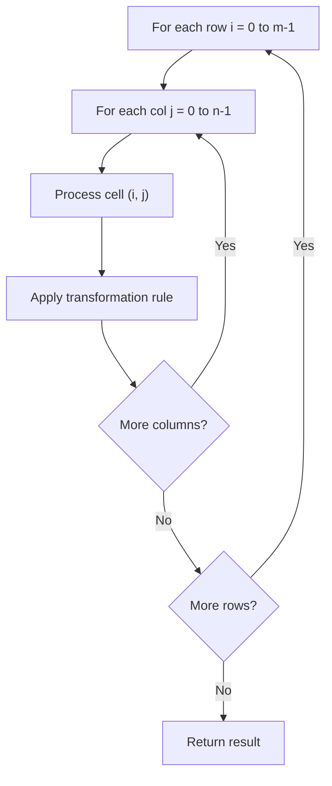

# Problem 2319: Check if Matrix Is X-Matrix

**Difficulty:** Easy  
**Tags:** Array, Matrix  
**Pattern:** Matrix / 2D Array  
**Link:** [leetcode.com/problems/check-if-matrix-is-x-matrix](https://leetcode.com/problems/check-if-matrix-is-x-matrix/)

## Description

A square matrix is said to be an **X-Matrix** if **both** of the following conditions hold:

	- All the elements in the diagonals of the matrix are **non-zero**.
	- All other elements are 0.

Given a 2D integer array `grid` of size `n x n` representing a square matrix, return `true`* if *`grid`* is an X-Matrix*. Otherwise, return `false`.

 

Example 1:

```

**Input:** grid = [[2,0,0,1],[0,3,1,0],[0,5,2,0],[4,0,0,2]]
**Output:** true
**Explanation:** Refer to the diagram above. 
An X-Matrix should have the green elements (diagonals) be non-zero and the red elements be 0.
Thus, grid is an X-Matrix.

```

Example 2:

```

**Input:** grid = [[5,7,0],[0,3,1],[0,5,0]]
**Output:** false
**Explanation:** Refer to the diagram above.
An X-Matrix should have the green elements (diagonals) be non-zero and the red elements be 0.
Thus, grid is not an X-Matrix.

```

 

**Constraints:**

	- `n == grid.length == grid[i].length`
	- `3 <= n <= 100`
	- `0 <= grid[i][j] <= 10^5`

## Approach: Matrix / 2D Array

Process the matrix row by row or column by column. Common patterns: rotation, spiral traversal, in-place modification, transposition.

## Pseudocode

```
1. For each row i:
   For each column j:
     Process cell (i, j) based on neighbors or rules
2. Handle boundary conditions
3. Return modified matrix or computed result
```

## Algorithm Flow



## Complexity Analysis

- **Time:** O(m * n)
- **Space:** O(1) extra

## Solution (Python3)

```python
class Solution:
    def checkXMatrix(self, grid: List[List[int]]) -> bool:
        # Matrix manipulation - O(m*n) time
        if not grid:
            return False
        m, n = len(grid), len(grid[0])
        # Process matrix in-place or build result
        for i in range(m):
            for j in range(n):
                pass  # Process grid[i][j]
        return False
```

## Solution (C++)

```cpp
#include <string>
#include <vector>
using namespace std;

class Solution {
public:
    bool checkXMatrix(vector<vector<int>>& grid) {
        // Matrix manipulation - O(m*n) time
        if (grid.empty()) return false;
        int m = grid.size(), n = grid[0].size();
        for (int i = 0; i < m; i++) {
            for (int j = 0; j < n; j++) {
                // Process matrix[i][j]
            }
        }
        return false;
    }
};
```
