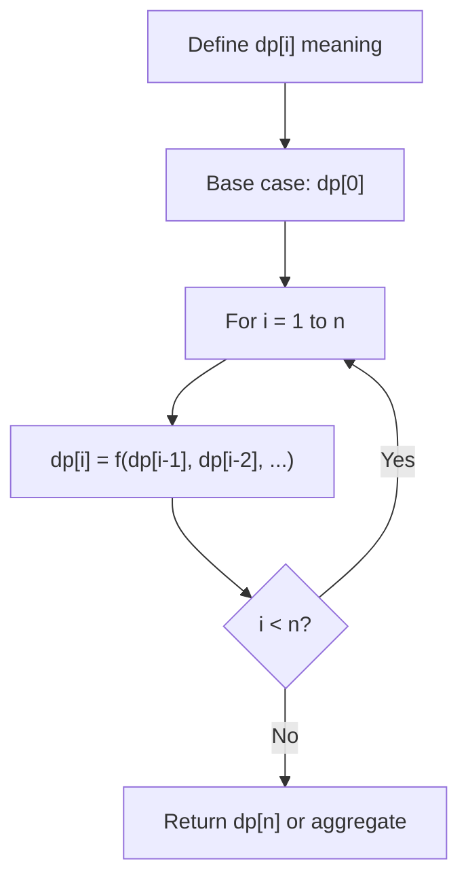
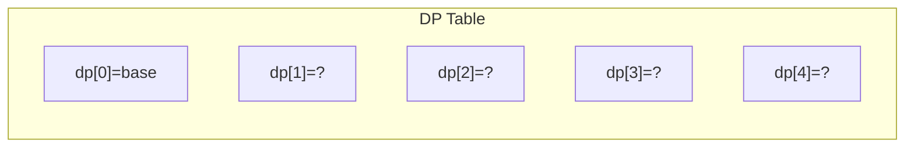
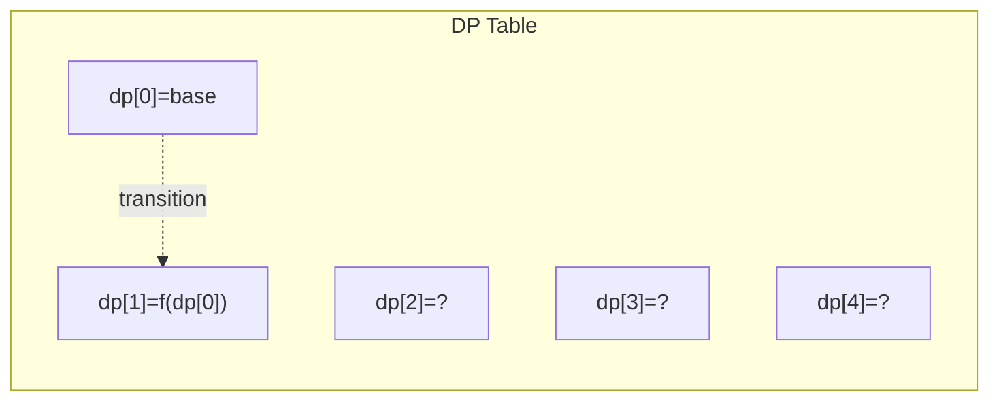
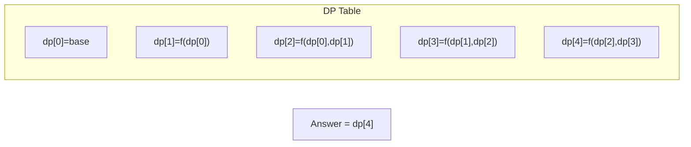

# Problem 2321: Maximum Score Of Spliced Array

**Difficulty:** Hard  
**Tags:** Array, Dynamic Programming  
**Pattern:** Dynamic Programming (1D)  
**Link:** [leetcode.com/problems/maximum-score-of-spliced-array](https://leetcode.com/problems/maximum-score-of-spliced-array/)

## Description

You are given two **0-indexed** integer arrays `nums1` and `nums2`, both of length `n`.

You can choose two integers `left` and `right` where `0 <= left <= right < n` and **swap** the subarray `nums1[left...right]` with the subarray `nums2[left...right]`.

	- For example, if `nums1 = [1,2,3,4,5]` and `nums2 = [11,12,13,14,15]` and you choose `left = 1` and `right = 2`, `nums1` becomes `[1,**12,13**,4,5]` and `nums2` becomes `[11,**2,3**,14,15]`.

You may choose to apply the mentioned operation **once** or not do anything.

The **score** of the arrays is the **maximum** of `sum(nums1)` and `sum(nums2)`, where `sum(arr)` is the sum of all the elements in the array `arr`.

Return *the **maximum possible score***.

A **subarray** is a contiguous sequence of elements within an array. `arr[left...right]` denotes the subarray that contains the elements of `nums` between indices `left` and `right` (**inclusive**).

 

Example 1:

```

**Input:** nums1 = [60,60,60], nums2 = [10,90,10]
**Output:** 210
**Explanation:** Choosing left = 1 and right = 1, we have nums1 = [60,**90**,60] and nums2 = [10,**60**,10].
The score is max(sum(nums1), sum(nums2)) = max(210, 80) = 210.
```

Example 2:

```

**Input:** nums1 = [20,40,20,70,30], nums2 = [50,20,50,40,20]
**Output:** 220
**Explanation:** Choosing left = 3, right = 4, we have nums1 = [20,40,20,**40,20**] and nums2 = [50,20,50,**70,30**].
The score is max(sum(nums1), sum(nums2)) = max(140, 220) = 220.

```

Example 3:

```

**Input:** nums1 = [7,11,13], nums2 = [1,1,1]
**Output:** 31
**Explanation:** We choose not to swap any subarray.
The score is max(sum(nums1), sum(nums2)) = max(31, 3) = 31.

```

 

**Constraints:**

	- `n == nums1.length == nums2.length`
	- `1 <= n <= 10^5`
	- `1 <= nums1[i], nums2[i] <= 10^4`

## Approach: Dynamic Programming (1D)

Break the problem into overlapping subproblems. Define dp[i] as the optimal value for the subproblem ending at or considering index i. Build the solution bottom-up, using previously computed dp values.

## Pseudocode

```
1. Define dp[i] = optimal value for subproblem i
2. Base case: dp[0] = initial value
3. For i from 1 to n:
   a. dp[i] = recurrence(dp[i-1], dp[i-2], ...)
4. Return dp[n] or max/min of dp
```

## Algorithm Flow



## Visual State Transitions

**1D Dynamic Programming Table Build:**

**Frame 1: Initialize base cases**


**Frame 2: Fill dp[1] from dp[0]**


**Frame 3: Fill remaining cells**



## Complexity Analysis

- **Time:** O(n)
- **Space:** O(n)

## Solution (Python3)

```python
class Solution:
    def maximumsSplicedArray(self, nums1: List[int], nums2: List[int]) -> int:
        # Dynamic programming (1D) - O(n) time, O(n) space
        if not nums1:
            return 0
        n = len(nums1) if isinstance(nums1, list) else nums1
        dp = [0] * (n + 1)
        dp[0] = 1  # base case
        for i in range(1, n + 1):
            dp[i] = dp[i-1]  # transition (customize per problem)
            if i >= 2:
                dp[i] += dp[i-2]
        return dp[n]
```

## Solution (C++)

```cpp
#include <string>
#include <vector>
using namespace std;

class Solution {
public:
    int maximumsSplicedArray(vector<int>& nums1, vector<int>& nums2) {
        // Dynamic programming (1D) - O(n) time, O(n) space
        int n = nums1;
        if (n <= 0) return 0;
        vector<int> dp(n + 1, 0);
        dp[0] = 1;
        for (int i = 1; i <= n; i++) {
            dp[i] = dp[i-1];
            if (i >= 2) dp[i] += dp[i-2];
        }
        return dp[n];
    }
};
```
