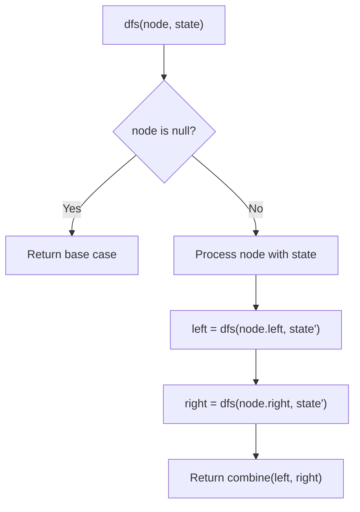
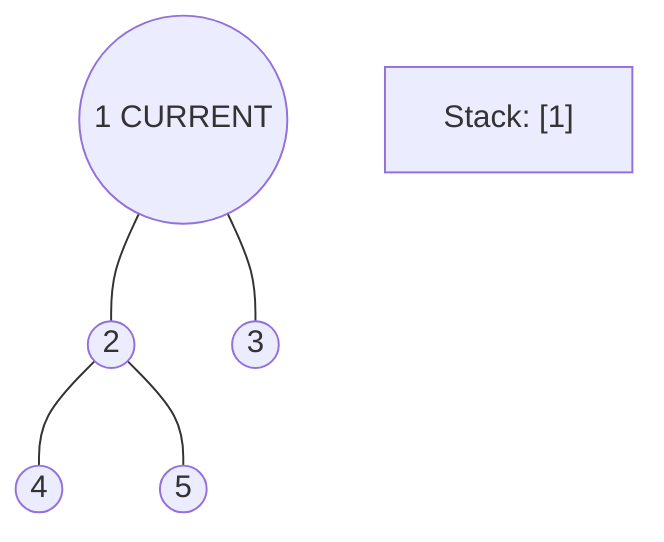
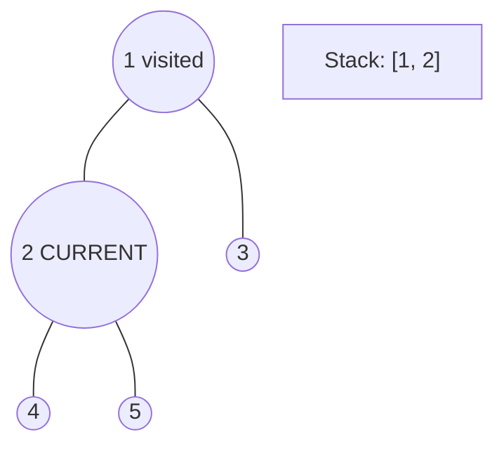
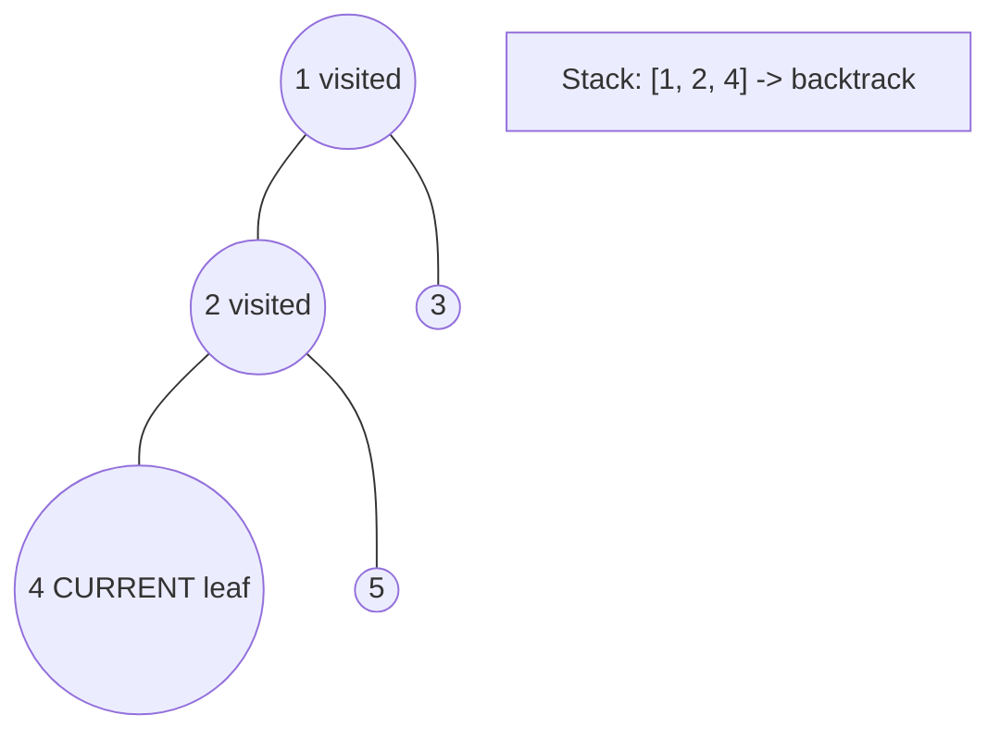
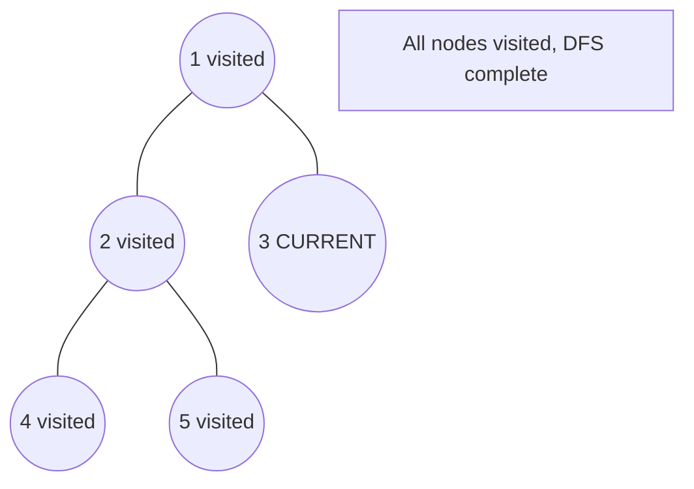

# Problem 2322: Minimum Score After Removals on a Tree

**Difficulty:** Hard  
**Tags:** Array, Bit Manipulation, Tree, Depth-First Search  
**Pattern:** DFS Tree Traversal  
**Link:** [leetcode.com/problems/minimum-score-after-removals-on-a-tree](https://leetcode.com/problems/minimum-score-after-removals-on-a-tree/)

## Description

There is an undirected connected tree with `n` nodes labeled from `0` to `n - 1` and `n - 1` edges.

You are given a **0-indexed** integer array `nums` of length `n` where `nums[i]` represents the value of the `i^th` node. You are also given a 2D integer array `edges` of length `n - 1` where `edges[i] = [ai, bi]` indicates that there is an edge between nodes `ai` and `bi` in the tree.

Remove two **distinct** edges of the tree to form three connected components. For a pair of removed edges, the following steps are defined:

	- Get the XOR of all the values of the nodes for **each** of the three components respectively.
	- The **difference** between the **largest** XOR value and the **smallest** XOR value is the **score** of the pair.

	- For example, say the three components have the node values: `[4,5,7]`, `[1,9]`, and `[3,3,3]`. The three XOR values are `4 ^ 5 ^ 7 = **6**`, `1 ^ 9 = **8**`, and `3 ^ 3 ^ 3 = **3**`. The largest XOR value is `8` and the smallest XOR value is `3`. The score is then `8 - 3 = 5`.

Return *the **minimum** score of any possible pair of edge removals on the given tree*.

 

Example 1:

```

**Input:** nums = [1,5,5,4,11], edges = [[0,1],[1,2],[1,3],[3,4]]
**Output:** 9
**Explanation:** The diagram above shows a way to make a pair of removals.
- The 1st component has nodes [1,3,4] with values [5,4,11]. Its XOR value is 5 ^ 4 ^ 11 = 10.
- The 2nd component has node [0] with value [1]. Its XOR value is 1 = 1.
- The 3rd component has node [2] with value [5]. Its XOR value is 5 = 5.
The score is the difference between the largest and smallest XOR value which is 10 - 1 = 9.
It can be shown that no other pair of removals will obtain a smaller score than 9.

```

Example 2:

```

**Input:** nums = [5,5,2,4,4,2], edges = [[0,1],[1,2],[5,2],[4,3],[1,3]]
**Output:** 0
**Explanation:** The diagram above shows a way to make a pair of removals.
- The 1st component has nodes [3,4] with values [4,4]. Its XOR value is 4 ^ 4 = 0.
- The 2nd component has nodes [1,0] with values [5,5]. Its XOR value is 5 ^ 5 = 0.
- The 3rd component has nodes [2,5] with values [2,2]. Its XOR value is 2 ^ 2 = 0.
The score is the difference between the largest and smallest XOR value which is 0 - 0 = 0.
We cannot obtain a smaller score than 0.

```

 

**Constraints:**

	- `n == nums.length`
	- `3 <= n <= 1000`
	- `1 <= nums[i] <= 10^8`
	- `edges.length == n - 1`
	- `edges[i].length == 2`
	- `0 <= ai, bi < n`
	- `ai != bi`
	- `edges` represents a valid tree.

## Approach: DFS Tree Traversal

Perform depth-first search on the tree. Recurse on left and right subtrees, combining results bottom-up. Track state (path, depth, sum) during traversal.

## Pseudocode

```
1. Define dfs(node, state):
   a. Base case: if null, return default
   b. Process node with current state
   c. left_result = dfs(node.left, updated_state)
   d. right_result = dfs(node.right, updated_state)
   e. Return combine(left_result, right_result)
2. Return dfs(root, initial_state)
```

## Algorithm Flow



## Visual State Transitions

**DFS Tree Traversal Step-by-Step:**

**Frame 1: Start at root**


**Frame 2: Go left - visit node 2**


**Frame 3: Go left - visit node 4 (leaf)**


**Frame 4: Backtrack, visit node 5, then node 3**



## Complexity Analysis

- **Time:** O(n)
- **Space:** O(h)

## Solution (Python3)

```python
class Solution:
    def minimumScore(self, nums: List[int], edges: List[List[int]]) -> int:
        # DFS on binary tree - O(n) time, O(h) space
        def dfs(node):
            if not node:
                return 0
            left = dfs(node.left)
            right = dfs(node.right)
            return 1 + max(left, right)
        
        result = dfs(nums)
        return result
```

## Solution (C++)

```cpp
#include <algorithm>
#include <functional>
#include <string>
#include <vector>
using namespace std;

class Solution {
public:
    int minimumScore(vector<int>& nums, vector<vector<int>>& edges) {
        // DFS on binary tree - O(n) time, O(h) space
        function<int(TreeNode*)> dfs = [&](TreeNode* node) -> int {
            if (!node) return 0;
            int left = dfs(node->left);
            int right = dfs(node->right);
            return 1 + max(left, right);
        };
        return dfs(nums);
    }
};
```
