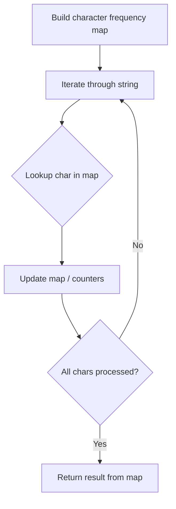

# Problem 2325: Decode the Message

**Difficulty:** Easy  
**Tags:** Hash Table, String  
**Pattern:** Hash Map String Processing  
**Link:** [leetcode.com/problems/decode-the-message](https://leetcode.com/problems/decode-the-message/)

## Description

You are given the strings `key` and `message`, which represent a cipher key and a secret message, respectively. The steps to decode `message` are as follows:

	- Use the **first** appearance of all 26 lowercase English letters in `key` as the **order** of the substitution table.
	- Align the substitution table with the regular English alphabet.
	- Each letter in `message` is then **substituted** using the table.
	- Spaces `' '` are transformed to themselves.

	- For example, given `key = "**hap**p**y** **bo**y"` (actual key would have **at least one** instance of each letter in the alphabet), we have the partial substitution table of (`'h' -> 'a'`, `'a' -> 'b'`, `'p' -> 'c'`, `'y' -> 'd'`, `'b' -> 'e'`, `'o' -> 'f'`).

Return *the decoded message*.

 

Example 1:

```

**Input:** key = "the quick brown fox jumps over the lazy dog", message = "vkbs bs t suepuv"
**Output:** "this is a secret"
**Explanation:** The diagram above shows the substitution table.
It is obtained by taking the first appearance of each letter in "**the** **quick** **brown** **f**o**x** **j**u**mps** o**v**er the **lazy** **d**o**g**".

```

Example 2:

```

**Input:** key = "eljuxhpwnyrdgtqkviszcfmabo", message = "zwx hnfx lqantp mnoeius ycgk vcnjrdb"
**Output:** "the five boxing wizards jump quickly"
**Explanation:** The diagram above shows the substitution table.
It is obtained by taking the first appearance of each letter in "**eljuxhpwnyrdgtqkviszcfmabo**".

```

 

**Constraints:**

	- `26 <= key.length <= 2000`
	- `key` consists of lowercase English letters and `' '`.
	- `key` contains every letter in the English alphabet (`'a'` to `'z'`) **at least once**.
	- `1 <= message.length <= 2000`
	- `message` consists of lowercase English letters and `' '`.

## Approach: Hash Map String Processing

Use a hash map to count character frequencies or map characters/strings for O(1) lookups. Process the string in one or two passes.

## Pseudocode

```
1. Build frequency map / char-to-index map
2. Iterate through string:
   a. Look up character in map
   b. Update counts or mappings
3. Return result based on map state
```

## Algorithm Flow



## Complexity Analysis

- **Time:** O(n)
- **Space:** O(n)

## Solution (Python3)

```python
class Solution:
    def decodeMessage(self, key: str, message: str) -> str:
        # Hash map for string/character frequency - O(n) time
        freq = {}
        for ch in key:
            freq[ch] = freq.get(ch, 0) + 1
        # Process frequency map
        for ch, cnt in freq.items():
            if cnt == 1:
                return key.index(ch)
        return ""
```

## Solution (C++)

```cpp
#include <string>
#include <unordered_map>
#include <vector>
using namespace std;

class Solution {
public:
    string decodeMessage(string& key, string& message) {
        // Hash map for string/character frequency - O(n) time
        unordered_map<char, int> freq;
        for (char ch : key) {
            freq[ch]++;
        }
        // Process frequency map
        for (int i = 0; i < key.size(); i++) {
            if (freq[key[i]] == 1) return i;
        }
        return "";
    }
};
```
