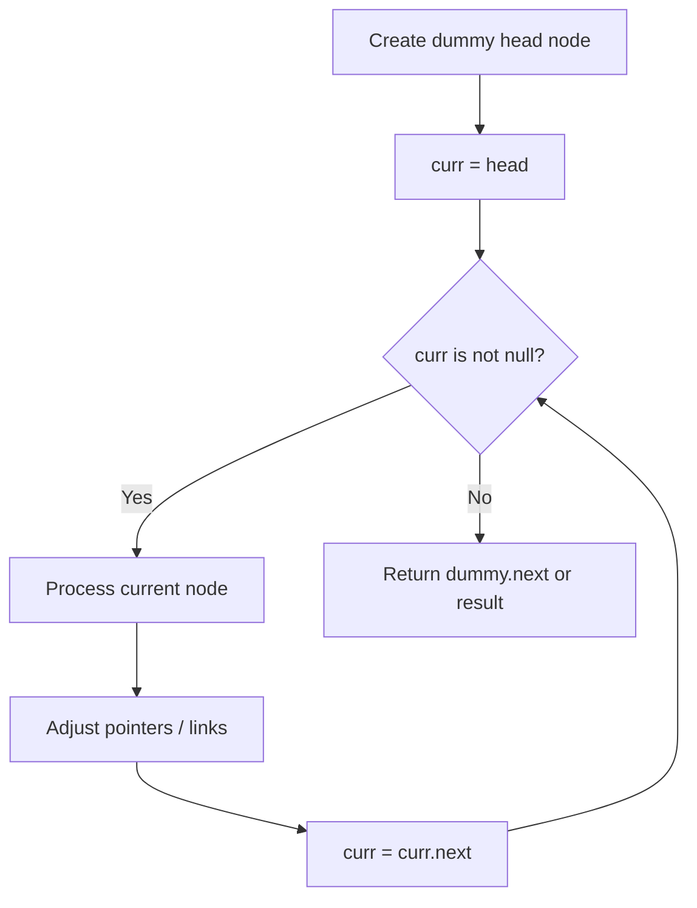
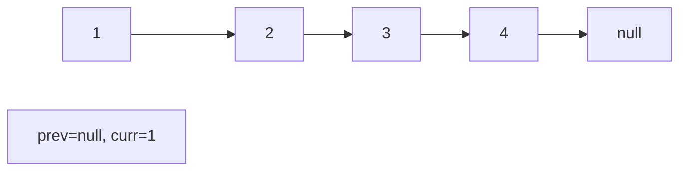
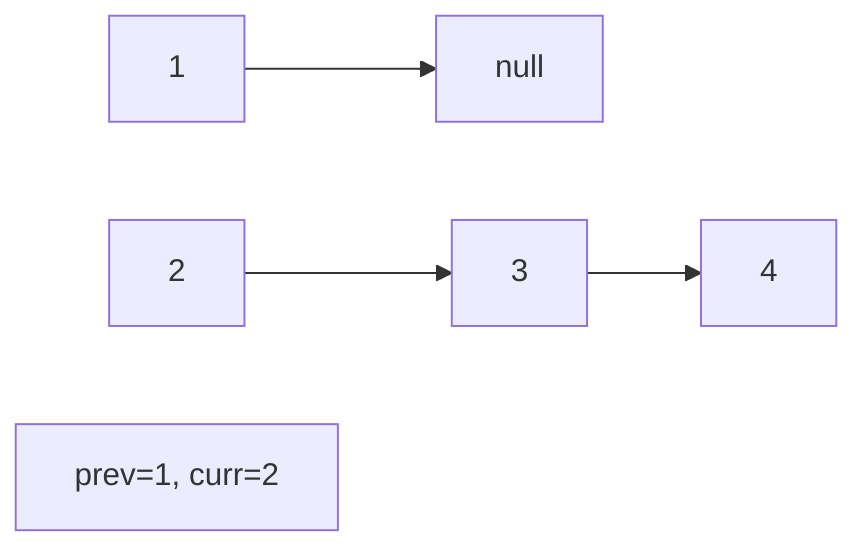
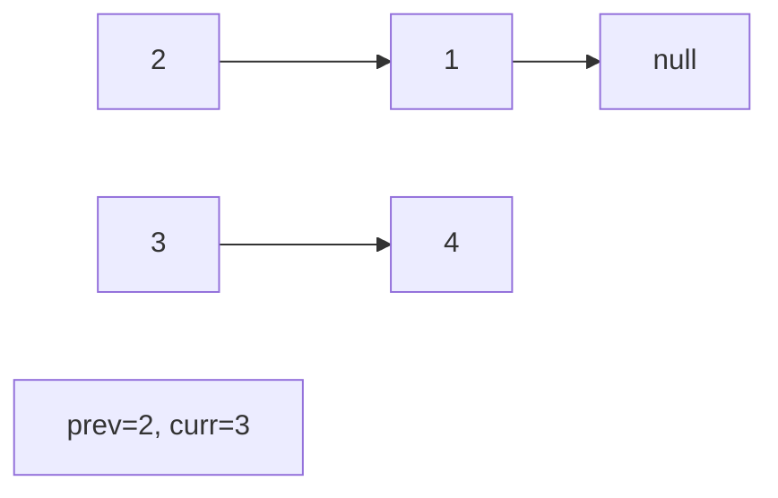
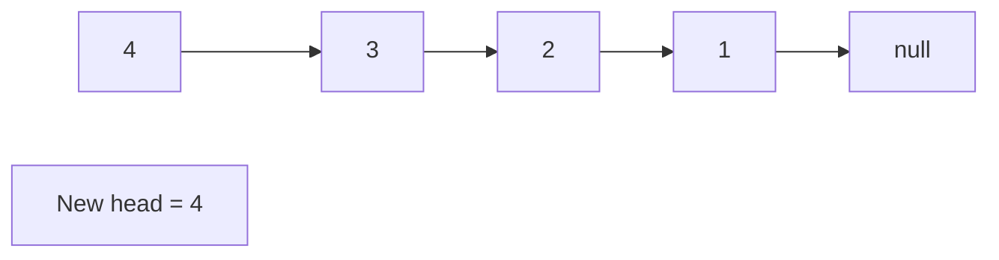

# Problem 2326: Spiral Matrix IV

**Difficulty:** Medium  
**Tags:** Array, Linked List, Matrix, Simulation  
**Pattern:** Linked List  
**Link:** [leetcode.com/problems/spiral-matrix-iv](https://leetcode.com/problems/spiral-matrix-iv/)

## Description

You are given two integers `m` and `n`, which represent the dimensions of a matrix.

You are also given the `head` of a linked list of integers.

Generate an `m x n` matrix that contains the integers in the linked list presented in **spiral** order **(clockwise)**, starting from the **top-left** of the matrix. If there are remaining empty spaces, fill them with `-1`.

Return *the generated matrix*.

 

Example 1:

```

**Input:** m = 3, n = 5, head = [3,0,2,6,8,1,7,9,4,2,5,5,0]
**Output:** [[3,0,2,6,8],[5,0,-1,-1,1],[5,2,4,9,7]]
**Explanation:** The diagram above shows how the values are printed in the matrix.
Note that the remaining spaces in the matrix are filled with -1.

```

Example 2:

```

**Input:** m = 1, n = 4, head = [0,1,2]
**Output:** [[0,1,2,-1]]
**Explanation:** The diagram above shows how the values are printed from left to right in the matrix.
The last space in the matrix is set to -1.
```

 

**Constraints:**

	- `1 <= m, n <= 10^5`
	- `1 <= m * n <= 10^5`
	- The number of nodes in the list is in the range `[1, m * n]`.
	- `0 <= Node.val <= 1000`

## Approach: Linked List

Traverse or manipulate the linked list using pointer techniques. Common patterns: dummy head node for edge cases, fast/slow pointers for cycle detection or middle finding, in-place reversal, and merge operations.

## Pseudocode

```
1. Create dummy head if needed
2. Initialize pointer(s) at head
3. Traverse / modify list:
   a. Process current node
   b. Adjust next pointers as needed
   c. Move to next node
4. Return dummy.next or result
```

## Algorithm Flow



## Visual State Transitions

**Linked List Operation (Reverse):**

**Frame 1: Initial list**


**Frame 2: Reverse first link**


**Frame 3: Reverse second link**


**Frame 4: Fully reversed**



## Complexity Analysis

- **Time:** O(n)
- **Space:** O(1)

## Solution (Python3)

```python
class Solution:
    def spiralMatrix(self, m: int, n: int, head: Optional[ListNode]) -> List[List[int]]:
        # Linked list traversal/manipulation
        dummy = ListNode(0)
        dummy.next = m
        prev, curr = dummy, m
        while curr:
            nxt = curr.next
            # Process current node
            prev = curr
            curr = nxt
        return dummy.next
```

## Solution (C++)

```cpp
#include <string>
#include <vector>
using namespace std;

class Solution {
public:
    vector<vector<int>> spiralMatrix(int m, int n, ListNode* head) {
        // Linked list traversal/manipulation
        ListNode dummy(0);
        dummy.next = m;
        ListNode* prev = &dummy;
        ListNode* curr = m;
        while (curr) {
            ListNode* nxt = curr->next;
            // Process current node
            prev = curr;
            curr = nxt;
        }
        return dummy.next;
    }
};
```
