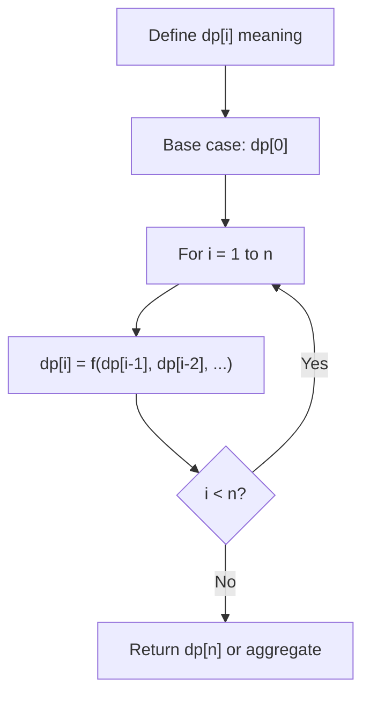
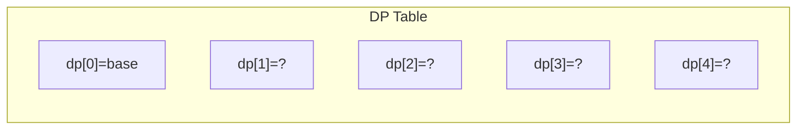
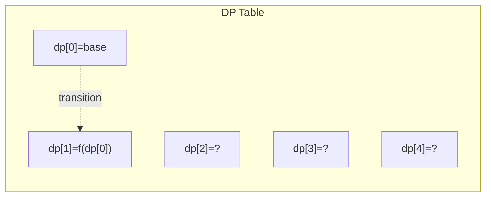
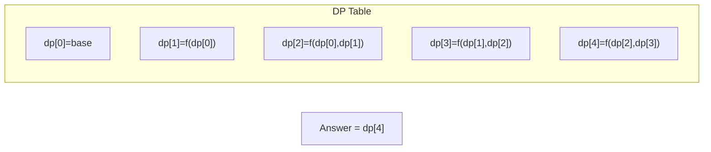

# Problem 2327: Number of People Aware of a Secret

**Difficulty:** Medium  
**Tags:** Dynamic Programming, Queue, Simulation  
**Pattern:** Dynamic Programming (1D)  
**Link:** [leetcode.com/problems/number-of-people-aware-of-a-secret](https://leetcode.com/problems/number-of-people-aware-of-a-secret/)

## Description

On day `1`, one person discovers a secret.

You are given an integer `delay`, which means that each person will **share** the secret with a new person **every day**, starting from `delay` days after discovering the secret. You are also given an integer `forget`, which means that each person will **forget** the secret `forget` days after discovering it. A person **cannot** share the secret on the same day they forgot it, or on any day afterwards.

Given an integer `n`, return* the number of people who know the secret at the end of day *`n`. Since the answer may be very large, return it **modulo** `10^9 + 7`.

 

Example 1:

```

**Input:** n = 6, delay = 2, forget = 4
**Output:** 5
**Explanation:**
Day 1: Suppose the first person is named A. (1 person)
Day 2: A is the only person who knows the secret. (1 person)
Day 3: A shares the secret with a new person, B. (2 people)
Day 4: A shares the secret with a new person, C. (3 people)
Day 5: A forgets the secret, and B shares the secret with a new person, D. (3 people)
Day 6: B shares the secret with E, and C shares the secret with F. (5 people)

```

Example 2:

```

**Input:** n = 4, delay = 1, forget = 3
**Output:** 6
**Explanation:**
Day 1: The first person is named A. (1 person)
Day 2: A shares the secret with B. (2 people)
Day 3: A and B share the secret with 2 new people, C and D. (4 people)
Day 4: A forgets the secret. B, C, and D share the secret with 3 new people. (6 people)

```

 

**Constraints:**

	- `2 <= n <= 1000`
	- `1 <= delay < forget <= n`

## Approach: Dynamic Programming (1D)

Break the problem into overlapping subproblems. Define dp[i] as the optimal value for the subproblem ending at or considering index i. Build the solution bottom-up, using previously computed dp values.

## Pseudocode

```
1. Define dp[i] = optimal value for subproblem i
2. Base case: dp[0] = initial value
3. For i from 1 to n:
   a. dp[i] = recurrence(dp[i-1], dp[i-2], ...)
4. Return dp[n] or max/min of dp
```

## Algorithm Flow



## Visual State Transitions

**1D Dynamic Programming Table Build:**

**Frame 1: Initialize base cases**


**Frame 2: Fill dp[1] from dp[0]**


**Frame 3: Fill remaining cells**



## Complexity Analysis

- **Time:** O(n)
- **Space:** O(n)

## Solution (Python3)

```python
class Solution:
    def peopleAwareOfSecret(self, n: int, delay: int, forget: int) -> int:
        # Dynamic programming (1D) - O(n) time, O(n) space
        if not n:
            return 0
        n = len(n) if isinstance(n, list) else n
        dp = [0] * (n + 1)
        dp[0] = 1  # base case
        for i in range(1, n + 1):
            dp[i] = dp[i-1]  # transition (customize per problem)
            if i >= 2:
                dp[i] += dp[i-2]
        return dp[n]
```

## Solution (C++)

```cpp
#include <string>
#include <vector>
using namespace std;

class Solution {
public:
    int peopleAwareOfSecret(int n, int delay, int forget) {
        // Dynamic programming (1D) - O(n) time, O(n) space
        int n = n;
        if (n <= 0) return 0;
        vector<int> dp(n + 1, 0);
        dp[0] = 1;
        for (int i = 1; i <= n; i++) {
            dp[i] = dp[i-1];
            if (i >= 2) dp[i] += dp[i-2];
        }
        return dp[n];
    }
};
```
