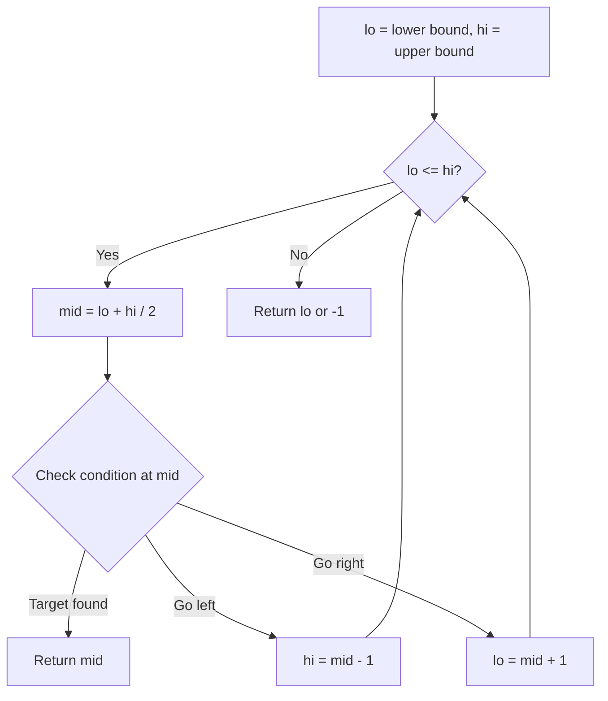
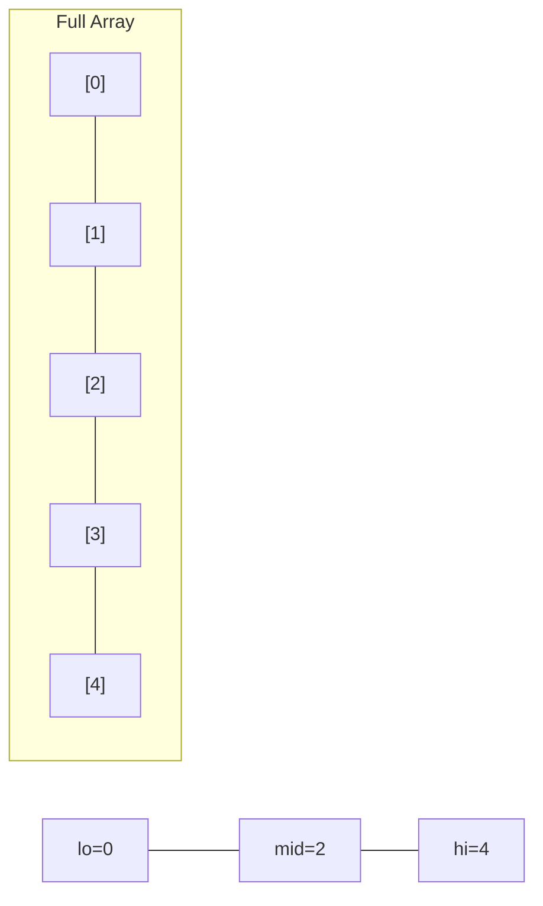
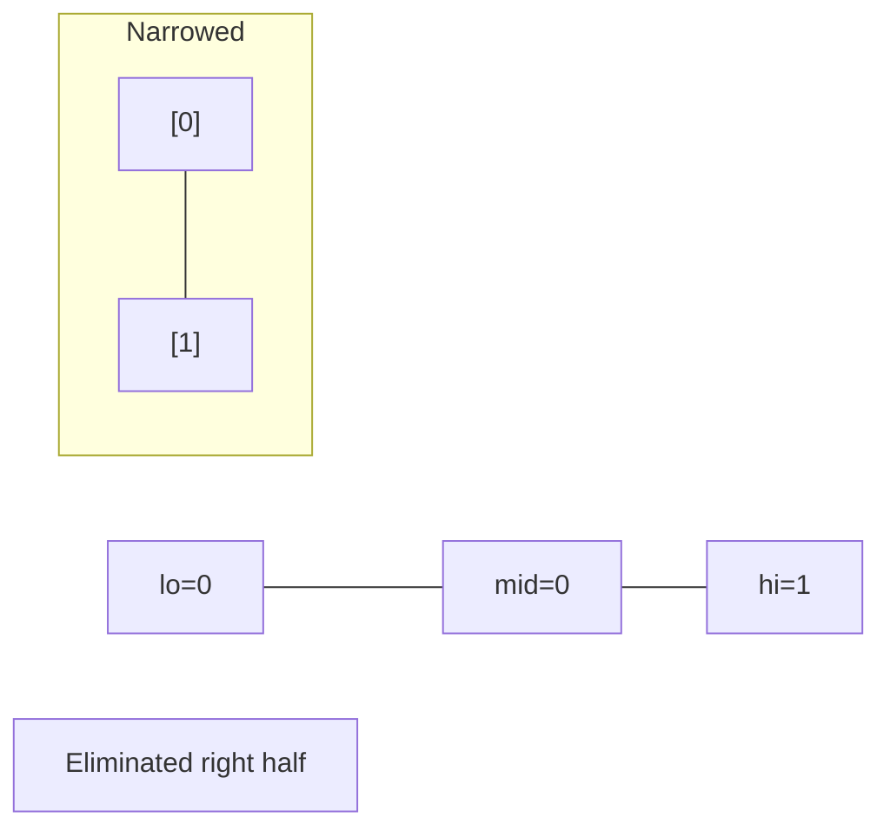
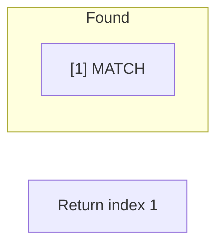

# Problem 2332: The Latest Time to Catch a Bus

**Difficulty:** Medium  
**Tags:** Array, Two Pointers, Binary Search, Sorting  
**Pattern:** Binary Search  
**Link:** [leetcode.com/problems/the-latest-time-to-catch-a-bus](https://leetcode.com/problems/the-latest-time-to-catch-a-bus/)

## Description

You are given a **0-indexed** integer array `buses` of length `n`, where `buses[i]` represents the departure time of the `i^th` bus. You are also given a **0-indexed** integer array `passengers` of length `m`, where `passengers[j]` represents the arrival time of the `j^th` passenger. All bus departure times are unique. All passenger arrival times are unique.

You are given an integer `capacity`, which represents the **maximum** number of passengers that can get on each bus.

When a passenger arrives, they will wait in line for the next available bus. You can get on a bus that departs at `x` minutes if you arrive at `y` minutes where `y <= x`, and the bus is not full. Passengers with the **earliest** arrival times get on the bus first.

More formally when a bus arrives, either:

	- If `capacity` or fewer passengers are waiting for a bus, they will **all** get on the bus, or
	- The `capacity` passengers with the **earliest** arrival times will get on the bus.

Return *the latest time you may arrive at the bus station to catch a bus*. You **cannot** arrive at the same time as another passenger.

**Note: **The arrays `buses` and `passengers` are not necessarily sorted.

 

Example 1:

```

**Input:** buses = [10,20], passengers = [2,17,18,19], capacity = 2
**Output:** 16
**Explanation:** Suppose you arrive at time 16.
At time 10, the first bus departs with the 0th passenger. 
At time 20, the second bus departs with you and the 1st passenger.
Note that you may not arrive at the same time as another passenger, which is why you must arrive before the 1st passenger to catch the bus.
```

Example 2:

```

**Input:** buses = [20,30,10], passengers = [19,13,26,4,25,11,21], capacity = 2
**Output:** 20
**Explanation:** Suppose you arrive at time 20.
At time 10, the first bus departs with the 3rd passenger. 
At time 20, the second bus departs with the 5th and 1st passengers.
At time 30, the third bus departs with the 0th passenger and you.
Notice if you had arrived any later, then the 6th passenger would have taken your seat on the third bus.
```

 

**Constraints:**

	- `n == buses.length`
	- `m == passengers.length`
	- `1 <= n, m, capacity <= 10^5`
	- `2 <= buses[i], passengers[i] <= 10^9`
	- Each element in `buses` is **unique**.
	- Each element in `passengers` is **unique**.

## Approach: Binary Search

Use binary search to halve the search space each iteration. Define the search range [lo, hi], compute mid, and decide which half to keep based on the problem's monotonic condition.

## Pseudocode

```
1. lo = lower_bound, hi = upper_bound
2. While lo <= hi (or lo < hi):
   a. mid = (lo + hi) // 2
   b. If condition(mid) is satisfied: record answer, search left half
   c. Else: search right half
3. Return answer
```

## Algorithm Flow



## Visual State Transitions

**Binary Search Step-by-Step:**

**Frame 1: Initial search space**


**Frame 2: Compare mid, narrow search**


**Frame 3: Found target**



## Complexity Analysis

- **Time:** O(log n)
- **Space:** O(1)

## Solution (Python3)

```python
class Solution:
    def latestTimeCatchTheBus(self, buses: List[int], passengers: List[int], capacity: int) -> int:
        # Binary search - O(log n) time, O(1) space
        lo, hi = 0, len(buses) - 1
        while lo <= hi:
            mid = lo + (hi - lo) // 2
            if buses[mid] == passengers:
                return mid
            elif buses[mid] < passengers:
                lo = mid + 1
            else:
                hi = mid - 1
        return 0
```

## Solution (C++)

```cpp
#include <string>
#include <vector>
using namespace std;

class Solution {
public:
    int latestTimeCatchTheBus(vector<int>& buses, vector<int>& passengers, int capacity) {
        // Binary search - O(log n) time, O(1) space
        int lo = 0, hi = buses.size() - 1;
        while (lo <= hi) {
            int mid = lo + (hi - lo) / 2;
            if (buses[mid] == passengers) {
                return mid;
            } else if (buses[mid] < passengers) {
                lo = mid + 1;
            } else {
                hi = mid - 1;
            }
        }
        return 0;
    }
};
```
