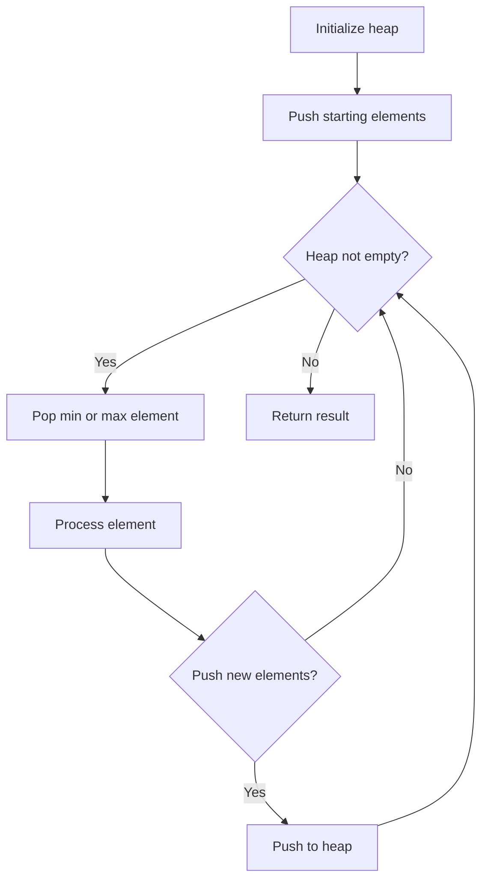
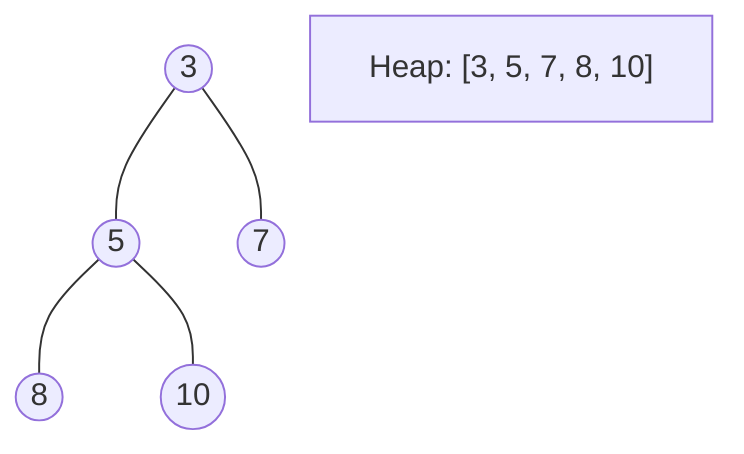
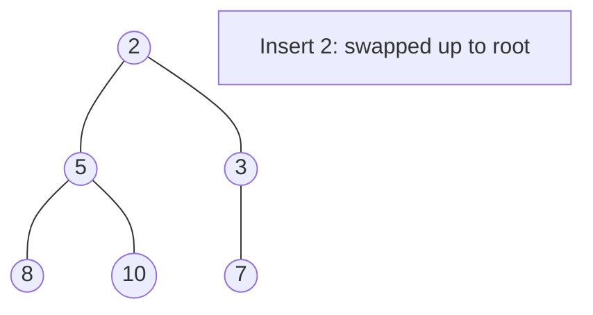
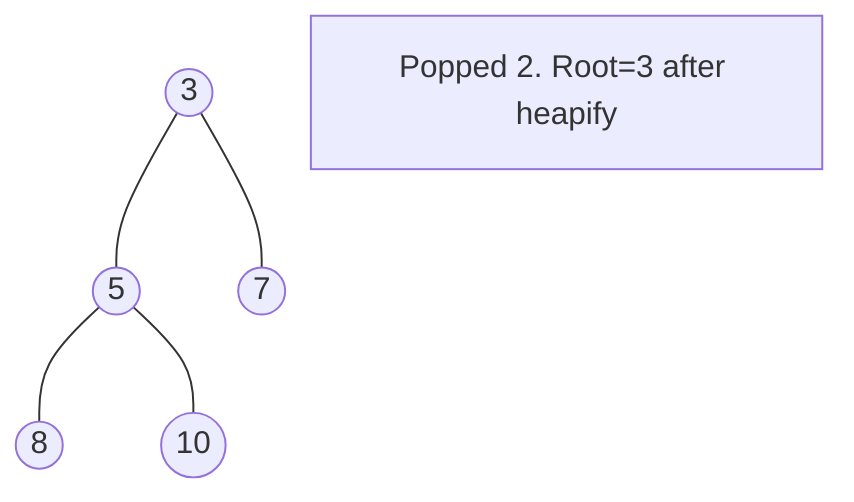

# Problem 2333: Minimum Sum of Squared Difference

**Difficulty:** Medium  
**Tags:** Array, Binary Search, Greedy, Sorting, Heap (Priority Queue)  
**Pattern:** Heap / Priority Queue  
**Link:** [leetcode.com/problems/minimum-sum-of-squared-difference](https://leetcode.com/problems/minimum-sum-of-squared-difference/)

## Description

You are given two positive **0-indexed** integer arrays `nums1` and `nums2`, both of length `n`.

The **sum of squared difference** of arrays `nums1` and `nums2` is defined as the **sum** of `(nums1[i] - nums2[i])^2` for each `0 <= i < n`.

You are also given two positive integers `k1` and `k2`. You can modify any of the elements of `nums1` by `+1` or `-1` at most `k1` times. Similarly, you can modify any of the elements of `nums2` by `+1` or `-1` at most `k2` times.

Return *the minimum **sum of squared difference** after modifying array *`nums1`* at most *`k1`* times and modifying array *`nums2`* at most *`k2`* times*.

**Note**: You are allowed to modify the array elements to become **negative** integers.

 

Example 1:

```

**Input:** nums1 = [1,2,3,4], nums2 = [2,10,20,19], k1 = 0, k2 = 0
**Output:** 579
**Explanation:** The elements in nums1 and nums2 cannot be modified because k1 = 0 and k2 = 0. 
The sum of square difference will be: (1 - 2)2 + (2 - 10)2 + (3 - 20)2 + (4 - 19)2 = 579.

```

Example 2:

```

**Input:** nums1 = [1,4,10,12], nums2 = [5,8,6,9], k1 = 1, k2 = 1
**Output:** 43
**Explanation:** One way to obtain the minimum sum of square difference is: 
- Increase nums1[0] once.
- Increase nums2[2] once.
The minimum of the sum of square difference will be: 
(2 - 5)2 + (4 - 8)2 + (10 - 7)2 + (12 - 9)2 = 43.
Note that, there are other ways to obtain the minimum of the sum of square difference, but there is no way to obtain a sum smaller than 43.
```

 

**Constraints:**

	- `n == nums1.length == nums2.length`
	- `1 <= n <= 10^5`
	- `0 <= nums1[i], nums2[i] <= 10^5`
	- `0 <= k1, k2 <= 10^9`

## Approach: Heap / Priority Queue

Use a min-heap or max-heap to efficiently access the smallest/largest element. Push elements and pop the top to process in priority order.

## Pseudocode

```
1. Initialize heap (min or max)
2. Push initial elements onto heap
3. While heap not empty and condition:
   a. Pop top element (min or max)
   b. Process element
   c. Push new elements if needed
4. Return result
```

## Algorithm Flow



## Visual State Transitions

**Heap Operations (Min-Heap):**

**Frame 1: Initial heap**


**Frame 2: Insert 2 - bubble up**


**Frame 3: Pop minimum (2) - heapify down**



## Complexity Analysis

- **Time:** O(n log n)
- **Space:** O(n)

## Solution (Python3)

```python
class Solution:
    def minSumSquareDiff(self, nums1: List[int], nums2: List[int], k1: int, k2: int) -> int:
        # Heap/Priority Queue - O(n log k) time
        import heapq
        if not nums1:
            return 0
        # Min heap (negate for max heap)
        heap = []
        for val in nums1:
            heapq.heappush(heap, val)
            if len(heap) > (nums2 if isinstance(nums2, int) else len(nums1)):
                heapq.heappop(heap)
        return heap[0] if heap else 0
```

## Solution (C++)

```cpp
#include <queue>
#include <string>
#include <vector>
using namespace std;

class Solution {
public:
    int minSumSquareDiff(vector<int>& nums1, vector<int>& nums2, int k1, int k2) {
        // Heap/Priority Queue - O(n log k) time
        priority_queue<int, vector<int>, greater<int>> pq;
        for (int val : nums1) {
            pq.push(val);
            if ((int)pq.size() > nums2)
                pq.pop();
        }
        return pq.empty() ? 0 : pq.top();
    }
};
```
