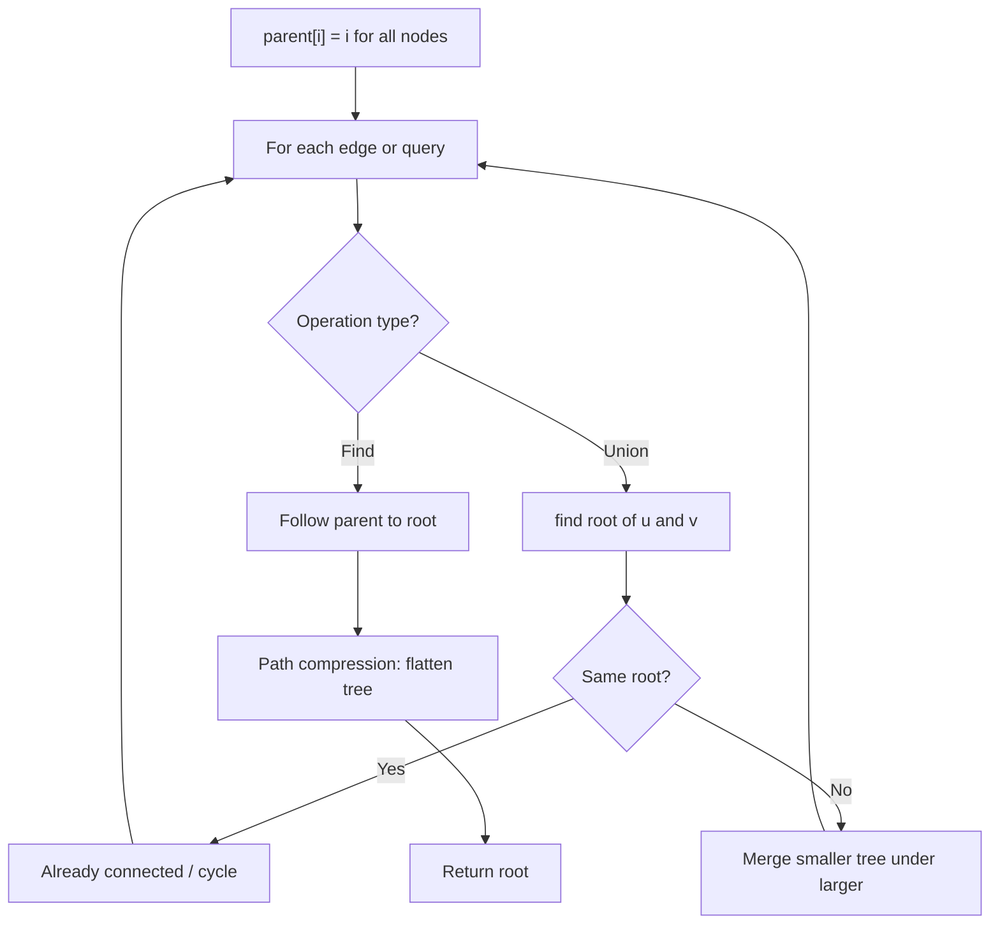
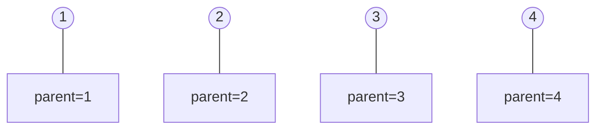
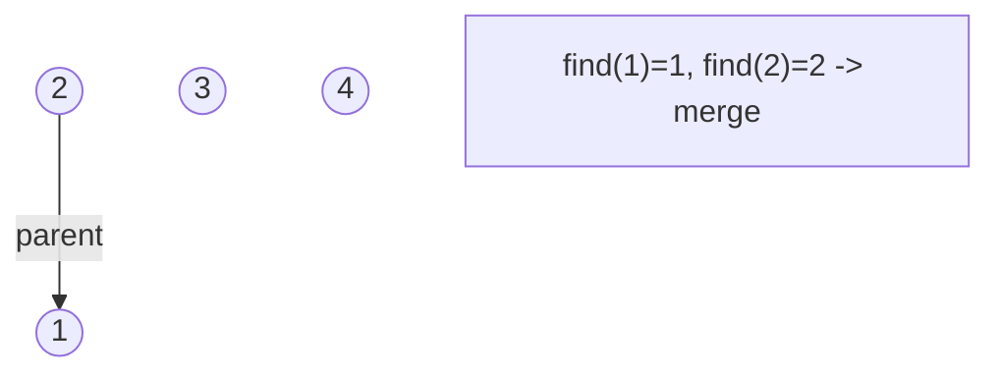
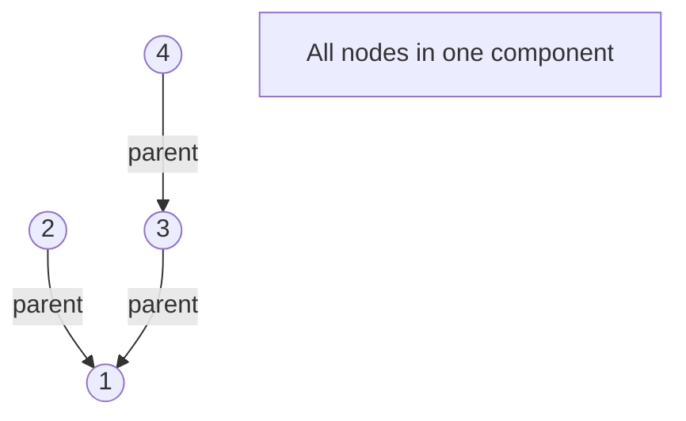
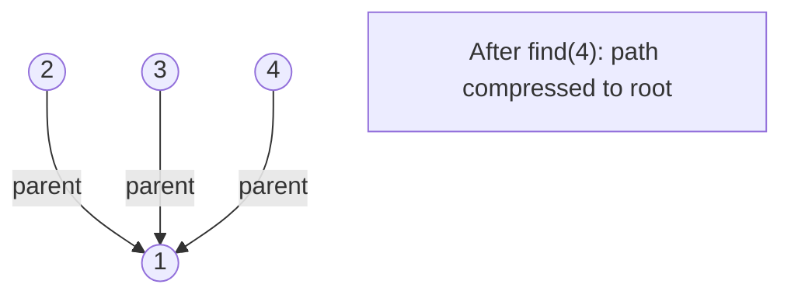

# Problem 2334: Subarray With Elements Greater Than Varying Threshold

**Difficulty:** Hard  
**Tags:** Array, Stack, Union-Find, Monotonic Stack  
**Pattern:** Union-Find / Disjoint Set  
**Link:** [leetcode.com/problems/subarray-with-elements-greater-than-varying-threshold](https://leetcode.com/problems/subarray-with-elements-greater-than-varying-threshold/)

## Description

You are given an integer array `nums` and an integer `threshold`.

Find any subarray of `nums` of length `k` such that **every** element in the subarray is **greater** than `threshold / k`.

Return* the **size** of **any** such subarray*. If there is no such subarray, return `-1`.

A **subarray** is a contiguous non-empty sequence of elements within an array.

 

Example 1:

```

**Input:** nums = [1,3,4,3,1], threshold = 6
**Output:** 3
**Explanation:** The subarray [3,4,3] has a size of 3, and every element is greater than 6 / 3 = 2.
Note that this is the only valid subarray.

```

Example 2:

```

**Input:** nums = [6,5,6,5,8], threshold = 7
**Output:** 1
**Explanation:** The subarray [8] has a size of 1, and 8 > 7 / 1 = 7. So 1 is returned.
Note that the subarray [6,5] has a size of 2, and every element is greater than 7 / 2 = 3.5. 
Similarly, the subarrays [6,5,6], [6,5,6,5], [6,5,6,5,8] also satisfy the given conditions.
Therefore, 2, 3, 4, or 5 may also be returned.
```

 

**Constraints:**

	- `1 <= nums.length <= 10^5`
	- `1 <= nums[i], threshold <= 10^9`

## Approach: Union-Find / Disjoint Set

Use Union-Find with path compression and union by rank to efficiently manage connected components. Find(x) returns the root of x's component; Union(x,y) merges two components.

## Pseudocode

```
1. parent[i] = i for all nodes (each is its own set)
2. find(x): follow parent pointers to root (with path compression)
3. union(x, y): merge sets of x and y by rank
4. Process edges/operations:
   a. For each edge (u, v): union(u, v)
5. Answer queries using find()
```

## Algorithm Flow



## Visual State Transitions

**Union-Find Step-by-Step:**

**Frame 1: Initial - each node is own parent**


**Frame 2: Union(1,2) - merge components**


**Frame 3: Union(3,4) then Union(2,3)**


**Frame 4: Path compression on find(4)**



## Complexity Analysis

- **Time:** O(n * alpha(n))
- **Space:** O(n)

## Solution (Python3)

```python
class Solution:
    def validSubarraySize(self, nums: List[int], threshold: int) -> int:
        # Union Find (Disjoint Set Union) - O(n * alpha(n))
        parent = list(range(len(nums) + 1 if isinstance(nums, list) else nums + 1))
        rank = [0] * len(parent)
        
        def find(x):
            if parent[x] != x:
                parent[x] = find(parent[x])
            return parent[x]
        
        def union(x, y):
            px, py = find(x), find(y)
            if px == py:
                return False
            if rank[px] < rank[py]:
                px, py = py, px
            parent[py] = px
            if rank[px] == rank[py]:
                rank[px] += 1
            return True
        
        components = len(parent)
        # Process edges/connections
        return components
```

## Solution (C++)

```cpp
#include <functional>
#include <numeric>
#include <string>
#include <vector>
using namespace std;

class Solution {
public:
    int validSubarraySize(vector<int>& nums, int threshold) {
        // Union Find (DSU) - O(n * alpha(n))
        int n = nums.size();
        vector<int> parent(n + 1), rnk(n + 1, 0);
        iota(parent.begin(), parent.end(), 0);
        function<int(int)> find = [&](int x) -> int {
            return parent[x] == x ? x : parent[x] = find(parent[x]);
        };
        auto unite = [&](int x, int y) -> bool {
            int px = find(x), py = find(y);
            if (px == py) return false;
            if (rnk[px] < rnk[py]) swap(px, py);
            parent[py] = px;
            if (rnk[px] == rnk[py]) rnk[px]++;
            return true;
        };
        int components = n;
        return components;
    }
};
```
