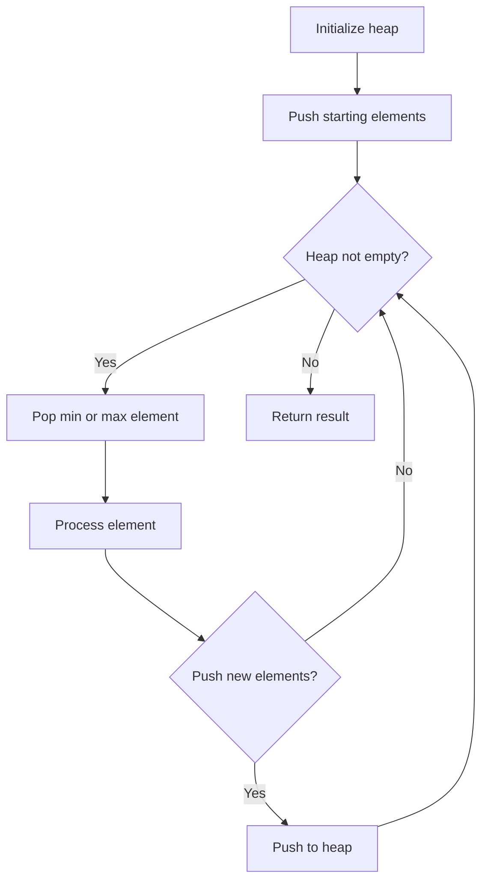
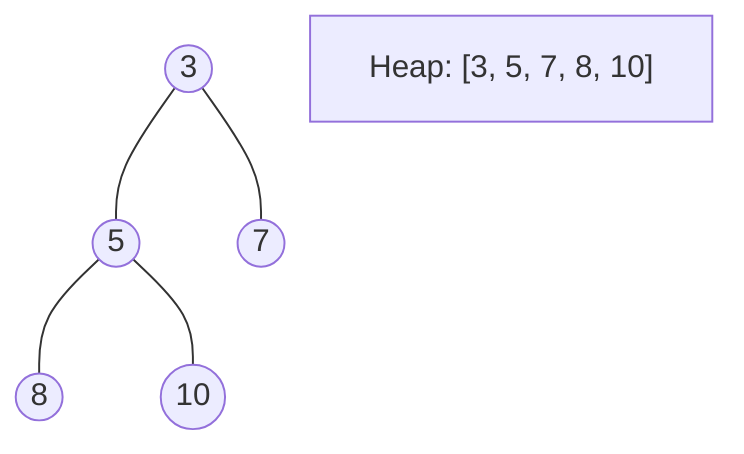
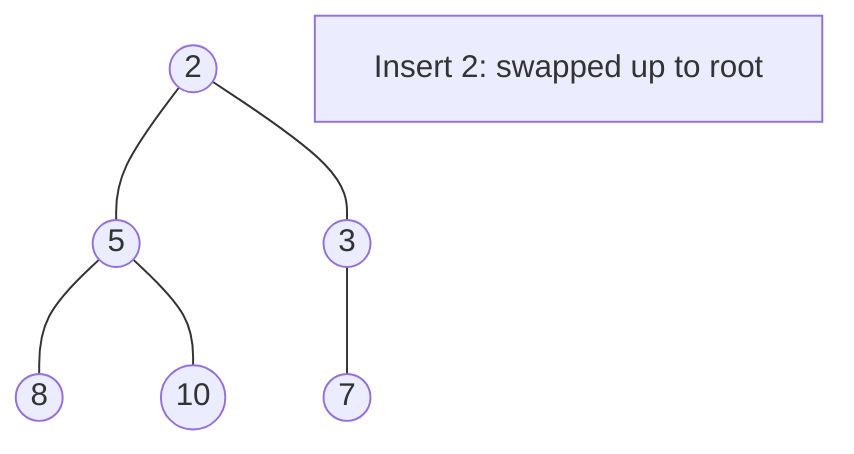
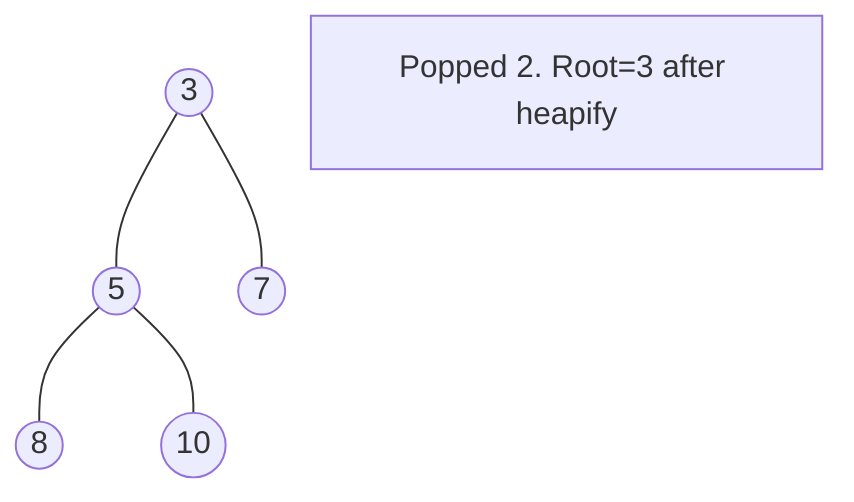

# Problem 2335: Minimum Amount of Time to Fill Cups

**Difficulty:** Easy  
**Tags:** Array, Greedy, Sorting, Heap (Priority Queue)  
**Pattern:** Heap / Priority Queue  
**Link:** [leetcode.com/problems/minimum-amount-of-time-to-fill-cups](https://leetcode.com/problems/minimum-amount-of-time-to-fill-cups/)

## Description

You have a water dispenser that can dispense cold, warm, and hot water. Every second, you can either fill up `2` cups with **different** types of water, or `1` cup of any type of water.

You are given a **0-indexed** integer array `amount` of length `3` where `amount[0]`, `amount[1]`, and `amount[2]` denote the number of cold, warm, and hot water cups you need to fill respectively. Return *the **minimum** number of seconds needed to fill up all the cups*.

 

Example 1:

```

**Input:** amount = [1,4,2]
**Output:** 4
**Explanation:** One way to fill up the cups is:
Second 1: Fill up a cold cup and a warm cup.
Second 2: Fill up a warm cup and a hot cup.
Second 3: Fill up a warm cup and a hot cup.
Second 4: Fill up a warm cup.
It can be proven that 4 is the minimum number of seconds needed.

```

Example 2:

```

**Input:** amount = [5,4,4]
**Output:** 7
**Explanation:** One way to fill up the cups is:
Second 1: Fill up a cold cup, and a hot cup.
Second 2: Fill up a cold cup, and a warm cup.
Second 3: Fill up a cold cup, and a warm cup.
Second 4: Fill up a warm cup, and a hot cup.
Second 5: Fill up a cold cup, and a hot cup.
Second 6: Fill up a cold cup, and a warm cup.
Second 7: Fill up a hot cup.

```

Example 3:

```

**Input:** amount = [5,0,0]
**Output:** 5
**Explanation:** Every second, we fill up a cold cup.

```

 

**Constraints:**

	- `amount.length == 3`
	- `0 <= amount[i] <= 100`

## Approach: Heap / Priority Queue

Use a min-heap or max-heap to efficiently access the smallest/largest element. Push elements and pop the top to process in priority order.

## Pseudocode

```
1. Initialize heap (min or max)
2. Push initial elements onto heap
3. While heap not empty and condition:
   a. Pop top element (min or max)
   b. Process element
   c. Push new elements if needed
4. Return result
```

## Algorithm Flow



## Visual State Transitions

**Heap Operations (Min-Heap):**

**Frame 1: Initial heap**


**Frame 2: Insert 2 - bubble up**


**Frame 3: Pop minimum (2) - heapify down**



## Complexity Analysis

- **Time:** O(n log n)
- **Space:** O(n)

## Solution (Python3)

```python
class Solution:
    def fillCups(self, amount: List[int]) -> int:
        # Heap/Priority Queue - O(n log k) time
        import heapq
        if not amount:
            return 0
        # Min heap (negate for max heap)
        heap = []
        for val in amount:
            heapq.heappush(heap, val)
            if len(heap) > (amount if isinstance(amount, int) else len(amount)):
                heapq.heappop(heap)
        return heap[0] if heap else 0
```

## Solution (C++)

```cpp
#include <queue>
#include <string>
#include <vector>
using namespace std;

class Solution {
public:
    int fillCups(vector<int>& amount) {
        // Heap/Priority Queue - O(n log k) time
        priority_queue<int, vector<int>, greater<int>> pq;
        for (int val : amount) {
            pq.push(val);
            if ((int)pq.size() > amount)
                pq.pop();
        }
        return pq.empty() ? 0 : pq.top();
    }
};
```
