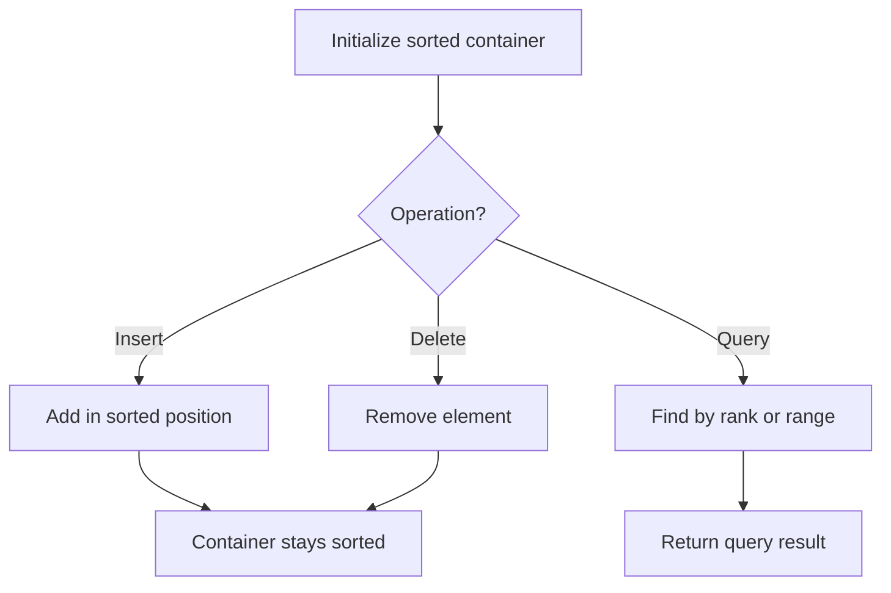

# Problem 2336: Smallest Number in Infinite Set

**Difficulty:** Medium  
**Tags:** Hash Table, Design, Heap (Priority Queue), Ordered Set  
**Pattern:** Heap / Design  
**Link:** [leetcode.com/problems/smallest-number-in-infinite-set](https://leetcode.com/problems/smallest-number-in-infinite-set/)

## Description

You have a set which contains all positive integers `[1, 2, 3, 4, 5, ...]`.

Implement the `SmallestInfiniteSet` class:

	- `SmallestInfiniteSet()` Initializes the **SmallestInfiniteSet** object to contain **all** positive integers.
	- `int popSmallest()` **Removes** and returns the smallest integer contained in the infinite set.
	- `void addBack(int num)` **Adds** a positive integer `num` back into the infinite set, if it is **not** already in the infinite set.

 

Example 1:

```

**Input**
["SmallestInfiniteSet", "addBack", "popSmallest", "popSmallest", "popSmallest", "addBack", "popSmallest", "popSmallest", "popSmallest"]
[[], [2], [], [], [], [1], [], [], []]
**Output**
[null, null, 1, 2, 3, null, 1, 4, 5]

**Explanation**
SmallestInfiniteSet smallestInfiniteSet = new SmallestInfiniteSet();
smallestInfiniteSet.addBack(2);    // 2 is already in the set, so no change is made.
smallestInfiniteSet.popSmallest(); // return 1, since 1 is the smallest number, and remove it from the set.
smallestInfiniteSet.popSmallest(); // return 2, and remove it from the set.
smallestInfiniteSet.popSmallest(); // return 3, and remove it from the set.
smallestInfiniteSet.addBack(1);    // 1 is added back to the set.
smallestInfiniteSet.popSmallest(); // return 1, since 1 was added back to the set and
                                   // is the smallest number, and remove it from the set.
smallestInfiniteSet.popSmallest(); // return 4, and remove it from the set.
smallestInfiniteSet.popSmallest(); // return 5, and remove it from the set.

```

 

**Constraints:**

	- `1 <= num <= 1000`
	- At most `1000` calls will be made **in total** to `popSmallest` and `addBack`.

## Approach: Heap / Design

Track current smallest + min-heap for added-back numbers below current.

## Pseudocode

```
1. Initialize sorted container
2. For each operation:
   - Insert: add element in sorted position O(log n)
   - Delete: remove element O(log n)
   - Query: find kth element, count, or range O(log n)
3. Return results
```

## Algorithm Flow



## Complexity Analysis

- **Time:** O(log n) per op
- **Space:** O(n)

## Solution (Python3)

```python
import heapq

class SmallestInfiniteSet:
    def __init__(self):
        self.current = 1
        self.added_back = []
        self.added_set = set()

    def popSmallest(self) -> int:
        if self.added_back:
            val = heapq.heappop(self.added_back)
            self.added_set.remove(val)
            return val
        val = self.current
        self.current += 1
        return val

    def addBack(self, num: int) -> None:
        if num < self.current and num not in self.added_set:
            heapq.heappush(self.added_back, num)
            self.added_set.add(num)
```

## Solution (C++)

```cpp
#include <algorithm>
#include <set>
#include <string>
#include <vector>
using namespace std;

class SmallestInfiniteSet {
public:
    SmallestInfiniteSet() {
        // Initialize
    }

    int popSmallest() {
        return 0;
    }

    void addBack(int num) {
        return ;
    }

};
```
