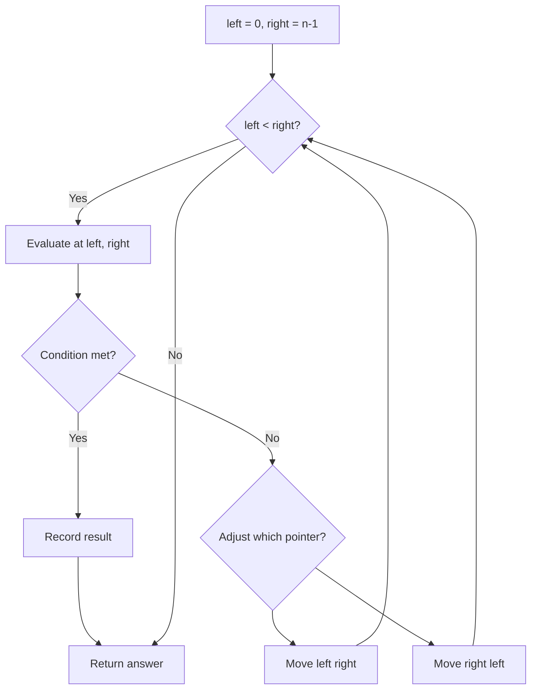
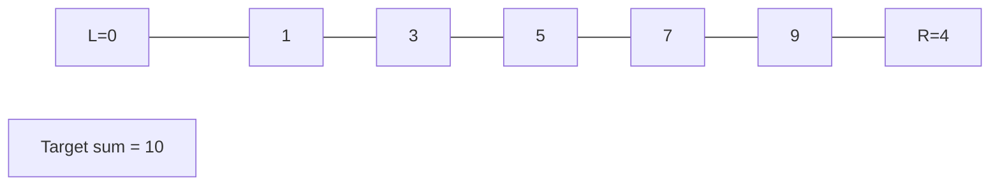
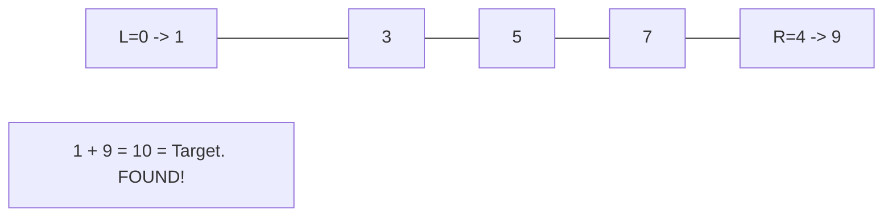

# Problem 2337: Move Pieces to Obtain a String

**Difficulty:** Medium  
**Tags:** Two Pointers, String  
**Pattern:** Two Pointers  
**Link:** [leetcode.com/problems/move-pieces-to-obtain-a-string](https://leetcode.com/problems/move-pieces-to-obtain-a-string/)

## Description

You are given two strings `start` and `target`, both of length `n`. Each string consists **only** of the characters `'L'`, `'R'`, and `'_'` where:

	- The characters `'L'` and `'R'` represent pieces, where a piece `'L'` can move to the **left** only if there is a **blank** space directly to its left, and a piece `'R'` can move to the **right** only if there is a **blank** space directly to its right.
	- The character `'_'` represents a blank space that can be occupied by **any** of the `'L'` or `'R'` pieces.

Return `true` *if it is possible to obtain the string* `target`* by moving the pieces of the string *`start`* **any** number of times*. Otherwise, return `false`.

 

Example 1:

```

**Input:** start = "_L__R__R_", target = "L______RR"
**Output:** true
**Explanation:** We can obtain the string target from start by doing the following moves:
- Move the first piece one step to the left, start becomes equal to "**L**___R__R_".
- Move the last piece one step to the right, start becomes equal to "L___R___**R**".
- Move the second piece three steps to the right, start becomes equal to "L______**R**R".
Since it is possible to get the string target from start, we return true.

```

Example 2:

```

**Input:** start = "R_L_", target = "__LR"
**Output:** false
**Explanation:** The 'R' piece in the string start can move one step to the right to obtain "_**R**L_".
After that, no pieces can move anymore, so it is impossible to obtain the string target from start.

```

Example 3:

```

**Input:** start = "_R", target = "R_"
**Output:** false
**Explanation:** The piece in the string start can move only to the right, so it is impossible to obtain the string target from start.
```

 

**Constraints:**

	- `n == start.length == target.length`
	- `1 <= n <= 10^5`
	- `start` and `target` consist of the characters `'L'`, `'R'`, and `'_'`.

## Approach: Two Pointers

Use two pointers moving through the data structure. Depending on the problem, pointers may move toward each other (converging), in the same direction (fast/slow), or independently.

## Pseudocode

```
1. Initialize left = 0, right = n-1 (or two independent pointers)
2. While pointers haven't crossed:
   a. Evaluate condition at pointer positions
   b. Move left pointer right or right pointer left
3. Return result
```

## Algorithm Flow



## Visual State Transitions

**Two Pointer Convergence:**

**Frame 1: Initialize pointers**


**Frame 2: Sum = 1+9 = 10, found!**



## Complexity Analysis

- **Time:** O(n)
- **Space:** O(1)

## Solution (Python3)

```python
class Solution:
    def canChange(self, start: str, target: str) -> bool:
        # Two pointer approach - O(n) time, O(1) space
        left, right = 0, len(start) - 1
        while left < right:
            curr = start[left] + start[right]
            if curr == target:
                return [left, right]
            elif curr < target:
                left += 1
            else:
                right -= 1
        return False
```

## Solution (C++)

```cpp
#include <string>
#include <vector>
using namespace std;

class Solution {
public:
    bool canChange(string& start, string& target) {
        // Two pointer approach - O(n) time, O(1) space
        int left = 0, right = start.size() - 1;
        while (left < right) {
            int curr = start[left] + start[right];
            if (curr == target) {
                return {left, right};
            } else if (curr < target) {
                left++;
            } else {
                right--;
            }
        }
        return false;
    }
};
```
