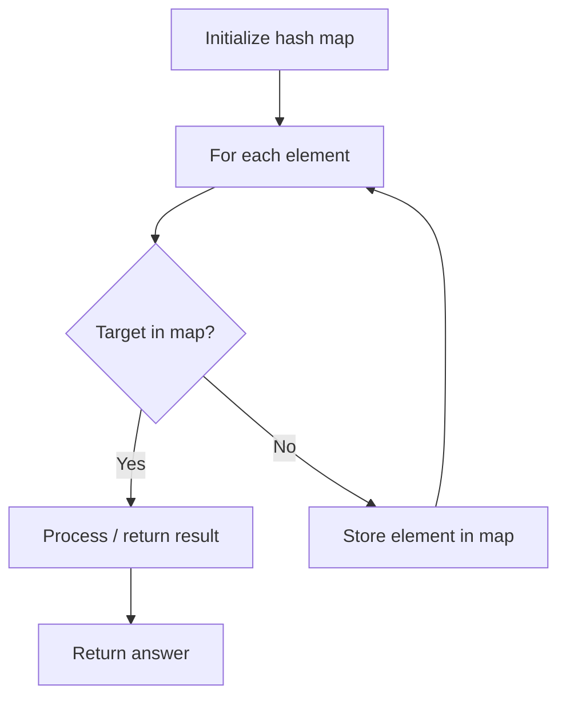

# Problem 2341: Maximum Number of Pairs in Array

**Difficulty:** Easy  
**Tags:** Array, Hash Table, Counting  
**Pattern:** Hash Map Lookup  
**Link:** [leetcode.com/problems/maximum-number-of-pairs-in-array](https://leetcode.com/problems/maximum-number-of-pairs-in-array/)

## Description

You are given a **0-indexed** integer array `nums`. In one operation, you may do the following:

	- Choose **two** integers in `nums` that are **equal**.
	- Remove both integers from `nums`, forming a **pair**.

The operation is done on `nums` as many times as possible.

Return *a **0-indexed** integer array *`answer`* of size *`2`* where *`answer[0]`* is the number of pairs that are formed and *`answer[1]`* is the number of leftover integers in *`nums`* after doing the operation as many times as possible*.

 

Example 1:

```

**Input:** nums = [1,3,2,1,3,2,2]
**Output:** [3,1]
**Explanation:**
Form a pair with nums[0] and nums[3] and remove them from nums. Now, nums = [3,2,3,2,2].
Form a pair with nums[0] and nums[2] and remove them from nums. Now, nums = [2,2,2].
Form a pair with nums[0] and nums[1] and remove them from nums. Now, nums = [2].
No more pairs can be formed. A total of 3 pairs have been formed, and there is 1 number leftover in nums.

```

Example 2:

```

**Input:** nums = [1,1]
**Output:** [1,0]
**Explanation:** Form a pair with nums[0] and nums[1] and remove them from nums. Now, nums = [].
No more pairs can be formed. A total of 1 pair has been formed, and there are 0 numbers leftover in nums.

```

Example 3:

```

**Input:** nums = [0]
**Output:** [0,1]
**Explanation:** No pairs can be formed, and there is 1 number leftover in nums.

```

 

**Constraints:**

	- `1 <= nums.length <= 100`
	- `0 <= nums[i] <= 100`

## Approach: Hash Map Lookup

Use a hash map (dictionary) to store elements for O(1) lookup. Iterate through the input, checking membership or counting frequencies in the map.

## Pseudocode

```
1. Initialize hash map
2. Iterate through elements:
   a. Check if target/complement exists in map
   b. If found: process result
   c. Otherwise: store element in map
3. Return result
```

## Algorithm Flow



## Complexity Analysis

- **Time:** O(n)
- **Space:** O(n)

## Solution (Python3)

```python
class Solution:
    def numberOfPairs(self, nums: List[int]) -> List[int]:
        # Hash map approach - O(n) time, O(n) space
        seen = {}
        for i, val in enumerate(nums):
            complement = nums - val
            if complement in seen:
                return [seen[complement], i]
            seen[val] = i
        return []
```

## Solution (C++)

```cpp
#include <string>
#include <unordered_map>
#include <vector>
using namespace std;

class Solution {
public:
    vector<int> numberOfPairs(vector<int>& nums) {
        // Hash map approach - O(n) time, O(n) space
        unordered_map<int, int> seen;
        for (int i = 0; i < nums.size(); i++) {
            int complement = nums - nums[i];
            if (seen.count(complement)) {
                return {seen[complement], i};
            }
            seen[nums[i]] = i;
        }
        return {};
    }
};
```
