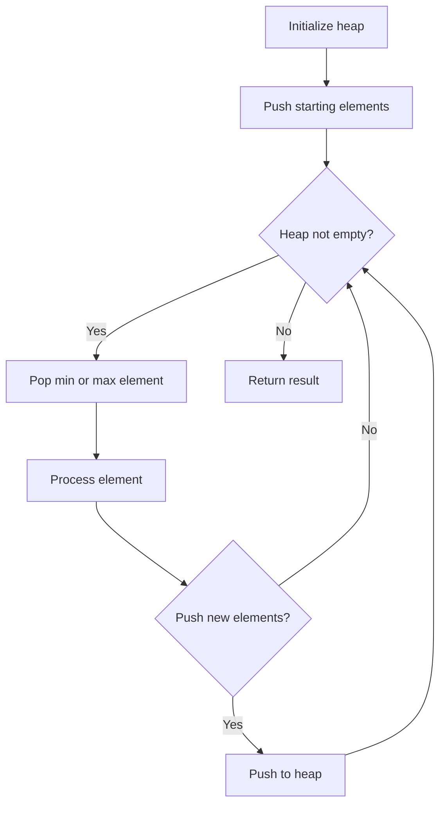
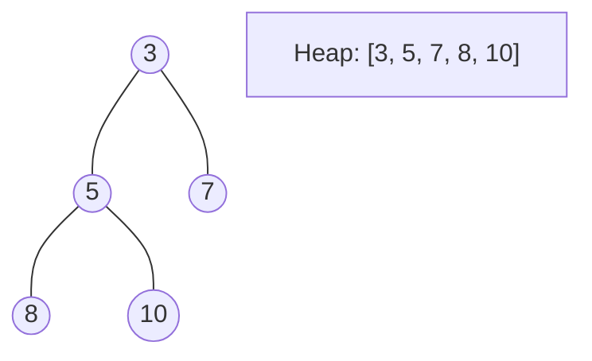
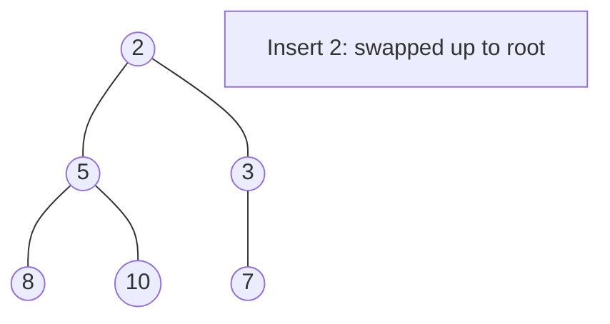
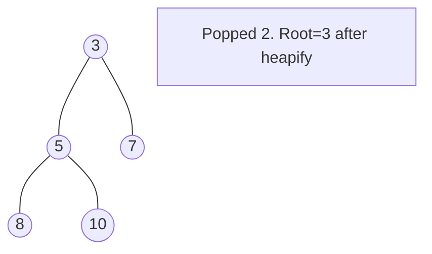

# Problem 2342: Max Sum of a Pair With Equal Sum of Digits

**Difficulty:** Medium  
**Tags:** Array, Hash Table, Sorting, Heap (Priority Queue)  
**Pattern:** Heap / Priority Queue  
**Link:** [leetcode.com/problems/max-sum-of-a-pair-with-equal-sum-of-digits](https://leetcode.com/problems/max-sum-of-a-pair-with-equal-sum-of-digits/)

## Description

You are given a **0-indexed** array `nums` consisting of **positive** integers. You can choose two indices `i` and `j`, such that `i != j`, and the sum of digits of the number `nums[i]` is equal to that of `nums[j]`.

Return the **maximum** value of* *`nums[i] + nums[j]`* *that you can obtain over all possible indices `i` and `j` that satisfy the conditions. If no such pair of indices exists, return -1.

 

Example 1:

```

**Input:** nums = [18,43,36,13,7]
**Output:** 54
**Explanation:** The pairs (i, j) that satisfy the conditions are:
- (0, 2), both numbers have a sum of digits equal to 9, and their sum is 18 + 36 = 54.
- (1, 4), both numbers have a sum of digits equal to 7, and their sum is 43 + 7 = 50.
So the maximum sum that we can obtain is 54.

```

Example 2:

```

**Input:** nums = [10,12,19,14]
**Output:** -1
**Explanation:** There are no two numbers that satisfy the conditions, so we return -1.

```

 

**Constraints:**

	- `1 <= nums.length <= 10^5`
	- `1 <= nums[i] <= 10^9`

## Approach: Heap / Priority Queue

Use a min-heap or max-heap to efficiently access the smallest/largest element. Push elements and pop the top to process in priority order.

## Pseudocode

```
1. Initialize heap (min or max)
2. Push initial elements onto heap
3. While heap not empty and condition:
   a. Pop top element (min or max)
   b. Process element
   c. Push new elements if needed
4. Return result
```

## Algorithm Flow



## Visual State Transitions

**Heap Operations (Min-Heap):**

**Frame 1: Initial heap**


**Frame 2: Insert 2 - bubble up**


**Frame 3: Pop minimum (2) - heapify down**



## Complexity Analysis

- **Time:** O(n log n)
- **Space:** O(n)

## Solution (Python3)

```python
class Solution:
    def maximumSum(self, nums: List[int]) -> int:
        # Heap/Priority Queue - O(n log k) time
        import heapq
        if not nums:
            return 0
        # Min heap (negate for max heap)
        heap = []
        for val in nums:
            heapq.heappush(heap, val)
            if len(heap) > (nums if isinstance(nums, int) else len(nums)):
                heapq.heappop(heap)
        return heap[0] if heap else 0
```

## Solution (C++)

```cpp
#include <queue>
#include <string>
#include <vector>
using namespace std;

class Solution {
public:
    int maximumSum(vector<int>& nums) {
        // Heap/Priority Queue - O(n log k) time
        priority_queue<int, vector<int>, greater<int>> pq;
        for (int val : nums) {
            pq.push(val);
            if ((int)pq.size() > nums)
                pq.pop();
        }
        return pq.empty() ? 0 : pq.top();
    }
};
```
