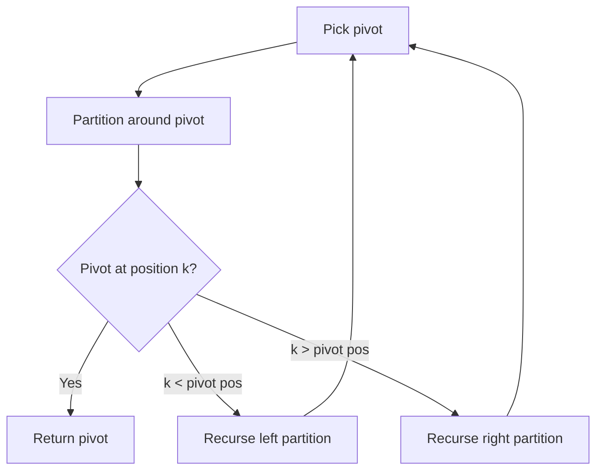

# Problem 2343: Query Kth Smallest Trimmed Number

**Difficulty:** Medium  
**Tags:** Array, String, Divide and Conquer, Sorting, Heap (Priority Queue), Radix Sort, Quickselect  
**Pattern:** Quickselect  
**Link:** [leetcode.com/problems/query-kth-smallest-trimmed-number](https://leetcode.com/problems/query-kth-smallest-trimmed-number/)

## Description

You are given a **0-indexed** array of strings `nums`, where each string is of **equal length** and consists of only digits.

You are also given a **0-indexed** 2D integer array `queries` where `queries[i] = [ki, trimi]`. For each `queries[i]`, you need to:

	- **Trim** each number in `nums` to its **rightmost** `trimi` digits.
	- Determine the **index** of the `ki^th` smallest trimmed number in `nums`. If two trimmed numbers are equal, the number with the **lower** index is considered to be smaller.
	- Reset each number in `nums` to its original length.

Return *an array *`answer`* of the same length as *`queries`,* where *`answer[i]`* is the answer to the *`i^th`* query.*

**Note**:

	- To trim to the rightmost `x` digits means to keep removing the leftmost digit, until only `x` digits remain.
	- Strings in `nums` may contain leading zeros.

 

Example 1:

```

**Input:** nums = ["102","473","251","814"], queries = [[1,1],[2,3],[4,2],[1,2]]
**Output:** [2,2,1,0]
**Explanation:**
1. After trimming to the last digit, nums = ["2","3","1","4"]. The smallest number is 1 at index 2.
2. Trimmed to the last 3 digits, nums is unchanged. The 2nd smallest number is 251 at index 2.
3. Trimmed to the last 2 digits, nums = ["02","73","51","14"]. The 4th smallest number is 73.
4. Trimmed to the last 2 digits, the smallest number is 2 at index 0.
   Note that the trimmed number "02" is evaluated as 2.

```

Example 2:

```

**Input:** nums = ["24","37","96","04"], queries = [[2,1],[2,2]]
**Output:** [3,0]
**Explanation:**
1. Trimmed to the last digit, nums = ["4","7","6","4"]. The 2nd smallest number is 4 at index 3.
   There are two occurrences of 4, but the one at index 0 is considered smaller than the one at index 3.
2. Trimmed to the last 2 digits, nums is unchanged. The 2nd smallest number is 24.

```

 

**Constraints:**

	- `1 <= nums.length <= 100`
	- `1 <= nums[i].length <= 100`
	- `nums[i]` consists of only digits.
	- All `nums[i].length` are **equal**.
	- `1 <= queries.length <= 100`
	- `queries[i].length == 2`
	- `1 <= ki <= nums.length`
	- `1 <= trimi <= nums[i].length`

 

**Follow up:** Could you use the **Radix Sort Algorithm** to solve this problem? What will be the complexity of that solution?

## Approach: Quickselect

Find the kth element by partitioning: pick a pivot, partition elements around it, then recurse only into the partition containing kth position.

## Pseudocode

```
1. Pick pivot element
2. Partition: elements < pivot | pivot | elements > pivot
3. If pivot is at position k: return pivot
4. If k < pivot position: recurse left
5. If k > pivot position: recurse right
```

## Algorithm Flow



## Complexity Analysis

- **Time:** O(n) average
- **Space:** O(1)

## Solution (Python3)

```python
class Solution:
    def smallestTrimmedNumbers(self, nums: List[str], queries: List[List[int]]) -> List[int]:
        # Quickselect - O(n) average time
        import random
        def quickselect(arr, k):
            if len(arr) == 1:
                return arr[0]
            pivot = random.choice(arr)
            lows = [x for x in arr if x < pivot]
            highs = [x for x in arr if x > pivot]
            pivots = [x for x in arr if x == pivot]
            if k < len(lows):
                return quickselect(lows, k)
            elif k < len(lows) + len(pivots):
                return pivot
            else:
                return quickselect(highs, k - len(lows) - len(pivots))
        
        k = queries if isinstance(queries, int) else 1
        return quickselect(nums, len(nums) - k)
```

## Solution (C++)

```cpp
#include <algorithm>
#include <string>
#include <vector>
using namespace std;

class Solution {
public:
    vector<int> smallestTrimmedNumbers(vector<string>& nums, vector<vector<int>>& queries) {
        // Quickselect - O(n) average time
        int k = queries;
        nth_element(nums.begin(), nums.begin() + nums.size() - k, nums.end());
        return nums[nums.size() - k];
    }
};
```
