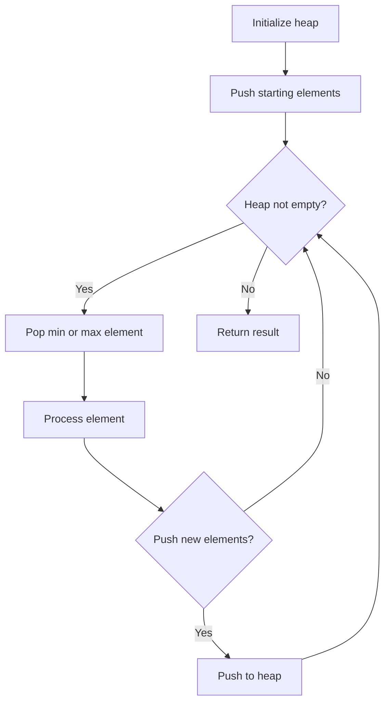
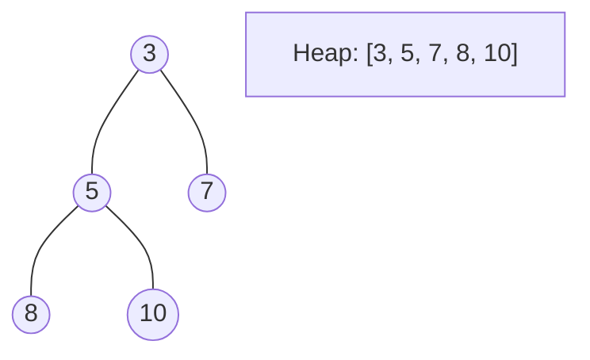
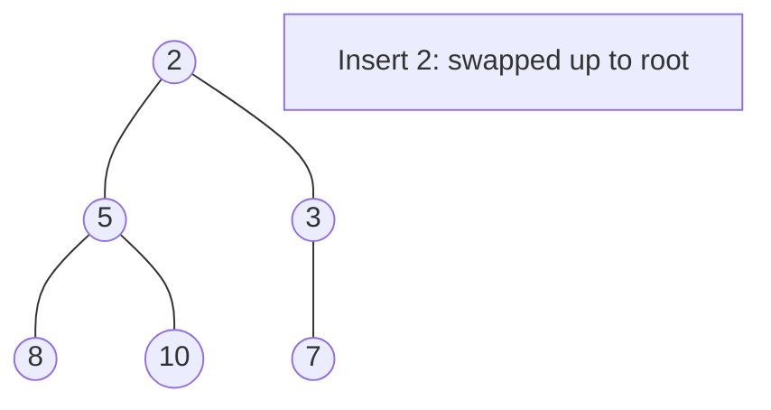
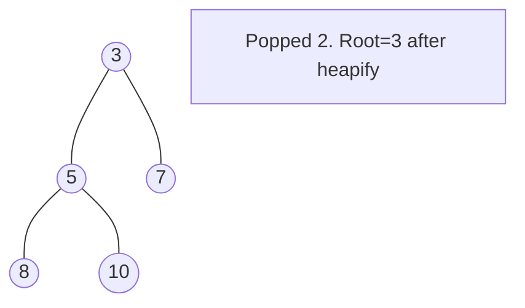

# Problem 2344: Minimum Deletions to Make Array Divisible

**Difficulty:** Hard  
**Tags:** Array, Math, Sorting, Heap (Priority Queue), Number Theory  
**Pattern:** Heap / Priority Queue  
**Link:** [leetcode.com/problems/minimum-deletions-to-make-array-divisible](https://leetcode.com/problems/minimum-deletions-to-make-array-divisible/)

## Description

You are given two positive integer arrays `nums` and `numsDivide`. You can delete any number of elements from `nums`.

Return *the **minimum** number of deletions such that the **smallest** element in *`nums`* **divides** all the elements of *`numsDivide`. If this is not possible, return `-1`.

Note that an integer `x` divides `y` if `y % x == 0`.

 

Example 1:

```

**Input:** nums = [2,3,2,4,3], numsDivide = [9,6,9,3,15]
**Output:** 2
**Explanation:** 
The smallest element in [2,3,2,4,3] is 2, which does not divide all the elements of numsDivide.
We use 2 deletions to delete the elements in nums that are equal to 2 which makes nums = [3,4,3].
The smallest element in [3,4,3] is 3, which divides all the elements of numsDivide.
It can be shown that 2 is the minimum number of deletions needed.

```

Example 2:

```

**Input:** nums = [4,3,6], numsDivide = [8,2,6,10]
**Output:** -1
**Explanation:** 
We want the smallest element in nums to divide all the elements of numsDivide.
There is no way to delete elements from nums to allow this.
```

 

**Constraints:**

	- `1 <= nums.length, numsDivide.length <= 10^5`
	- `1 <= nums[i], numsDivide[i] <= 10^9`

## Approach: Heap / Priority Queue

Use a min-heap or max-heap to efficiently access the smallest/largest element. Push elements and pop the top to process in priority order.

## Pseudocode

```
1. Initialize heap (min or max)
2. Push initial elements onto heap
3. While heap not empty and condition:
   a. Pop top element (min or max)
   b. Process element
   c. Push new elements if needed
4. Return result
```

## Algorithm Flow



## Visual State Transitions

**Heap Operations (Min-Heap):**

**Frame 1: Initial heap**


**Frame 2: Insert 2 - bubble up**


**Frame 3: Pop minimum (2) - heapify down**



## Complexity Analysis

- **Time:** O(n log n)
- **Space:** O(n)

## Solution (Python3)

```python
class Solution:
    def minOperations(self, nums: List[int], numsDivide: List[int]) -> int:
        # Heap/Priority Queue - O(n log k) time
        import heapq
        if not nums:
            return 0
        # Min heap (negate for max heap)
        heap = []
        for val in nums:
            heapq.heappush(heap, val)
            if len(heap) > (numsDivide if isinstance(numsDivide, int) else len(nums)):
                heapq.heappop(heap)
        return heap[0] if heap else 0
```

## Solution (C++)

```cpp
#include <queue>
#include <string>
#include <vector>
using namespace std;

class Solution {
public:
    int minOperations(vector<int>& nums, vector<int>& numsDivide) {
        // Heap/Priority Queue - O(n log k) time
        priority_queue<int, vector<int>, greater<int>> pq;
        for (int val : nums) {
            pq.push(val);
            if ((int)pq.size() > numsDivide)
                pq.pop();
        }
        return pq.empty() ? 0 : pq.top();
    }
};
```
