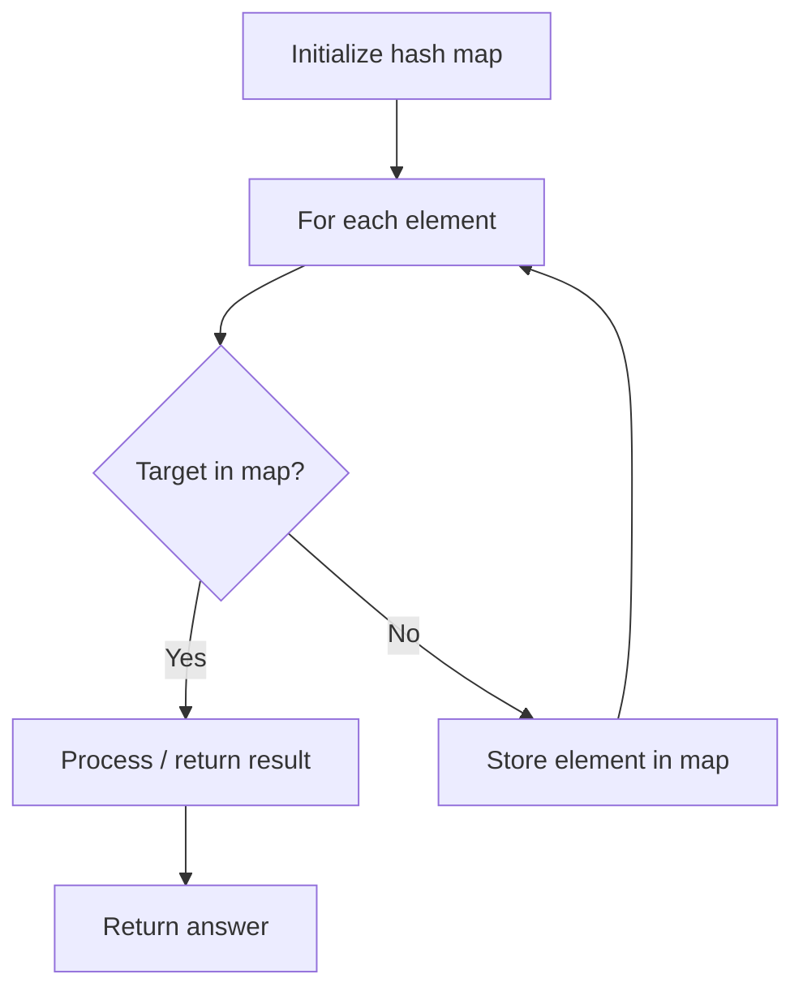

# Problem 2347: Best Poker Hand

**Difficulty:** Easy  
**Tags:** Array, Hash Table, Counting  
**Pattern:** Hash Map Lookup  
**Link:** [leetcode.com/problems/best-poker-hand](https://leetcode.com/problems/best-poker-hand/)

## Description

You are given an integer array `ranks` and a character array `suits`. You have `5` cards where the `i^th` card has a rank of `ranks[i]` and a suit of `suits[i]`.

The following are the types of **poker hands** you can make from best to worst:

	- `"Flush"`: Five cards of the same suit.
	- `"Three of a Kind"`: Three cards of the same rank.
	- `"Pair"`: Two cards of the same rank.
	- `"High Card"`: Any single card.

Return *a string representing the **best** type of **poker hand** you can make with the given cards.*

**Note** that the return values are **case-sensitive**.

 

Example 1:

```

**Input:** ranks = [13,2,3,1,9], suits = ["a","a","a","a","a"]
**Output:** "Flush"
**Explanation:** The hand with all the cards consists of 5 cards with the same suit, so we have a "Flush".

```

Example 2:

```

**Input:** ranks = [4,4,2,4,4], suits = ["d","a","a","b","c"]
**Output:** "Three of a Kind"
**Explanation:** The hand with the first, second, and fourth card consists of 3 cards with the same rank, so we have a "Three of a Kind".
Note that we could also make a "Pair" hand but "Three of a Kind" is a better hand.
Also note that other cards could be used to make the "Three of a Kind" hand.
```

Example 3:

```

**Input:** ranks = [10,10,2,12,9], suits = ["a","b","c","a","d"]
**Output:** "Pair"
**Explanation:** The hand with the first and second card consists of 2 cards with the same rank, so we have a "Pair".
Note that we cannot make a "Flush" or a "Three of a Kind".

```

 

**Constraints:**

	- `ranks.length == suits.length == 5`
	- `1 <= ranks[i] <= 13`
	- `'a' <= suits[i] <= 'd'`
	- No two cards have the same rank and suit.

## Approach: Hash Map Lookup

Use a hash map (dictionary) to store elements for O(1) lookup. Iterate through the input, checking membership or counting frequencies in the map.

## Pseudocode

```
1. Initialize hash map
2. Iterate through elements:
   a. Check if target/complement exists in map
   b. If found: process result
   c. Otherwise: store element in map
3. Return result
```

## Algorithm Flow



## Complexity Analysis

- **Time:** O(n)
- **Space:** O(n)

## Solution (Python3)

```python
class Solution:
    def bestHand(self, ranks: List[int], suits: List[str]) -> str:
        # Hash map approach - O(n) time, O(n) space
        seen = {}
        for i, val in enumerate(ranks):
            complement = suits - val
            if complement in seen:
                return [seen[complement], i]
            seen[val] = i
        return ""
```

## Solution (C++)

```cpp
#include <string>
#include <unordered_map>
#include <vector>
using namespace std;

class Solution {
public:
    string bestHand(vector<int>& ranks, vector<string>& suits) {
        // Hash map approach - O(n) time, O(n) space
        unordered_map<int, int> seen;
        for (int i = 0; i < ranks.size(); i++) {
            int complement = suits - ranks[i];
            if (seen.count(complement)) {
                return {seen[complement], i};
            }
            seen[ranks[i]] = i;
        }
        return "";
    }
};
```
