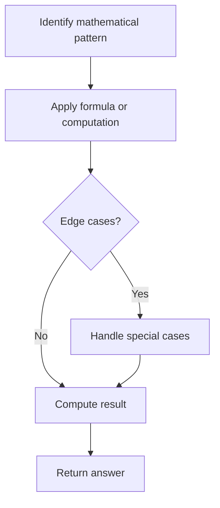

# Problem 2348: Number of Zero-Filled Subarrays

**Difficulty:** Medium  
**Tags:** Array, Math  
**Pattern:** Math  
**Link:** [leetcode.com/problems/number-of-zero-filled-subarrays](https://leetcode.com/problems/number-of-zero-filled-subarrays/)

## Description

Given an integer array `nums`, return *the number of **subarrays** filled with *`0`.

A **subarray** is a contiguous non-empty sequence of elements within an array.

 

Example 1:

```

**Input:** nums = [1,3,0,0,2,0,0,4]
**Output:** 6
**Explanation:** 
There are 4 occurrences of [0] as a subarray.
There are 2 occurrences of [0,0] as a subarray.
There is no occurrence of a subarray with a size more than 2 filled with 0. Therefore, we return 6.
```

Example 2:

```

**Input:** nums = [0,0,0,2,0,0]
**Output:** 9
Explanation:
There are 5 occurrences of [0] as a subarray.
There are 3 occurrences of [0,0] as a subarray.
There is 1 occurrence of [0,0,0] as a subarray.
There is no occurrence of a subarray with a size more than 3 filled with 0. Therefore, we return 9.

```

Example 3:

```

**Input:** nums = [2,10,2019]
**Output:** 0
**Explanation:** There is no subarray filled with 0. Therefore, we return 0.

```

 

**Constraints:**

	- `1 <= nums.length <= 10^5`
	- `-10^9 <= nums[i] <= 10^9`

## Approach: Math

Apply mathematical properties, formulas, or number-theoretic concepts. Look for patterns, modular arithmetic, or closed-form solutions.

## Pseudocode

```
1. Identify the mathematical pattern or formula
2. Apply computation:
   - Modular arithmetic for large numbers
   - GCD/LCM for divisibility
   - Sieve for primes
3. Handle edge cases
4. Return result
```

## Algorithm Flow



## Complexity Analysis

- **Time:** O(n) or O(sqrt(n))
- **Space:** O(1)

## Solution (Python3)

```python
class Solution:
    def zeroFilledSubarray(self, nums: List[int]) -> int:
        # Mathematical approach
        result = 0
        x = nums
        while x != 0:
            result = result * 10 + x % 10
            x //= 10 if isinstance(x, int) else 1
        return result
```

## Solution (C++)

```cpp
#include <string>
#include <vector>
using namespace std;

class Solution {
public:
    int zeroFilledSubarray(vector<int>& nums) {
        // Mathematical approach
        long long result = 0;
        int x = nums;
        while (x != 0) {
            result = result * 10 + x % 10;
            x /= 10;
        }
        return (int)result;
    }
};
```
