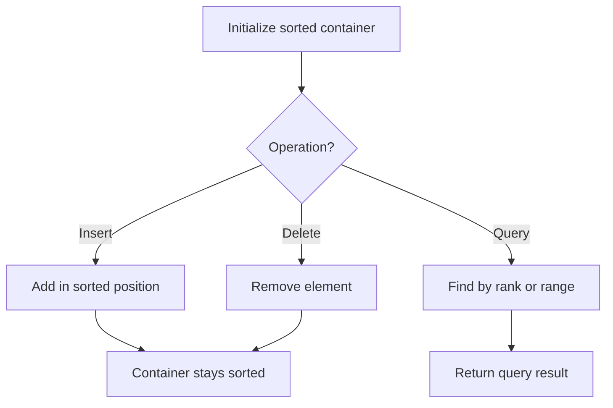

# Problem 2349: Design a Number Container System

**Difficulty:** Medium  
**Tags:** Hash Table, Design, Heap (Priority Queue), Ordered Set  
**Pattern:** Ordered Set / SortedList  
**Link:** [leetcode.com/problems/design-a-number-container-system](https://leetcode.com/problems/design-a-number-container-system/)

## Description

Design a number container system that can do the following:

	- **Insert **or **Replace** a number at the given index in the system.
	- **Return **the smallest index for the given number in the system.

Implement the `NumberContainers` class:

	- `NumberContainers()` Initializes the number container system.
	- `void change(int index, int number)` Fills the container at `index` with the `number`. If there is already a number at that `index`, replace it.
	- `int find(int number)` Returns the smallest index for the given `number`, or `-1` if there is no index that is filled by `number` in the system.

 

Example 1:

```

**Input**
["NumberContainers", "find", "change", "change", "change", "change", "find", "change", "find"]
[[], [10], [2, 10], [1, 10], [3, 10], [5, 10], [10], [1, 20], [10]]
**Output**
[null, -1, null, null, null, null, 1, null, 2]

**Explanation**
NumberContainers nc = new NumberContainers();
nc.find(10); // There is no index that is filled with number 10. Therefore, we return -1.
nc.change(2, 10); // Your container at index 2 will be filled with number 10.
nc.change(1, 10); // Your container at index 1 will be filled with number 10.
nc.change(3, 10); // Your container at index 3 will be filled with number 10.
nc.change(5, 10); // Your container at index 5 will be filled with number 10.
nc.find(10); // Number 10 is at the indices 1, 2, 3, and 5. Since the smallest index that is filled with 10 is 1, we return 1.
nc.change(1, 20); // Your container at index 1 will be filled with number 20. Note that index 1 was filled with 10 and then replaced with 20. 
nc.find(10); // Number 10 is at the indices 2, 3, and 5. The smallest index that is filled with 10 is 2. Therefore, we return 2.

```

 

**Constraints:**

	- `1 <= index, number <= 10^9`
	- At most `10^5` calls will be made **in total** to `change` and `find`.

## Approach: Ordered Set / SortedList

Maintain elements in sorted order for efficient insertion, deletion, and rank queries. Use balanced BST, skip list, or sorted container.

## Pseudocode

```
1. Initialize sorted container
2. For each operation:
   - Insert: add element in sorted position O(log n)
   - Delete: remove element O(log n)
   - Query: find kth element, count, or range O(log n)
3. Return results
```

## Algorithm Flow



## Complexity Analysis

- **Time:** O(n log n)
- **Space:** O(n)

## Solution (Python3)

```python
class NumberContainers:
    def __init__(self):
        # Initialize data structure
        pass

    def change(self, index: int, number: int) -> None:
        return None

    def find(self, number: int) -> int:
        return 0

```

## Solution (C++)

```cpp
#include <algorithm>
#include <set>
#include <string>
#include <vector>
using namespace std;

class NumberContainers {
public:
    NumberContainers() {
        // Initialize
    }

    void change(int index, int number) {
        return ;
    }

    int find(int number) {
        return 0;
    }

};
```
