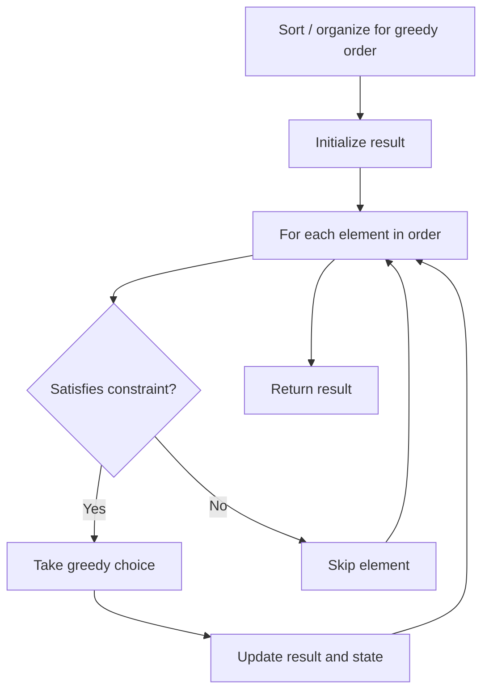

# Problem 2350: Shortest Impossible Sequence of Rolls

**Difficulty:** Hard  
**Tags:** Array, Hash Table, Greedy  
**Pattern:** Greedy  
**Link:** [leetcode.com/problems/shortest-impossible-sequence-of-rolls](https://leetcode.com/problems/shortest-impossible-sequence-of-rolls/)

## Description

You are given an integer array `rolls` of length `n` and an integer `k`. You roll a `k` sided dice numbered from `1` to `k`, `n` times, where the result of the `i^th` roll is `rolls[i]`.

Return* the length of the **shortest** sequence of rolls so that there's no such subsequence in *`rolls`.

A **sequence of rolls** of length `len` is the result of rolling a `k` sided dice `len` times.

 

Example 1:

```

**Input:** rolls = [4,2,1,2,3,3,2,4,1], k = 4
**Output:** 3
**Explanation:** Every sequence of rolls of length 1, [1], [2], [3], [4], can be taken from rolls.
Every sequence of rolls of length 2, [1, 1], [1, 2], ..., [4, 4], can be taken from rolls.
The sequence [1, 4, 2] cannot be taken from rolls, so we return 3.
Note that there are other sequences that cannot be taken from rolls.
```

Example 2:

```

**Input:** rolls = [1,1,2,2], k = 2
**Output:** 2
**Explanation:** Every sequence of rolls of length 1, [1], [2], can be taken from rolls.
The sequence [2, 1] cannot be taken from rolls, so we return 2.
Note that there are other sequences that cannot be taken from rolls but [2, 1] is the shortest.

```

Example 3:

```

**Input:** rolls = [1,1,3,2,2,2,3,3], k = 4
**Output:** 1
**Explanation:** The sequence [4] cannot be taken from rolls, so we return 1.
Note that there are other sequences that cannot be taken from rolls but [4] is the shortest.

```

 

**Constraints:**

	- `n == rolls.length`
	- `1 <= n <= 10^5`
	- `1 <= rolls[i] <= k <= 10^5`

## Approach: Greedy

Make the locally optimal choice at each step, trusting it leads to a global optimum. Greedy works when the problem has the greedy-choice property and optimal substructure.

## Pseudocode

```
1. Sort or organize data for greedy ordering
2. Initialize result
3. For each element in greedy order:
   a. If element satisfies constraint:
      - Take the greedy choice
      - Update result and state
4. Return result
```

## Algorithm Flow



## Complexity Analysis

- **Time:** O(n log n)
- **Space:** O(1)

## Solution (Python3)

```python
class Solution:
    def shortestSequence(self, rolls: List[int], k: int) -> int:
        # Greedy approach - O(n) time
        result = 0
        curr_max = 0
        for i in range(len(rolls)):
            if isinstance(rolls[i], int):
                curr_max = max(curr_max, rolls[i])
                result = max(result, curr_max)
            else:
                result += 1
        return result
```

## Solution (C++)

```cpp
#include <algorithm>
#include <string>
#include <vector>
using namespace std;

class Solution {
public:
    int shortestSequence(vector<int>& rolls, int k) {
        // Greedy approach - O(n) time
        int result = 0, curr_max = 0;
        for (int i = 0; i < (int)rolls.size(); i++) {
            curr_max = max(curr_max, rolls[i]);
            result = max(result, curr_max);
        }
        return result;
    }
};
```
