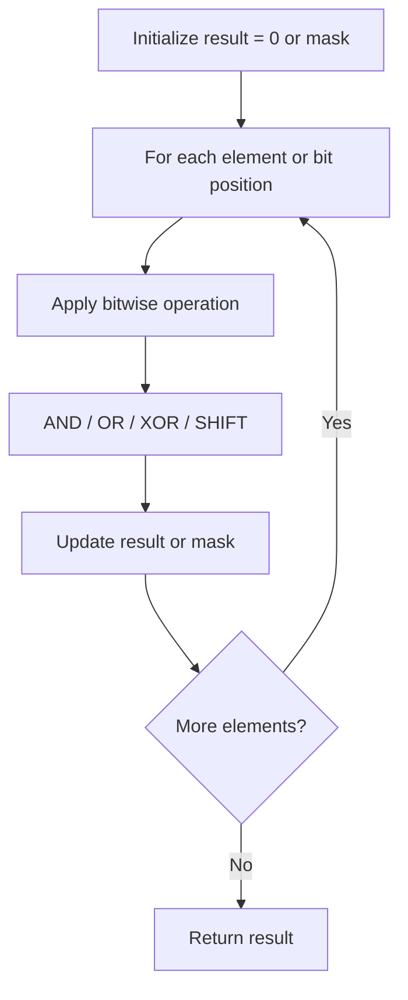

# Problem 2351: First Letter to Appear Twice

**Difficulty:** Easy  
**Tags:** Hash Table, String, Bit Manipulation, Counting  
**Pattern:** Bit Manipulation  
**Link:** [leetcode.com/problems/first-letter-to-appear-twice](https://leetcode.com/problems/first-letter-to-appear-twice/)

## Description

Given a string `s` consisting of lowercase English letters, return *the first letter to appear **twice***.

**Note**:

	- A letter `a` appears twice before another letter `b` if the **second** occurrence of `a` is before the **second** occurrence of `b`.
	- `s` will contain at least one letter that appears twice.

 

Example 1:

```

**Input:** s = "abccbaacz"
**Output:** "c"
**Explanation:**
The letter 'a' appears on the indexes 0, 5 and 6.
The letter 'b' appears on the indexes 1 and 4.
The letter 'c' appears on the indexes 2, 3 and 7.
The letter 'z' appears on the index 8.
The letter 'c' is the first letter to appear twice, because out of all the letters the index of its second occurrence is the smallest.

```

Example 2:

```

**Input:** s = "abcdd"
**Output:** "d"
**Explanation:**
The only letter that appears twice is 'd' so we return 'd'.

```

 

**Constraints:**

	- `2 <= s.length <= 100`
	- `s` consists of lowercase English letters.
	- `s` has at least one repeated letter.

## Approach: Bit Manipulation

Operate on individual bits using bitwise operators (AND, OR, XOR, shift). Common tricks: x & (x-1) removes lowest set bit, x ^ x = 0, XOR all elements to find unique.

## Pseudocode

```
1. Apply bitwise operations:
   - XOR all elements to cancel paired bits
   - Use bitmask to track state
   - Shift and mask to extract/set individual bits
2. Return result
```

## Algorithm Flow



## Complexity Analysis

- **Time:** O(n) or O(log n)
- **Space:** O(1)

## Solution (Python3)

```python
class Solution:
    def repeatedCharacter(self, s: str) -> str:
        # Bit manipulation - O(n) time, O(1) space
        result = 0
        for val in s:
            result ^= val
        return result
```

## Solution (C++)

```cpp
#include <string>
#include <vector>
using namespace std;

class Solution {
public:
    string repeatedCharacter(string& s) {
        // Bit manipulation - O(n) time, O(1) space
        int result = 0;
        for (int val : s) {
            result ^= val;
        }
        return result;
    }
};
```
