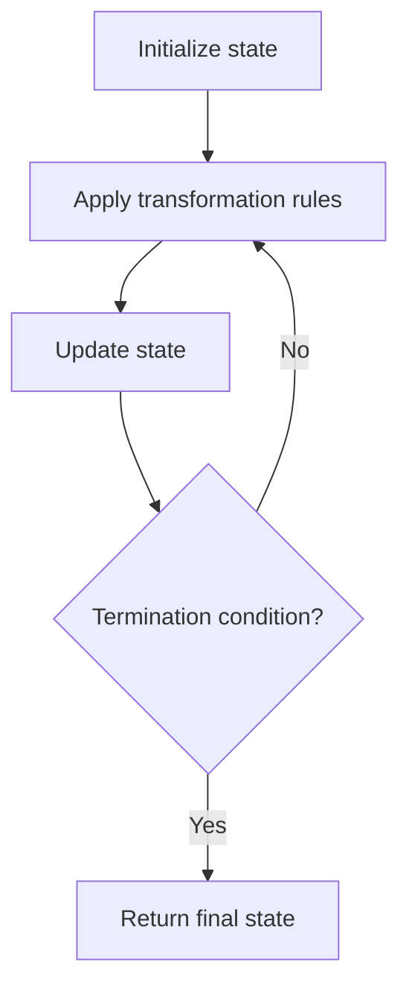

# Problem 2352: Equal Row and Column Pairs

**Difficulty:** Medium  
**Tags:** Array, Hash Table, Matrix, Simulation  
**Pattern:** Hash Map / Matrix  
**Link:** [leetcode.com/problems/equal-row-and-column-pairs](https://leetcode.com/problems/equal-row-and-column-pairs/)

## Description

Given a **0-indexed** `n x n` integer matrix `grid`, *return the number of pairs *`(ri, cj)`* such that row *`ri`* and column *`cj`* are equal*.

A row and column pair is considered equal if they contain the same elements in the same order (i.e., an equal array).

 

Example 1:

```

**Input:** grid = [[3,2,1],[1,7,6],[2,7,7]]
**Output:** 1
**Explanation:** There is 1 equal row and column pair:
- (Row 2, Column 1): [2,7,7]

```

Example 2:

```

**Input:** grid = [[3,1,2,2],[1,4,4,5],[2,4,2,2],[2,4,2,2]]
**Output:** 3
**Explanation:** There are 3 equal row and column pairs:
- (Row 0, Column 0): [3,1,2,2]
- (Row 2, Column 2): [2,4,2,2]
- (Row 3, Column 2): [2,4,2,2]

```

 

**Constraints:**

	- `n == grid.length == grid[i].length`
	- `1 <= n <= 200`
	- `1 <= grid[i][j] <= 10^5`

## Approach: Hash Map / Matrix

Hash all rows. For each column, check if it matches any row.

## Pseudocode

```
1. Initialize state (grid, pointers, counters)
2. For each step / iteration:
   a. Apply the transformation rules
   b. Update state
   c. Check termination condition
3. Return final state or result
```

## Algorithm Flow



## Complexity Analysis

- **Time:** O(n^2)
- **Space:** O(n^2)

## Solution (Python3)

```python
class Solution:
    def equalPairs(self, grid: list[list[int]]) -> int:
        from collections import Counter
        rows = Counter(tuple(row) for row in grid)
        count = 0
        n = len(grid)
        for c in range(n):
            col = tuple(grid[r][c] for r in range(n))
            count += rows[col]
        return count
```

## Solution (C++)

```cpp
#include <string>
#include <vector>
using namespace std;

class Solution {
public:
    int equalPairs(vector<vector<int>>& grid) {
        // Simulation approach
        int n = grid.size();
        for (int i = 0; i < n; i++) {
            // Simulate each step
        }
        return 0;
    }
};
```
