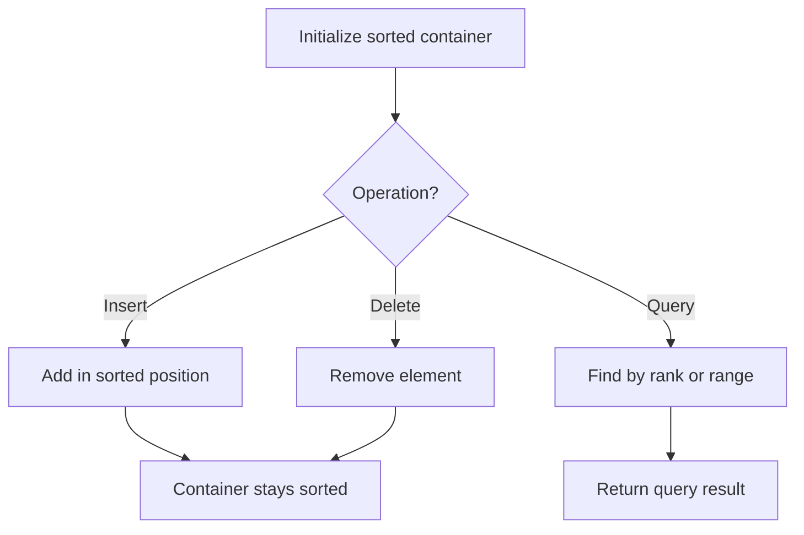

# Problem 2353: Design a Food Rating System

**Difficulty:** Medium  
**Tags:** Array, Hash Table, String, Design, Heap (Priority Queue), Ordered Set  
**Pattern:** Ordered Set / SortedList  
**Link:** [leetcode.com/problems/design-a-food-rating-system](https://leetcode.com/problems/design-a-food-rating-system/)

## Description

Design a food rating system that can do the following:

	- **Modify** the rating of a food item listed in the system.
	- Return the highest-rated food item for a type of cuisine in the system.

Implement the `FoodRatings` class:

	- `FoodRatings(String[] foods, String[] cuisines, int[] ratings)` Initializes the system. The food items are described by `foods`, `cuisines` and `ratings`, all of which have a length of `n`.

	
		`foods[i]` is the name of the `i^th` food,
		- `cuisines[i]` is the type of cuisine of the `i^th` food, and
		- `ratings[i]` is the initial rating of the `i^th` food.
	
	
	- `void changeRating(String food, int newRating)` Changes the rating of the food item with the name `food`.
	- `String highestRated(String cuisine)` Returns the name of the food item that has the highest rating for the given type of `cuisine`. If there is a tie, return the item with the **lexicographically smaller** name.

Note that a string `x` is lexicographically smaller than string `y` if `x` comes before `y` in dictionary order, that is, either `x` is a prefix of `y`, or if `i` is the first position such that `x[i] != y[i]`, then `x[i]` comes before `y[i]` in alphabetic order.

 

Example 1:

```

**Input**
["FoodRatings", "highestRated", "highestRated", "changeRating", "highestRated", "changeRating", "highestRated"]
[[["kimchi", "miso", "sushi", "moussaka", "ramen", "bulgogi"], ["korean", "japanese", "japanese", "greek", "japanese", "korean"], [9, 12, 8, 15, 14, 7]], ["korean"], ["japanese"], ["sushi", 16], ["japanese"], ["ramen", 16], ["japanese"]]
**Output**
[null, "kimchi", "ramen", null, "sushi", null, "ramen"]

**Explanation**
FoodRatings foodRatings = new FoodRatings(["kimchi", "miso", "sushi", "moussaka", "ramen", "bulgogi"], ["korean", "japanese", "japanese", "greek", "japanese", "korean"], [9, 12, 8, 15, 14, 7]);
foodRatings.highestRated("korean"); // return "kimchi"
                                    // "kimchi" is the highest rated korean food with a rating of 9.
foodRatings.highestRated("japanese"); // return "ramen"
                                      // "ramen" is the highest rated japanese food with a rating of 14.
foodRatings.changeRating("sushi", 16); // "sushi" now has a rating of 16.
foodRatings.highestRated("japanese"); // return "sushi"
                                      // "sushi" is the highest rated japanese food with a rating of 16.
foodRatings.changeRating("ramen", 16); // "ramen" now has a rating of 16.
foodRatings.highestRated("japanese"); // return "ramen"
                                      // Both "sushi" and "ramen" have a rating of 16.
                                      // However, "ramen" is lexicographically smaller than "sushi".

```

 

**Constraints:**

	- `1 <= n <= 2 * 10^4`
	- `n == foods.length == cuisines.length == ratings.length`
	- `1 <= foods[i].length, cuisines[i].length <= 10`
	- `foods[i]`, `cuisines[i]` consist of lowercase English letters.
	- `1 <= ratings[i] <= 10^8`
	- All the strings in `foods` are **distinct**.
	- `food` will be the name of a food item in the system across all calls to `changeRating`.
	- `cuisine` will be a type of cuisine of **at least one** food item in the system across all calls to `highestRated`.
	- At most `2 * 10^4` calls **in total** will be made to `changeRating` and `highestRated`.

## Approach: Ordered Set / SortedList

Maintain elements in sorted order for efficient insertion, deletion, and rank queries. Use balanced BST, skip list, or sorted container.

## Pseudocode

```
1. Initialize sorted container
2. For each operation:
   - Insert: add element in sorted position O(log n)
   - Delete: remove element O(log n)
   - Query: find kth element, count, or range O(log n)
3. Return results
```

## Algorithm Flow



## Complexity Analysis

- **Time:** O(n log n)
- **Space:** O(n)

## Solution (Python3)

```python
class FoodRatings:
    def __init__(self, foods: List[str], cuisines: List[str], ratings: List[int]):
        # Initialize data structure
        self.foods = foods
        self.cuisines = cuisines
        self.ratings = ratings

    def changeRating(self, food: str, newRating: int) -> None:
        return None

    def highestRated(self, cuisine: str) -> str:
        return ""

```

## Solution (C++)

```cpp
#include <algorithm>
#include <set>
#include <string>
#include <vector>
using namespace std;

class FoodRatings {
public:
    FoodRatings(vector<string>& foods, vector<string>& cuisines, vector<int>& ratings) {
        // Initialize
    }

    void changeRating(string& food, int newRating) {
        return ;
    }

    string highestRated(string& cuisine) {
        return "";
    }

};
```
