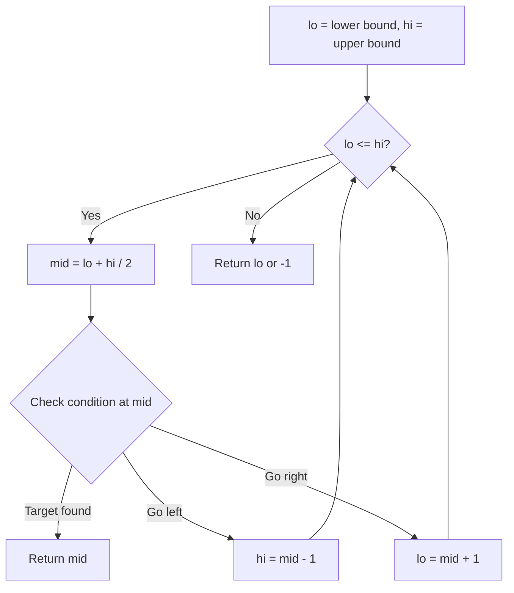
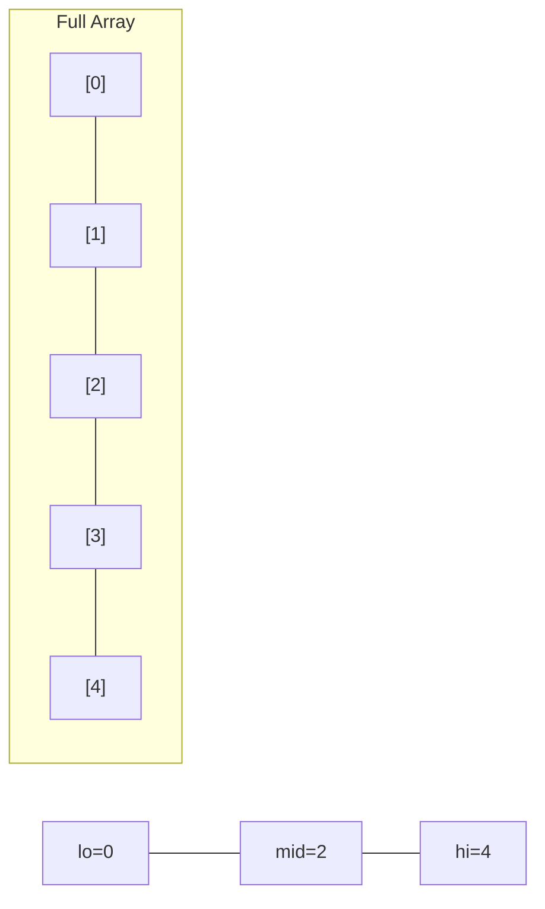
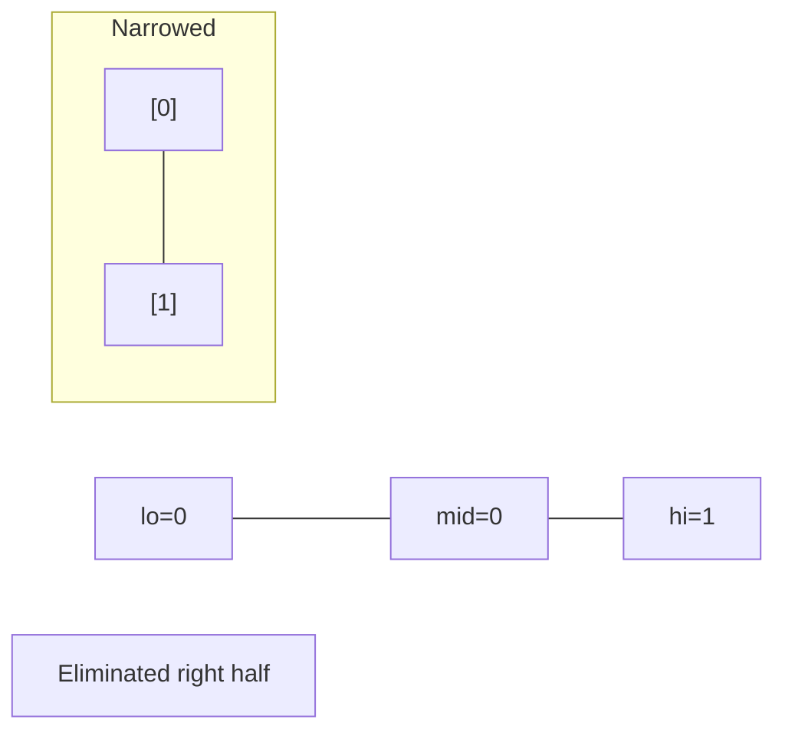
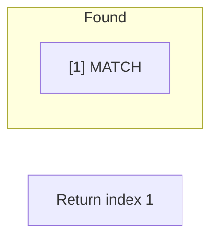

# Problem 2354: Number of Excellent Pairs

**Difficulty:** Hard  
**Tags:** Array, Hash Table, Binary Search, Bit Manipulation  
**Pattern:** Binary Search  
**Link:** [leetcode.com/problems/number-of-excellent-pairs](https://leetcode.com/problems/number-of-excellent-pairs/)

## Description

You are given a **0-indexed** positive integer array `nums` and a positive integer `k`.

A pair of numbers `(num1, num2)` is called **excellent** if the following conditions are satisfied:

	- **Both** the numbers `num1` and `num2` exist in the array `nums`.
	- The sum of the number of set bits in `num1 OR num2` and `num1 AND num2` is greater than or equal to `k`, where `OR` is the bitwise **OR** operation and `AND` is the bitwise **AND** operation.

Return *the number of **distinct** excellent pairs*.

Two pairs `(a, b)` and `(c, d)` are considered distinct if either `a != c` or `b != d`. For example, `(1, 2)` and `(2, 1)` are distinct.

**Note** that a pair `(num1, num2)` such that `num1 == num2` can also be excellent if you have at least **one** occurrence of `num1` in the array.

 

Example 1:

```

**Input:** nums = [1,2,3,1], k = 3
**Output:** 5
**Explanation:** The excellent pairs are the following:
- (3, 3). (3 AND 3) and (3 OR 3) are both equal to (11) in binary. The total number of set bits is 2 + 2 = 4, which is greater than or equal to k = 3.
- (2, 3) and (3, 2). (2 AND 3) is equal to (10) in binary, and (2 OR 3) is equal to (11) in binary. The total number of set bits is 1 + 2 = 3.
- (1, 3) and (3, 1). (1 AND 3) is equal to (01) in binary, and (1 OR 3) is equal to (11) in binary. The total number of set bits is 1 + 2 = 3.
So the number of excellent pairs is 5.
```

Example 2:

```

**Input:** nums = [5,1,1], k = 10
**Output:** 0
**Explanation:** There are no excellent pairs for this array.

```

 

**Constraints:**

	- `1 <= nums.length <= 10^5`
	- `1 <= nums[i] <= 10^9`
	- `1 <= k <= 60`

## Approach: Binary Search

Use binary search to halve the search space each iteration. Define the search range [lo, hi], compute mid, and decide which half to keep based on the problem's monotonic condition.

## Pseudocode

```
1. lo = lower_bound, hi = upper_bound
2. While lo <= hi (or lo < hi):
   a. mid = (lo + hi) // 2
   b. If condition(mid) is satisfied: record answer, search left half
   c. Else: search right half
3. Return answer
```

## Algorithm Flow



## Visual State Transitions

**Binary Search Step-by-Step:**

**Frame 1: Initial search space**


**Frame 2: Compare mid, narrow search**


**Frame 3: Found target**



## Complexity Analysis

- **Time:** O(log n)
- **Space:** O(1)

## Solution (Python3)

```python
class Solution:
    def countExcellentPairs(self, nums: List[int], k: int) -> int:
        # Binary search - O(log n) time, O(1) space
        lo, hi = 0, len(nums) - 1
        while lo <= hi:
            mid = lo + (hi - lo) // 2
            if nums[mid] == k:
                return mid
            elif nums[mid] < k:
                lo = mid + 1
            else:
                hi = mid - 1
        return 0
```

## Solution (C++)

```cpp
#include <string>
#include <vector>
using namespace std;

class Solution {
public:
    int countExcellentPairs(vector<int>& nums, int k) {
        // Binary search - O(log n) time, O(1) space
        int lo = 0, hi = nums.size() - 1;
        while (lo <= hi) {
            int mid = lo + (hi - lo) / 2;
            if (nums[mid] == k) {
                return mid;
            } else if (nums[mid] < k) {
                lo = mid + 1;
            } else {
                hi = mid - 1;
            }
        }
        return 0;
    }
};
```
