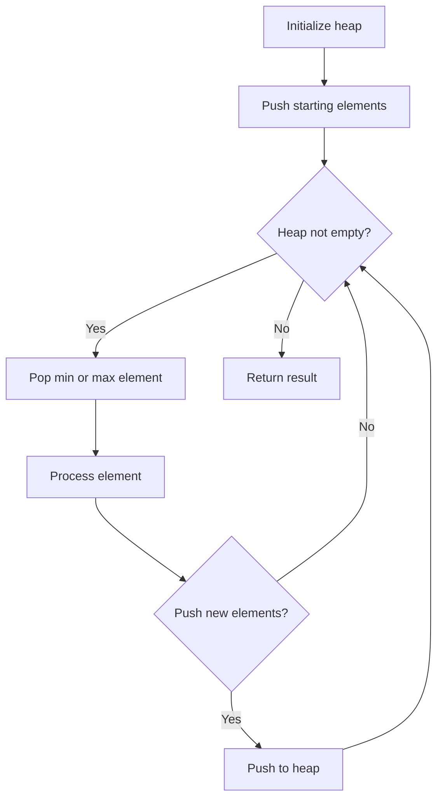
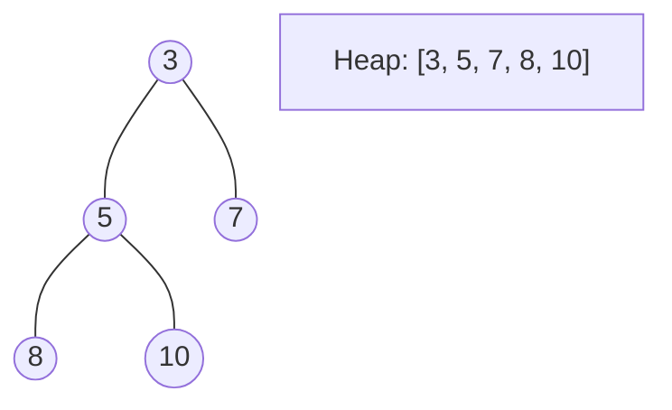
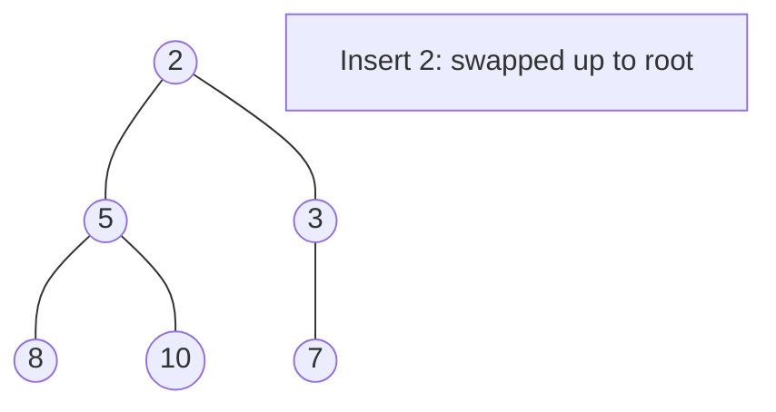
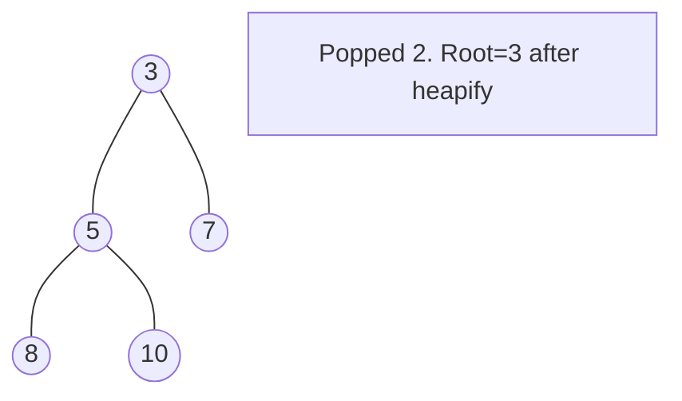

# Problem 2357: Make Array Zero by Subtracting Equal Amounts

**Difficulty:** Easy  
**Tags:** Array, Hash Table, Greedy, Sorting, Heap (Priority Queue), Simulation  
**Pattern:** Heap / Priority Queue  
**Link:** [leetcode.com/problems/make-array-zero-by-subtracting-equal-amounts](https://leetcode.com/problems/make-array-zero-by-subtracting-equal-amounts/)

## Description

You are given a non-negative integer array `nums`. In one operation, you must:

	- Choose a positive integer `x` such that `x` is less than or equal to the **smallest non-zero** element in `nums`.
	- Subtract `x` from every **positive** element in `nums`.

Return *the **minimum** number of operations to make every element in *`nums`* equal to *`0`.

 

Example 1:

```

**Input:** nums = [1,5,0,3,5]
**Output:** 3
**Explanation:**
In the first operation, choose x = 1. Now, nums = [0,4,0,2,4].
In the second operation, choose x = 2. Now, nums = [0,2,0,0,2].
In the third operation, choose x = 2. Now, nums = [0,0,0,0,0].

```

Example 2:

```

**Input:** nums = [0]
**Output:** 0
**Explanation:** Each element in nums is already 0 so no operations are needed.

```

 

**Constraints:**

	- `1 <= nums.length <= 100`
	- `0 <= nums[i] <= 100`

## Approach: Heap / Priority Queue

Use a min-heap or max-heap to efficiently access the smallest/largest element. Push elements and pop the top to process in priority order.

## Pseudocode

```
1. Initialize heap (min or max)
2. Push initial elements onto heap
3. While heap not empty and condition:
   a. Pop top element (min or max)
   b. Process element
   c. Push new elements if needed
4. Return result
```

## Algorithm Flow



## Visual State Transitions

**Heap Operations (Min-Heap):**

**Frame 1: Initial heap**


**Frame 2: Insert 2 - bubble up**


**Frame 3: Pop minimum (2) - heapify down**



## Complexity Analysis

- **Time:** O(n log n)
- **Space:** O(n)

## Solution (Python3)

```python
class Solution:
    def minimumOperations(self, nums: List[int]) -> int:
        # Heap/Priority Queue - O(n log k) time
        import heapq
        if not nums:
            return 0
        # Min heap (negate for max heap)
        heap = []
        for val in nums:
            heapq.heappush(heap, val)
            if len(heap) > (nums if isinstance(nums, int) else len(nums)):
                heapq.heappop(heap)
        return heap[0] if heap else 0
```

## Solution (C++)

```cpp
#include <queue>
#include <string>
#include <vector>
using namespace std;

class Solution {
public:
    int minimumOperations(vector<int>& nums) {
        // Heap/Priority Queue - O(n log k) time
        priority_queue<int, vector<int>, greater<int>> pq;
        for (int val : nums) {
            pq.push(val);
            if ((int)pq.size() > nums)
                pq.pop();
        }
        return pq.empty() ? 0 : pq.top();
    }
};
```
