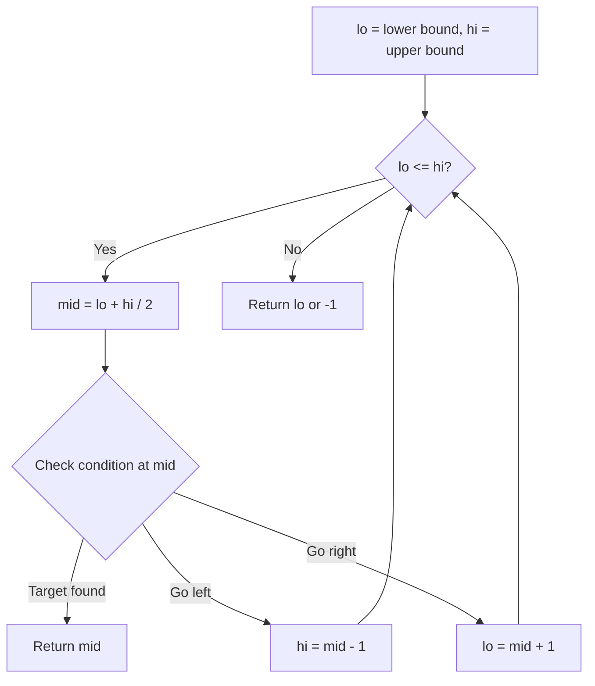
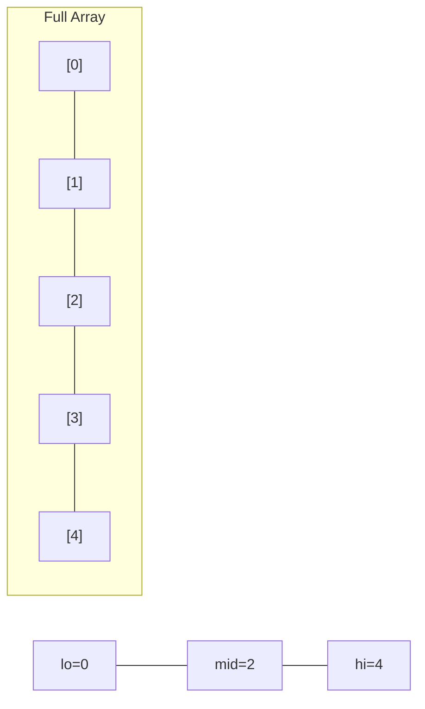
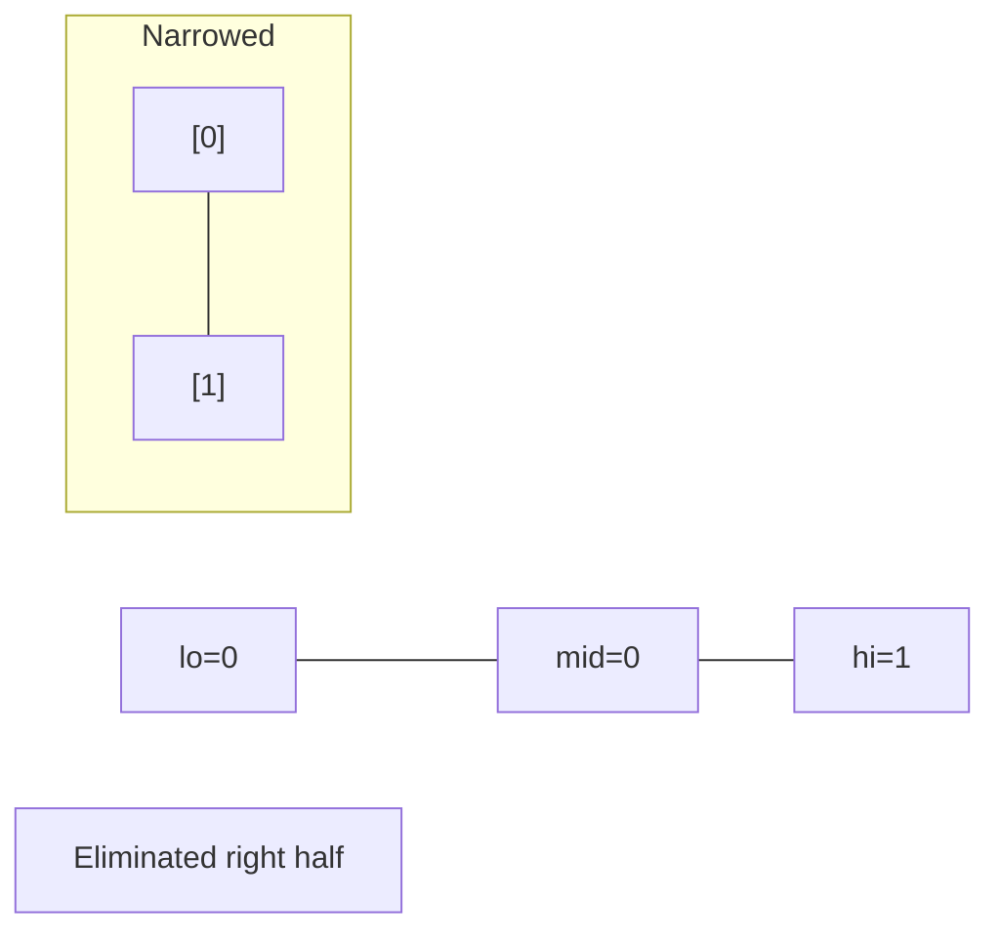
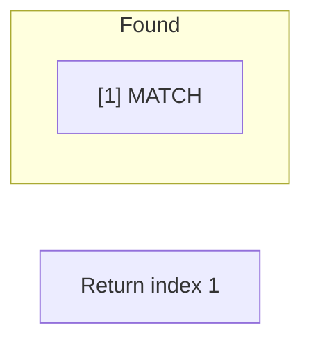

# Problem 2358: Maximum Number of Groups Entering a Competition

**Difficulty:** Medium  
**Tags:** Array, Math, Binary Search, Greedy  
**Pattern:** Binary Search  
**Link:** [leetcode.com/problems/maximum-number-of-groups-entering-a-competition](https://leetcode.com/problems/maximum-number-of-groups-entering-a-competition/)

## Description

You are given a positive integer array `grades` which represents the grades of students in a university. You would like to enter **all** these students into a competition in **ordered** non-empty groups, such that the ordering meets the following conditions:

	- The sum of the grades of students in the `i^th` group is **less than** the sum of the grades of students in the `(i + 1)^th` group, for all groups (except the last).
	- The total number of students in the `i^th` group is **less than** the total number of students in the `(i + 1)^th` group, for all groups (except the last).

Return *the **maximum** number of groups that can be formed*.

 

Example 1:

```

**Input:** grades = [10,6,12,7,3,5]
**Output:** 3
**Explanation:** The following is a possible way to form 3 groups of students:
- 1st group has the students with grades = [12]. Sum of grades: 12. Student count: 1
- 2nd group has the students with grades = [6,7]. Sum of grades: 6 + 7 = 13. Student count: 2
- 3rd group has the students with grades = [10,3,5]. Sum of grades: 10 + 3 + 5 = 18. Student count: 3
It can be shown that it is not possible to form more than 3 groups.

```

Example 2:

```

**Input:** grades = [8,8]
**Output:** 1
**Explanation:** We can only form 1 group, since forming 2 groups would lead to an equal number of students in both groups.

```

 

**Constraints:**

	- `1 <= grades.length <= 10^5`
	- `1 <= grades[i] <= 10^5`

## Approach: Binary Search

Use binary search to halve the search space each iteration. Define the search range [lo, hi], compute mid, and decide which half to keep based on the problem's monotonic condition.

## Pseudocode

```
1. lo = lower_bound, hi = upper_bound
2. While lo <= hi (or lo < hi):
   a. mid = (lo + hi) // 2
   b. If condition(mid) is satisfied: record answer, search left half
   c. Else: search right half
3. Return answer
```

## Algorithm Flow



## Visual State Transitions

**Binary Search Step-by-Step:**

**Frame 1: Initial search space**


**Frame 2: Compare mid, narrow search**


**Frame 3: Found target**



## Complexity Analysis

- **Time:** O(log n)
- **Space:** O(1)

## Solution (Python3)

```python
class Solution:
    def maximumGroups(self, grades: List[int]) -> int:
        # Binary search - O(log n) time, O(1) space
        lo, hi = 0, len(grades) - 1
        while lo <= hi:
            mid = lo + (hi - lo) // 2
            if grades[mid] == grades:
                return mid
            elif grades[mid] < grades:
                lo = mid + 1
            else:
                hi = mid - 1
        return 0
```

## Solution (C++)

```cpp
#include <string>
#include <vector>
using namespace std;

class Solution {
public:
    int maximumGroups(vector<int>& grades) {
        // Binary search - O(log n) time, O(1) space
        int lo = 0, hi = grades.size() - 1;
        while (lo <= hi) {
            int mid = lo + (hi - lo) / 2;
            if (grades[mid] == grades) {
                return mid;
            } else if (grades[mid] < grades) {
                lo = mid + 1;
            } else {
                hi = mid - 1;
            }
        }
        return 0;
    }
};
```
