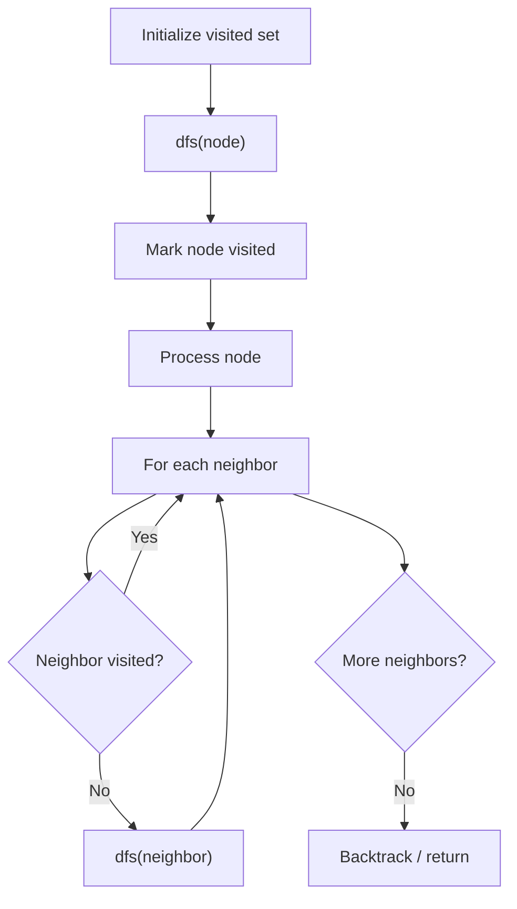

# Problem 2359: Find Closest Node to Given Two Nodes

**Difficulty:** Medium  
**Tags:** Depth-First Search, Graph Theory  
**Pattern:** DFS Graph Traversal  
**Link:** [leetcode.com/problems/find-closest-node-to-given-two-nodes](https://leetcode.com/problems/find-closest-node-to-given-two-nodes/)

## Description

You are given a **directed** graph of `n` nodes numbered from `0` to `n - 1`, where each node has **at most one** outgoing edge.

The graph is represented with a given **0-indexed** array `edges` of size `n`, indicating that there is a directed edge from node `i` to node `edges[i]`. If there is no outgoing edge from `i`, then `edges[i] == -1`.

You are also given two integers `node1` and `node2`.

Return *the **index** of the node that can be reached from both *`node1`* and *`node2`*, such that the **maximum** between the distance from *`node1`* to that node, and from *`node2`* to that node is **minimized***. If there are multiple answers, return the node with the **smallest** index, and if no possible answer exists, return `-1`.

Note that `edges` may contain cycles.

 

Example 1:

```

**Input:** edges = [2,2,3,-1], node1 = 0, node2 = 1
**Output:** 2
**Explanation:** The distance from node 0 to node 2 is 1, and the distance from node 1 to node 2 is 1.
The maximum of those two distances is 1. It can be proven that we cannot get a node with a smaller maximum distance than 1, so we return node 2.

```

Example 2:

```

**Input:** edges = [1,2,-1], node1 = 0, node2 = 2
**Output:** 2
**Explanation:** The distance from node 0 to node 2 is 2, and the distance from node 2 to itself is 0.
The maximum of those two distances is 2. It can be proven that we cannot get a node with a smaller maximum distance than 2, so we return node 2.

```

 

**Constraints:**

	- `n == edges.length`
	- `2 <= n <= 10^5`
	- `-1 <= edges[i] < n`
	- `edges[i] != i`
	- `0 <= node1, node2 < n`

## Approach: DFS Graph Traversal

Explore the graph depth-first using recursion or a stack. Mark nodes as visited to avoid cycles. Process each node and explore all unvisited neighbors.

## Pseudocode

```
1. Initialize visited set
2. Define dfs(node):
   a. Mark node as visited
   b. Process node
   c. For each neighbor of node:
      - If not visited: dfs(neighbor)
3. Call dfs(start) for each unvisited node
```

## Algorithm Flow



## Complexity Analysis

- **Time:** O(V + E)
- **Space:** O(V)

## Solution (Python3)

```python
class Solution:
    def closestMeetingNode(self, edges: List[int], node1: int, node2: int) -> int:
        # DFS on graph - O(V+E) time
        visited = set()
        result = []
        
        def dfs(node):
            if node in visited:
                return
            visited.add(node)
            result.append(node)
            # Traverse neighbors (adjust based on adjacency representation)
        
        dfs(0)
        return result if isinstance(0, list) else len(result)
```

## Solution (C++)

```cpp
#include <functional>
#include <string>
#include <vector>
using namespace std;

class Solution {
public:
    int closestMeetingNode(vector<int>& edges, int node1, int node2) {
        // DFS on graph - O(V+E) time
        vector<bool> visited(edges.size(), false);
        vector<int> result;
        function<void(int)> dfs = [&](int node) {
            if (visited[node]) return;
            visited[node] = true;
            result.push_back(node);
            // Traverse neighbors
        };
        dfs(0);
        return result;
    }
};
```
