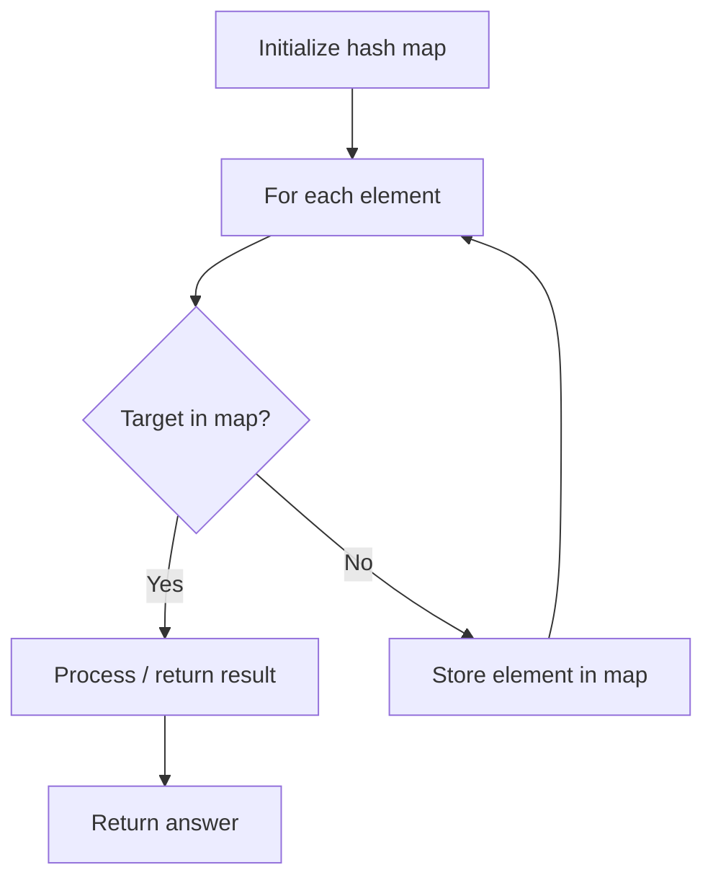

# Problem 2364: Count Number of Bad Pairs

**Difficulty:** Medium  
**Tags:** Array, Hash Table, Math, Counting  
**Pattern:** Hash Map Lookup  
**Link:** [leetcode.com/problems/count-number-of-bad-pairs](https://leetcode.com/problems/count-number-of-bad-pairs/)

## Description

You are given a **0-indexed** integer array `nums`. A pair of indices `(i, j)` is a **bad pair** if `i < j` and `j - i != nums[j] - nums[i]`.

Return* the total number of **bad pairs** in *`nums`.

 

Example 1:

```

**Input:** nums = [4,1,3,3]
**Output:** 5
**Explanation:** The pair (0, 1) is a bad pair since 1 - 0 != 1 - 4.
The pair (0, 2) is a bad pair since 2 - 0 != 3 - 4, 2 != -1.
The pair (0, 3) is a bad pair since 3 - 0 != 3 - 4, 3 != -1.
The pair (1, 2) is a bad pair since 2 - 1 != 3 - 1, 1 != 2.
The pair (2, 3) is a bad pair since 3 - 2 != 3 - 3, 1 != 0.
There are a total of 5 bad pairs, so we return 5.

```

Example 2:

```

**Input:** nums = [1,2,3,4,5]
**Output:** 0
**Explanation:** There are no bad pairs.

```

 

**Constraints:**

	- `1 <= nums.length <= 10^5`
	- `1 <= nums[i] <= 10^9`

## Approach: Hash Map Lookup

Use a hash map (dictionary) to store elements for O(1) lookup. Iterate through the input, checking membership or counting frequencies in the map.

## Pseudocode

```
1. Initialize hash map
2. Iterate through elements:
   a. Check if target/complement exists in map
   b. If found: process result
   c. Otherwise: store element in map
3. Return result
```

## Algorithm Flow



## Complexity Analysis

- **Time:** O(n)
- **Space:** O(n)

## Solution (Python3)

```python
class Solution:
    def countBadPairs(self, nums: List[int]) -> int:
        # Hash map approach - O(n) time, O(n) space
        seen = {}
        for i, val in enumerate(nums):
            complement = nums - val
            if complement in seen:
                return [seen[complement], i]
            seen[val] = i
        return 0
```

## Solution (C++)

```cpp
#include <string>
#include <unordered_map>
#include <vector>
using namespace std;

class Solution {
public:
    int countBadPairs(vector<int>& nums) {
        // Hash map approach - O(n) time, O(n) space
        unordered_map<int, int> seen;
        for (int i = 0; i < nums.size(); i++) {
            int complement = nums - nums[i];
            if (seen.count(complement)) {
                return {seen[complement], i};
            }
            seen[nums[i]] = i;
        }
        return 0;
    }
};
```
