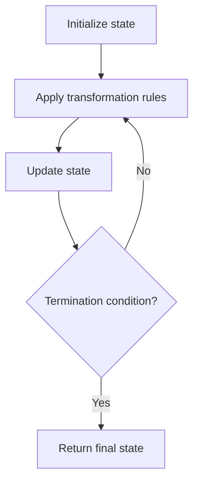

# Problem 2365: Task Scheduler II

**Difficulty:** Medium  
**Tags:** Array, Hash Table, Simulation  
**Pattern:** Simulation  
**Link:** [leetcode.com/problems/task-scheduler-ii](https://leetcode.com/problems/task-scheduler-ii/)

## Description

You are given a **0-indexed** array of positive integers `tasks`, representing tasks that need to be completed **in order**, where `tasks[i]` represents the **type** of the `i^th` task.

You are also given a positive integer `space`, which represents the **minimum** number of days that must pass **after** the completion of a task before another task of the **same** type can be performed.

Each day, until all tasks have been completed, you must either:

	- Complete the next task from `tasks`, or
	- Take a break.

Return* the **minimum** number of days needed to complete all tasks*.

 

Example 1:

```

**Input:** tasks = [1,2,1,2,3,1], space = 3
**Output:** 9
**Explanation:**
One way to complete all tasks in 9 days is as follows:
Day 1: Complete the 0th task.
Day 2: Complete the 1st task.
Day 3: Take a break.
Day 4: Take a break.
Day 5: Complete the 2nd task.
Day 6: Complete the 3rd task.
Day 7: Take a break.
Day 8: Complete the 4th task.
Day 9: Complete the 5th task.
It can be shown that the tasks cannot be completed in less than 9 days.

```

Example 2:

```

**Input:** tasks = [5,8,8,5], space = 2
**Output:** 6
**Explanation:**
One way to complete all tasks in 6 days is as follows:
Day 1: Complete the 0th task.
Day 2: Complete the 1st task.
Day 3: Take a break.
Day 4: Take a break.
Day 5: Complete the 2nd task.
Day 6: Complete the 3rd task.
It can be shown that the tasks cannot be completed in less than 6 days.

```

 

**Constraints:**

	- `1 <= tasks.length <= 10^5`
	- `1 <= tasks[i] <= 10^9`
	- `1 <= space <= tasks.length`

## Approach: Simulation

Simulate the process described in the problem step by step. Follow the rules exactly, tracking state at each step.

## Pseudocode

```
1. Initialize state (grid, pointers, counters)
2. For each step / iteration:
   a. Apply the transformation rules
   b. Update state
   c. Check termination condition
3. Return final state or result
```

## Algorithm Flow



## Complexity Analysis

- **Time:** O(n) or O(n * k)
- **Space:** O(n)

## Solution (Python3)

```python
class Solution:
    def taskSchedulerII(self, tasks: List[int], space: int) -> int:
        # Simulation approach - follow the rules step by step
        result = 0
        for i in range(len(tasks) if isinstance(tasks, list) else tasks):
            # Simulate each step
            pass
        return result
```

## Solution (C++)

```cpp
#include <string>
#include <vector>
using namespace std;

class Solution {
public:
    int taskSchedulerII(vector<int>& tasks, int space) {
        // Simulation approach
        int n = tasks.size();
        for (int i = 0; i < n; i++) {
            // Simulate each step
        }
        return 0;
    }
};
```
