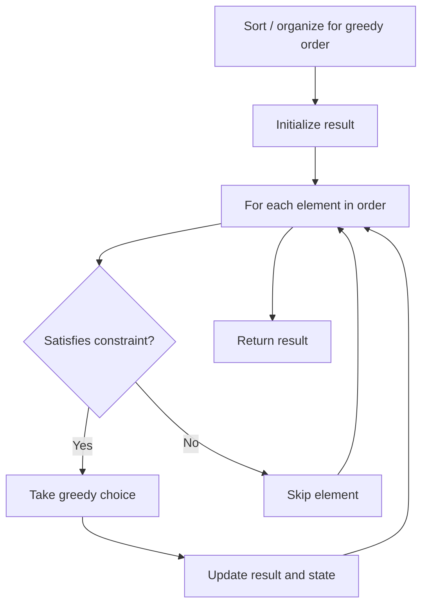

# Problem 2366: Minimum Replacements to Sort the Array

**Difficulty:** Hard  
**Tags:** Array, Math, Greedy  
**Pattern:** Greedy  
**Link:** [leetcode.com/problems/minimum-replacements-to-sort-the-array](https://leetcode.com/problems/minimum-replacements-to-sort-the-array/)

## Description

You are given a **0-indexed** integer array `nums`. In one operation you can replace any element of the array with **any two** elements that **sum** to it.

	- For example, consider `nums = [5,6,7]`. In one operation, we can replace `nums[1]` with `2` and `4` and convert `nums` to `[5,2,4,7]`.

Return *the minimum number of operations to make an array that is sorted in **non-decreasing** order*.

 

Example 1:

```

**Input:** nums = [3,9,3]
**Output:** 2
**Explanation:** Here are the steps to sort the array in non-decreasing order:
- From [3,9,3], replace the 9 with 3 and 6 so the array becomes [3,3,6,3]
- From [3,3,6,3], replace the 6 with 3 and 3 so the array becomes [3,3,3,3,3]
There are 2 steps to sort the array in non-decreasing order. Therefore, we return 2.

```

Example 2:

```

**Input:** nums = [1,2,3,4,5]
**Output:** 0
**Explanation:** The array is already in non-decreasing order. Therefore, we return 0. 

```

 

**Constraints:**

	- `1 <= nums.length <= 10^5`
	- `1 <= nums[i] <= 10^9`

## Approach: Greedy

Make the locally optimal choice at each step, trusting it leads to a global optimum. Greedy works when the problem has the greedy-choice property and optimal substructure.

## Pseudocode

```
1. Sort or organize data for greedy ordering
2. Initialize result
3. For each element in greedy order:
   a. If element satisfies constraint:
      - Take the greedy choice
      - Update result and state
4. Return result
```

## Algorithm Flow



## Complexity Analysis

- **Time:** O(n log n)
- **Space:** O(1)

## Solution (Python3)

```python
class Solution:
    def minimumReplacement(self, nums: List[int]) -> int:
        # Greedy approach - O(n) time
        result = 0
        curr_max = 0
        for i in range(len(nums)):
            if isinstance(nums[i], int):
                curr_max = max(curr_max, nums[i])
                result = max(result, curr_max)
            else:
                result += 1
        return result
```

## Solution (C++)

```cpp
#include <algorithm>
#include <string>
#include <vector>
using namespace std;

class Solution {
public:
    int minimumReplacement(vector<int>& nums) {
        // Greedy approach - O(n) time
        int result = 0, curr_max = 0;
        for (int i = 0; i < (int)nums.size(); i++) {
            curr_max = max(curr_max, nums[i]);
            result = max(result, curr_max);
        }
        return result;
    }
};
```
