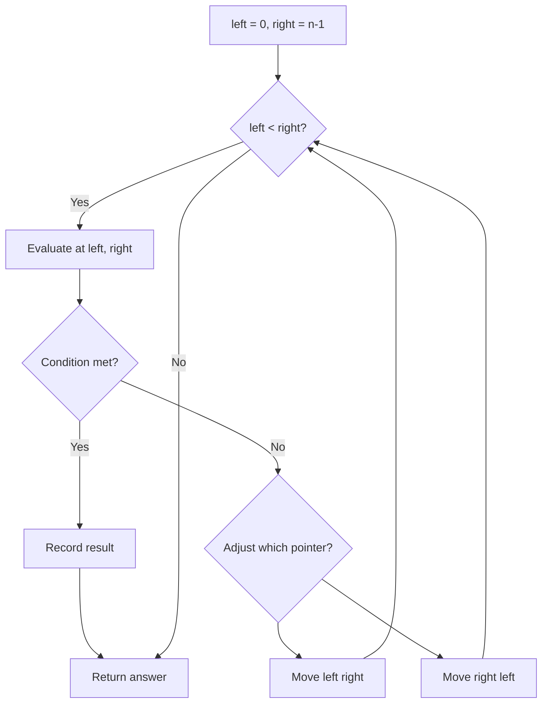
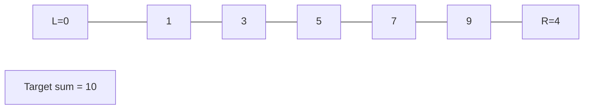
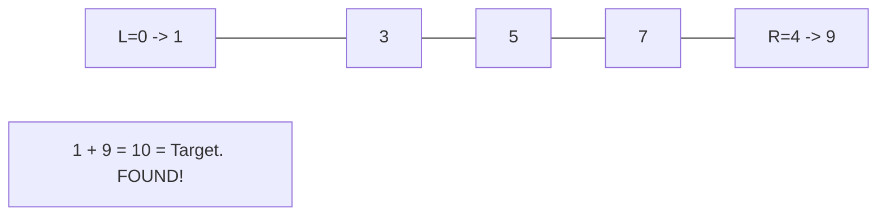

# Problem 2367: Number of Arithmetic Triplets

**Difficulty:** Easy  
**Tags:** Array, Hash Table, Two Pointers, Enumeration  
**Pattern:** Two Pointers  
**Link:** [leetcode.com/problems/number-of-arithmetic-triplets](https://leetcode.com/problems/number-of-arithmetic-triplets/)

## Description

You are given a **0-indexed**, **strictly increasing** integer array `nums` and a positive integer `diff`. A triplet `(i, j, k)` is an **arithmetic triplet** if the following conditions are met:

	- `i < j < k`,
	- `nums[j] - nums[i] == diff`, and
	- `nums[k] - nums[j] == diff`.

Return *the number of unique **arithmetic triplets**.*

 

Example 1:

```

**Input:** nums = [0,1,4,6,7,10], diff = 3
**Output:** 2
**Explanation:**
(1, 2, 4) is an arithmetic triplet because both 7 - 4 == 3 and 4 - 1 == 3.
(2, 4, 5) is an arithmetic triplet because both 10 - 7 == 3 and 7 - 4 == 3. 

```

Example 2:

```

**Input:** nums = [4,5,6,7,8,9], diff = 2
**Output:** 2
**Explanation:**
(0, 2, 4) is an arithmetic triplet because both 8 - 6 == 2 and 6 - 4 == 2.
(1, 3, 5) is an arithmetic triplet because both 9 - 7 == 2 and 7 - 5 == 2.

```

 

**Constraints:**

	- `3 <= nums.length <= 200`
	- `0 <= nums[i] <= 200`
	- `1 <= diff <= 50`
	- `nums` is **strictly** increasing.

## Approach: Two Pointers

Use two pointers moving through the data structure. Depending on the problem, pointers may move toward each other (converging), in the same direction (fast/slow), or independently.

## Pseudocode

```
1. Initialize left = 0, right = n-1 (or two independent pointers)
2. While pointers haven't crossed:
   a. Evaluate condition at pointer positions
   b. Move left pointer right or right pointer left
3. Return result
```

## Algorithm Flow



## Visual State Transitions

**Two Pointer Convergence:**

**Frame 1: Initialize pointers**


**Frame 2: Sum = 1+9 = 10, found!**



## Complexity Analysis

- **Time:** O(n)
- **Space:** O(1)

## Solution (Python3)

```python
class Solution:
    def arithmeticTriplets(self, nums: List[int], diff: int) -> int:
        # Two pointer approach - O(n) time, O(1) space
        left, right = 0, len(nums) - 1
        while left < right:
            curr = nums[left] + nums[right]
            if curr == diff:
                return [left, right]
            elif curr < diff:
                left += 1
            else:
                right -= 1
        return 0
```

## Solution (C++)

```cpp
#include <string>
#include <vector>
using namespace std;

class Solution {
public:
    int arithmeticTriplets(vector<int>& nums, int diff) {
        // Two pointer approach - O(n) time, O(1) space
        int left = 0, right = nums.size() - 1;
        while (left < right) {
            int curr = nums[left] + nums[right];
            if (curr == diff) {
                return {left, right};
            } else if (curr < diff) {
                left++;
            } else {
                right--;
            }
        }
        return 0;
    }
};
```
