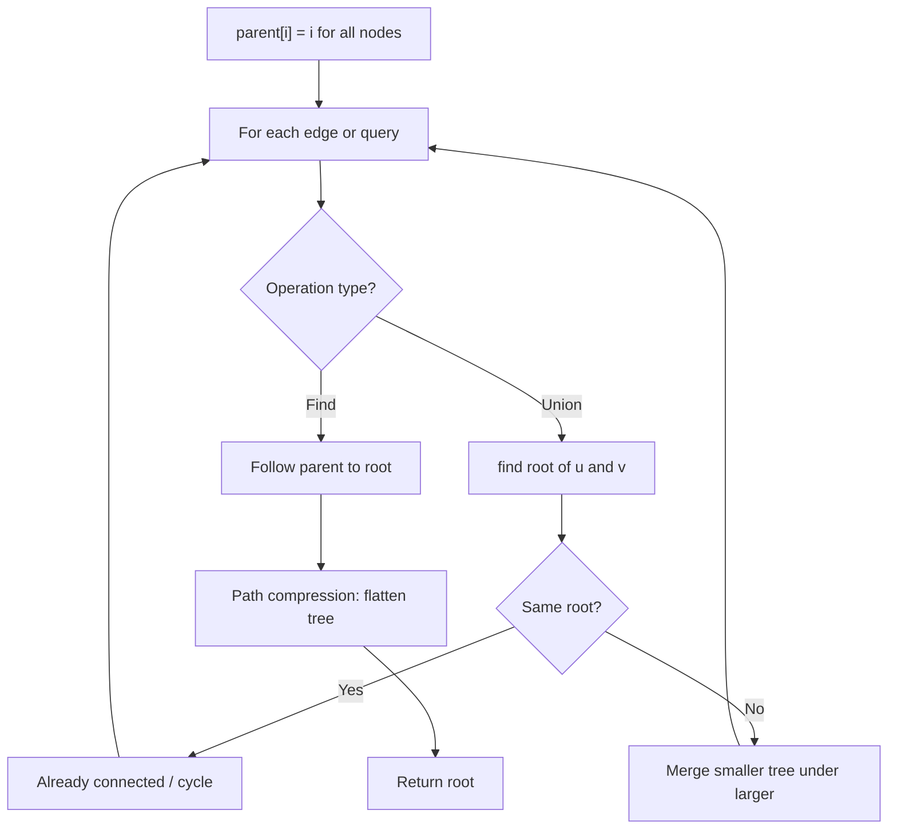
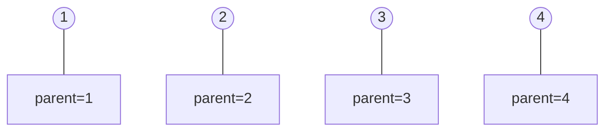
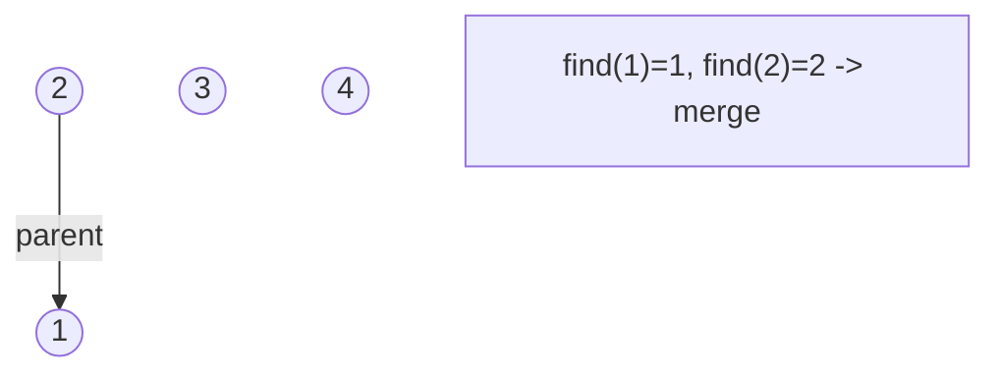
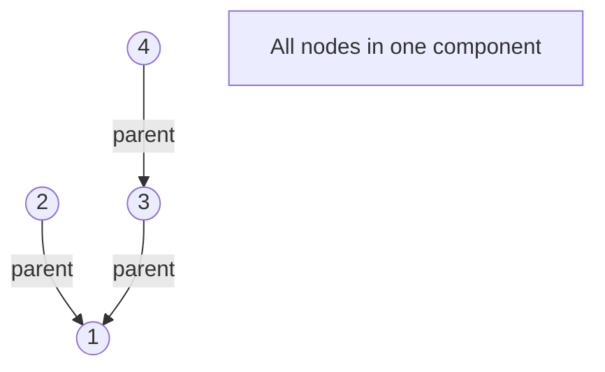
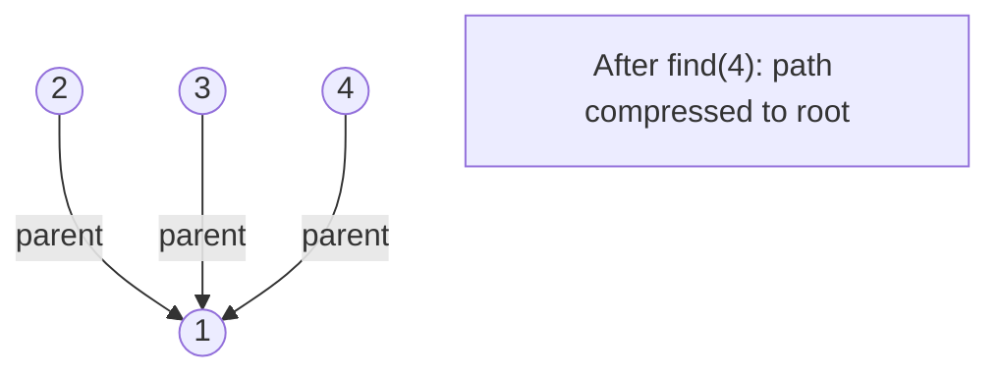

# Problem 2368: Reachable Nodes With Restrictions

**Difficulty:** Medium  
**Tags:** Array, Hash Table, Tree, Depth-First Search, Breadth-First Search, Union-Find, Graph Theory  
**Pattern:** Union-Find / Disjoint Set  
**Link:** [leetcode.com/problems/reachable-nodes-with-restrictions](https://leetcode.com/problems/reachable-nodes-with-restrictions/)

## Description

There is an undirected tree with `n` nodes labeled from `0` to `n - 1` and `n - 1` edges.

You are given a 2D integer array `edges` of length `n - 1` where `edges[i] = [ai, bi]` indicates that there is an edge between nodes `ai` and `bi` in the tree. You are also given an integer array `restricted` which represents **restricted** nodes.

Return *the **maximum** number of nodes you can reach from node *`0`* without visiting a restricted node.*

Note that node `0` will **not** be a restricted node.

 

Example 1:

```

**Input:** n = 7, edges = [[0,1],[1,2],[3,1],[4,0],[0,5],[5,6]], restricted = [4,5]
**Output:** 4
**Explanation:** The diagram above shows the tree.
We have that [0,1,2,3] are the only nodes that can be reached from node 0 without visiting a restricted node.

```

Example 2:

```

**Input:** n = 7, edges = [[0,1],[0,2],[0,5],[0,4],[3,2],[6,5]], restricted = [4,2,1]
**Output:** 3
**Explanation:** The diagram above shows the tree.
We have that [0,5,6] are the only nodes that can be reached from node 0 without visiting a restricted node.

```

 

**Constraints:**

	- `2 <= n <= 10^5`
	- `edges.length == n - 1`
	- `edges[i].length == 2`
	- `0 <= ai, bi < n`
	- `ai != bi`
	- `edges` represents a valid tree.
	- `1 <= restricted.length < n`
	- `1 <= restricted[i] < n`
	- All the values of `restricted` are **unique**.

## Approach: Union-Find / Disjoint Set

Use Union-Find with path compression and union by rank to efficiently manage connected components. Find(x) returns the root of x's component; Union(x,y) merges two components.

## Pseudocode

```
1. parent[i] = i for all nodes (each is its own set)
2. find(x): follow parent pointers to root (with path compression)
3. union(x, y): merge sets of x and y by rank
4. Process edges/operations:
   a. For each edge (u, v): union(u, v)
5. Answer queries using find()
```

## Algorithm Flow



## Visual State Transitions

**Union-Find Step-by-Step:**

**Frame 1: Initial - each node is own parent**


**Frame 2: Union(1,2) - merge components**


**Frame 3: Union(3,4) then Union(2,3)**


**Frame 4: Path compression on find(4)**



## Complexity Analysis

- **Time:** O(n * alpha(n))
- **Space:** O(n)

## Solution (Python3)

```python
class Solution:
    def reachableNodes(self, n: int, edges: List[List[int]], restricted: List[int]) -> int:
        # Union Find (Disjoint Set Union) - O(n * alpha(n))
        parent = list(range(len(n) + 1 if isinstance(n, list) else n + 1))
        rank = [0] * len(parent)
        
        def find(x):
            if parent[x] != x:
                parent[x] = find(parent[x])
            return parent[x]
        
        def union(x, y):
            px, py = find(x), find(y)
            if px == py:
                return False
            if rank[px] < rank[py]:
                px, py = py, px
            parent[py] = px
            if rank[px] == rank[py]:
                rank[px] += 1
            return True
        
        components = len(parent)
        # Process edges/connections
        return components
```

## Solution (C++)

```cpp
#include <functional>
#include <numeric>
#include <string>
#include <vector>
using namespace std;

class Solution {
public:
    int reachableNodes(int n, vector<vector<int>>& edges, vector<int>& restricted) {
        // Union Find (DSU) - O(n * alpha(n))
        int n = n.size();
        vector<int> parent(n + 1), rnk(n + 1, 0);
        iota(parent.begin(), parent.end(), 0);
        function<int(int)> find = [&](int x) -> int {
            return parent[x] == x ? x : parent[x] = find(parent[x]);
        };
        auto unite = [&](int x, int y) -> bool {
            int px = find(x), py = find(y);
            if (px == py) return false;
            if (rnk[px] < rnk[py]) swap(px, py);
            parent[py] = px;
            if (rnk[px] == rnk[py]) rnk[px]++;
            return true;
        };
        int components = n;
        return components;
    }
};
```
