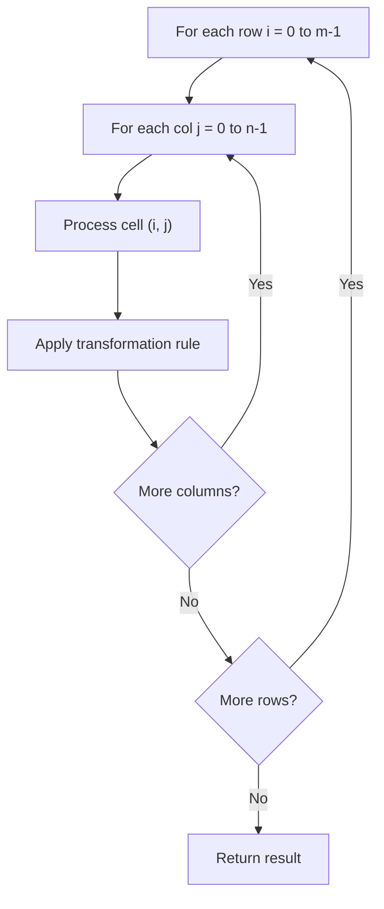

# Problem 2373: Largest Local Values in a Matrix

**Difficulty:** Easy  
**Tags:** Array, Matrix  
**Pattern:** Matrix / 2D Array  
**Link:** [leetcode.com/problems/largest-local-values-in-a-matrix](https://leetcode.com/problems/largest-local-values-in-a-matrix/)

## Description

You are given an `n x n` integer matrix `grid`.

Generate an integer matrix `maxLocal` of size `(n - 2) x (n - 2)` such that:

	- `maxLocal[i][j]` is equal to the **largest** value of the `3 x 3` matrix in `grid` centered around row `i + 1` and column `j + 1`.

In other words, we want to find the largest value in every contiguous `3 x 3` matrix in `grid`.

Return *the generated matrix*.

 

Example 1:

```

**Input:** grid = [[9,9,8,1],[5,6,2,6],[8,2,6,4],[6,2,2,2]]
**Output:** [[9,9],[8,6]]
**Explanation:** The diagram above shows the original matrix and the generated matrix.
Notice that each value in the generated matrix corresponds to the largest value of a contiguous 3 x 3 matrix in grid.
```

Example 2:

```

**Input:** grid = [[1,1,1,1,1],[1,1,1,1,1],[1,1,2,1,1],[1,1,1,1,1],[1,1,1,1,1]]
**Output:** [[2,2,2],[2,2,2],[2,2,2]]
**Explanation:** Notice that the 2 is contained within every contiguous 3 x 3 matrix in grid.

```

 

**Constraints:**

	- `n == grid.length == grid[i].length`
	- `3 <= n <= 100`
	- `1 <= grid[i][j] <= 100`

## Approach: Matrix / 2D Array

Process the matrix row by row or column by column. Common patterns: rotation, spiral traversal, in-place modification, transposition.

## Pseudocode

```
1. For each row i:
   For each column j:
     Process cell (i, j) based on neighbors or rules
2. Handle boundary conditions
3. Return modified matrix or computed result
```

## Algorithm Flow



## Complexity Analysis

- **Time:** O(m * n)
- **Space:** O(1) extra

## Solution (Python3)

```python
class Solution:
    def largestLocal(self, grid: List[List[int]]) -> List[List[int]]:
        # Matrix manipulation - O(m*n) time
        if not grid:
            return []
        m, n = len(grid), len(grid[0])
        # Process matrix in-place or build result
        for i in range(m):
            for j in range(n):
                pass  # Process grid[i][j]
        return []
```

## Solution (C++)

```cpp
#include <string>
#include <vector>
using namespace std;

class Solution {
public:
    vector<vector<int>> largestLocal(vector<vector<int>>& grid) {
        // Matrix manipulation - O(m*n) time
        if (grid.empty()) return {};
        int m = grid.size(), n = grid[0].size();
        for (int i = 0; i < m; i++) {
            for (int j = 0; j < n; j++) {
                // Process matrix[i][j]
            }
        }
        return {};
    }
};
```
