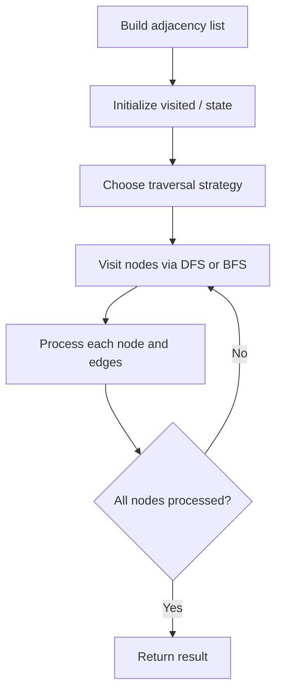

# Problem 2374: Node With Highest Edge Score

**Difficulty:** Medium  
**Tags:** Hash Table, Graph Theory  
**Pattern:** Graph Algorithm  
**Link:** [leetcode.com/problems/node-with-highest-edge-score](https://leetcode.com/problems/node-with-highest-edge-score/)

## Description

You are given a directed graph with `n` nodes labeled from `0` to `n - 1`, where each node has **exactly one** outgoing edge.

The graph is represented by a given **0-indexed** integer array `edges` of length `n`, where `edges[i]` indicates that there is a **directed** edge from node `i` to node `edges[i]`.

The **edge score** of a node `i` is defined as the sum of the **labels** of all the nodes that have an edge pointing to `i`.

Return *the node with the highest **edge score***. If multiple nodes have the same **edge score**, return the node with the **smallest** index.

 

Example 1:

```

**Input:** edges = [1,0,0,0,0,7,7,5]
**Output:** 7
**Explanation:**
- The nodes 1, 2, 3 and 4 have an edge pointing to node 0. The edge score of node 0 is 1 + 2 + 3 + 4 = 10.
- The node 0 has an edge pointing to node 1. The edge score of node 1 is 0.
- The node 7 has an edge pointing to node 5. The edge score of node 5 is 7.
- The nodes 5 and 6 have an edge pointing to node 7. The edge score of node 7 is 5 + 6 = 11.
Node 7 has the highest edge score so return 7.

```

Example 2:

```

**Input:** edges = [2,0,0,2]
**Output:** 0
**Explanation:**
- The nodes 1 and 2 have an edge pointing to node 0. The edge score of node 0 is 1 + 2 = 3.
- The nodes 0 and 3 have an edge pointing to node 2. The edge score of node 2 is 0 + 3 = 3.
Nodes 0 and 2 both have an edge score of 3. Since node 0 has a smaller index, we return 0.

```

 

**Constraints:**

	- `n == edges.length`
	- `2 <= n <= 10^5`
	- `0 <= edges[i] < n`
	- `edges[i] != i`

## Approach: Graph Algorithm

Build an adjacency list/matrix from the input. Apply graph traversal (DFS/BFS), shortest path, or connectivity algorithm as needed.

## Pseudocode

```
1. Build adjacency list from edges
2. Initialize visited/distance arrays
3. Apply traversal algorithm:
   - DFS/BFS for reachability
   - Dijkstra/Bellman-Ford for shortest path
   - Union-Find for connectivity
4. Return result
```

## Algorithm Flow



## Complexity Analysis

- **Time:** O(V + E)
- **Space:** O(V + E)

## Solution (Python3)

```python
class Solution:
    def edgeScore(self, edges: List[int]) -> int:
        # Graph traversal - O(V+E) time
        from collections import defaultdict
        graph = defaultdict(list)
        # Build adjacency list from input
        n = len(edges) if isinstance(edges, list) else edges
        visited = [False] * n
        result = 0
        
        def dfs(node):
            visited[node] = True
            for neighbor in graph[node]:
                if not visited[neighbor]:
                    dfs(neighbor)
        
        for i in range(n):
            if not visited[i]:
                dfs(i)
                result += 1
        return result
```

## Solution (C++)

```cpp
#include <functional>
#include <string>
#include <vector>
using namespace std;

class Solution {
public:
    int edgeScore(vector<int>& edges) {
        // Graph traversal - O(V+E) time
        int n = edges.size();
        vector<vector<int>> graph(n);
        vector<bool> visited(n, false);
        int result = 0;
        function<void(int)> dfs = [&](int node) {
            visited[node] = true;
            for (int neighbor : graph[node]) {
                if (!visited[neighbor]) dfs(neighbor);
            }
        };
        for (int i = 0; i < n; i++) {
            if (!visited[i]) {
                dfs(i);
                result++;
            }
        }
        return result;
    }
};
```
