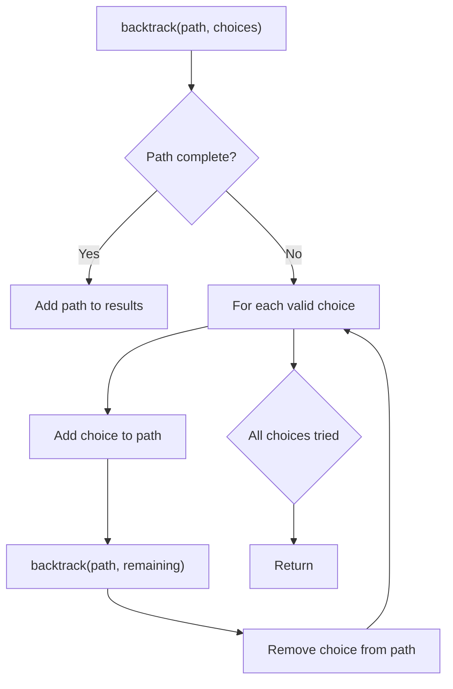
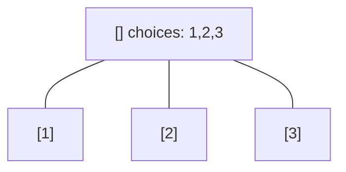
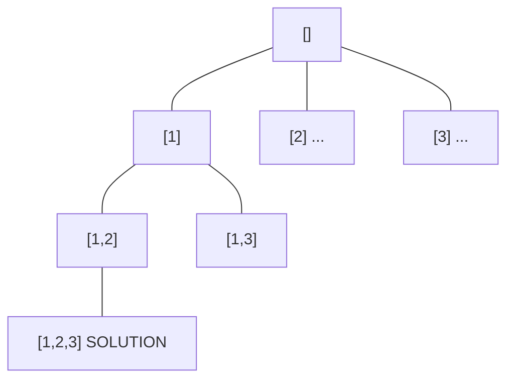
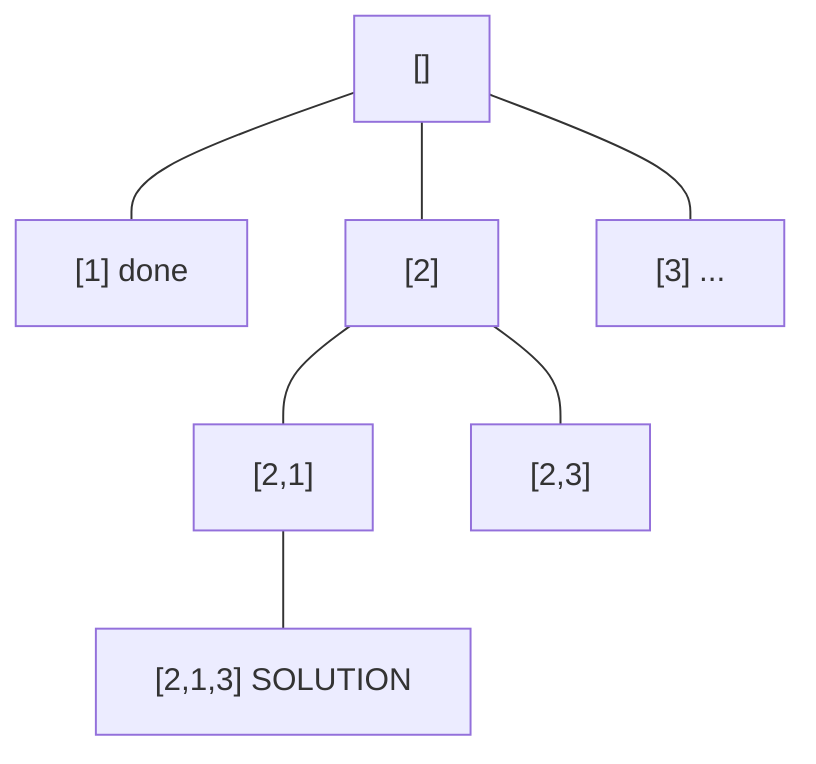
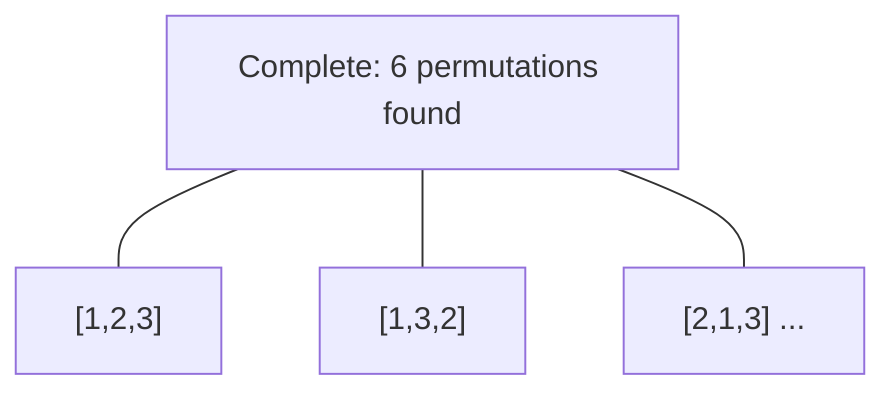

# Problem 2375: Construct Smallest Number From DI String

**Difficulty:** Medium  
**Tags:** String, Backtracking, Stack, Greedy  
**Pattern:** Backtracking  
**Link:** [leetcode.com/problems/construct-smallest-number-from-di-string](https://leetcode.com/problems/construct-smallest-number-from-di-string/)

## Description

You are given a **0-indexed** string `pattern` of length `n` consisting of the characters `'I'` meaning **increasing** and `'D'` meaning **decreasing**.

A **0-indexed** string `num` of length `n + 1` is created using the following conditions:

	- `num` consists of the digits `'1'` to `'9'`, where each digit is used **at most** once.
	- If `pattern[i] == 'I'`, then `num[i] < num[i + 1]`.
	- If `pattern[i] == 'D'`, then `num[i] > num[i + 1]`.

Return *the lexicographically **smallest** possible string *`num`* that meets the conditions.*

 

Example 1:

```

**Input:** pattern = "IIIDIDDD"
**Output:** "123549876"
Explanation:
At indices 0, 1, 2, and 4 we must have that num[i] < num[i+1].
At indices 3, 5, 6, and 7 we must have that num[i] > num[i+1].
Some possible values of num are "245639871", "135749862", and "123849765".
It can be proven that "123549876" is the smallest possible num that meets the conditions.
Note that "123414321" is not possible because the digit '1' is used more than once.
```

Example 2:

```

**Input:** pattern = "DDD"
**Output:** "4321"
**Explanation:**
Some possible values of num are "9876", "7321", and "8742".
It can be proven that "4321" is the smallest possible num that meets the conditions.

```

 

**Constraints:**

	- `1 <= pattern.length <= 8`
	- `pattern` consists of only the letters `'I'` and `'D'`.

## Approach: Backtracking

Explore all possible solutions by building candidates incrementally. At each step, make a choice and recurse. If the choice leads to a dead end, undo the choice (backtrack) and try the next option.

## Pseudocode

```
1. Define backtrack(path, choices):
   a. If path is a complete solution: add to results
   b. For each choice in choices:
      - If choice is valid:
        * Add choice to path
        * backtrack(path, remaining_choices)
        * Remove choice from path (backtrack)
2. Call backtrack([], all_choices)
```

## Algorithm Flow



## Visual State Transitions

**Backtracking Decision Tree:**

**Frame 1: Root - start with empty path**


**Frame 2: Explore branch [1]**


**Frame 3: Backtrack, explore [2]**


**Frame 4: All solutions found**



## Complexity Analysis

- **Time:** O(k^n) or O(n!)
- **Space:** O(n)

## Solution (Python3)

```python
class Solution:
    def smallestNumber(self, pattern: str) -> str:
        # Backtracking - O(2^n) or O(n!) time
        result = []
        
        def backtrack(path, start):
            result.append(path[:])
            for i in range(start, len(pattern)):
                path.append(pattern[i])
                backtrack(path, i + 1)
                path.pop()
        
        backtrack([], 0)
        return result
```

## Solution (C++)

```cpp
#include <functional>
#include <string>
#include <vector>
using namespace std;

class Solution {
public:
    string smallestNumber(string& pattern) {
        // Backtracking - O(2^n) or O(n!) time
        vector<vector<int>> result;
        vector<int> path;
        function<void(int)> backtrack = [&](int start) {
            result.push_back(path);
            for (int i = start; i < (int)pattern.size(); i++) {
                path.push_back(pattern[i]);
                backtrack(i + 1);
                path.pop_back();
            }
        };
        backtrack(0);
        return result;
    }
};
```
