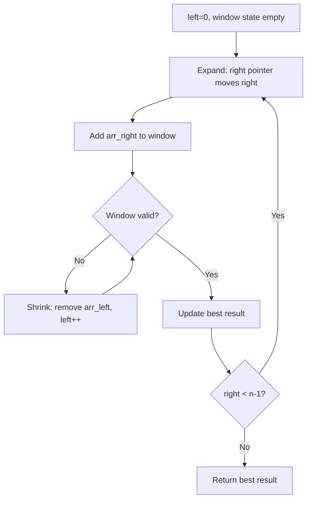
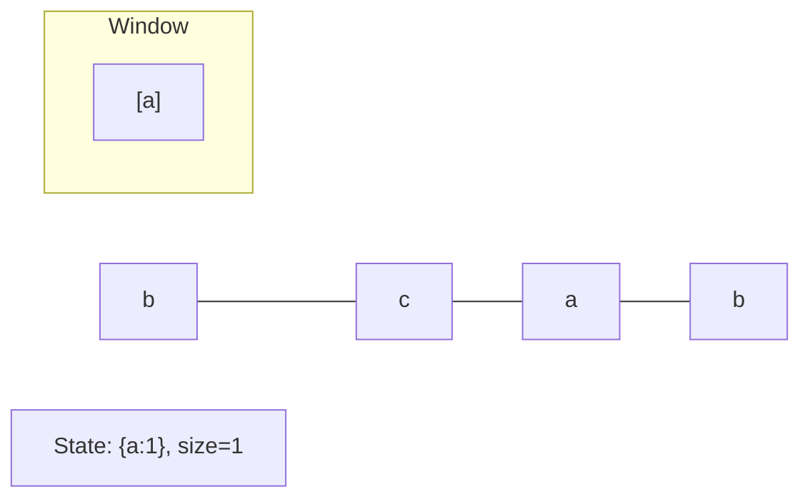
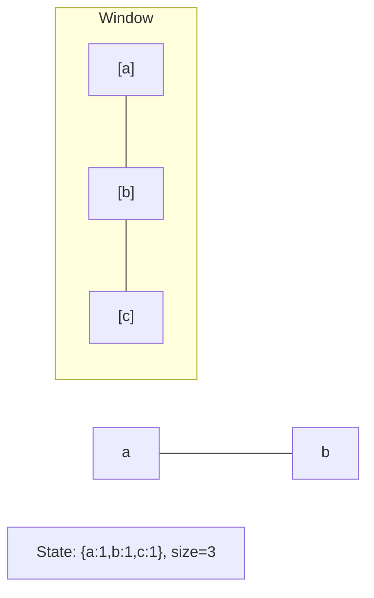
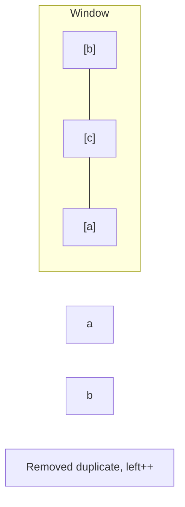
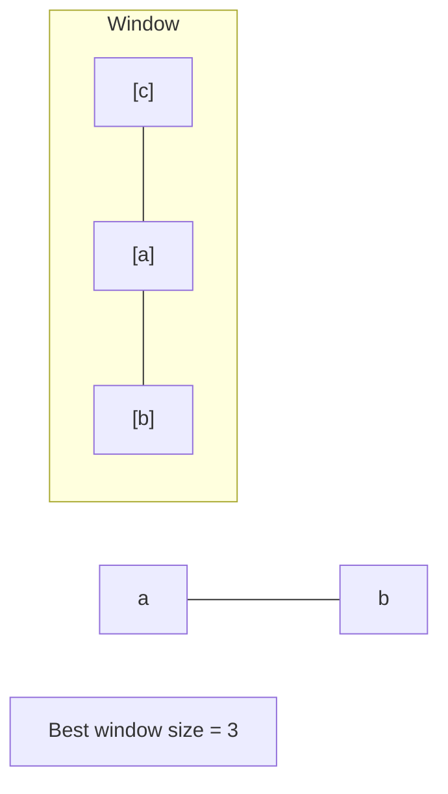

# Problem 2379: Minimum Recolors to Get K Consecutive Black Blocks

**Difficulty:** Easy  
**Tags:** String, Sliding Window  
**Pattern:** Sliding Window  
**Link:** [leetcode.com/problems/minimum-recolors-to-get-k-consecutive-black-blocks](https://leetcode.com/problems/minimum-recolors-to-get-k-consecutive-black-blocks/)

## Description

You are given a **0-indexed** string `blocks` of length `n`, where `blocks[i]` is either `'W'` or `'B'`, representing the color of the `i^th` block. The characters `'W'` and `'B'` denote the colors white and black, respectively.

You are also given an integer `k`, which is the desired number of **consecutive** black blocks.

In one operation, you can **recolor** a white block such that it becomes a black block.

Return* the **minimum** number of operations needed such that there is at least **one** occurrence of *`k`* consecutive black blocks.*

 

Example 1:

```

**Input:** blocks = "WBBWWBBWBW", k = 7
**Output:** 3
**Explanation:**
One way to achieve 7 consecutive black blocks is to recolor the 0th, 3rd, and 4th blocks
so that blocks = "BBBBBBBWBW". 
It can be shown that there is no way to achieve 7 consecutive black blocks in less than 3 operations.
Therefore, we return 3.

```

Example 2:

```

**Input:** blocks = "WBWBBBW", k = 2
**Output:** 0
**Explanation:**
No changes need to be made, since 2 consecutive black blocks already exist.
Therefore, we return 0.

```

 

**Constraints:**

	- `n == blocks.length`
	- `1 <= n <= 100`
	- `blocks[i]` is either `'W'` or `'B'`.
	- `1 <= k <= n`

## Approach: Sliding Window

Maintain a window over the data using two pointers. Expand the right boundary to include new elements, and shrink the left boundary when the window constraint is violated. Track the optimal window.

## Pseudocode

```
1. Initialize left = 0, result = initial_value
2. For right in range(n):
   a. Add element at right to window state
   b. While window is invalid:
      - Remove element at left from window state
      - left++
   c. Update result = best of (result, window size/value)
3. Return result
```

## Algorithm Flow



## Visual State Transitions

**Sliding Window Step-by-Step:**

**Frame 1: Initial window (left=0, right=0)**


**Frame 2: Expand right (right=2)**


**Frame 3: Violation - shrink left**


**Frame 4: Continue expanding**



## Complexity Analysis

- **Time:** O(n)
- **Space:** O(k)

## Solution (Python3)

```python
class Solution:
    def minimumRecolors(self, blocks: str, k: int) -> int:
        # Sliding window approach - O(n) time, O(k) space
        from collections import defaultdict
        window = defaultdict(int)
        left = 0
        result = 0
        for right in range(len(blocks)):
            window[blocks[right]] += 1
            while len(window) > (k if isinstance(k, int) else len(blocks)):
                window[blocks[left]] -= 1
                if window[blocks[left]] == 0:
                    del window[blocks[left]]
                left += 1
            result = max(result, right - left + 1)
        return result
```

## Solution (C++)

```cpp
#include <algorithm>
#include <string>
#include <unordered_map>
#include <vector>
using namespace std;

class Solution {
public:
    int minimumRecolors(string& blocks, int k) {
        // Sliding window approach - O(n) time, O(k) space
        unordered_map<char, int> window;
        int left = 0, result = 0;
        for (int right = 0; right < blocks.size(); right++) {
            window[blocks[right]]++;
            while ((int)window.size() > k) {
                window[blocks[left]]--;
                if (window[blocks[left]] == 0)
                    window.erase(blocks[left]);
                left++;
            }
            result = max(result, right - left + 1);
        }
        return result;
    }
};
```
