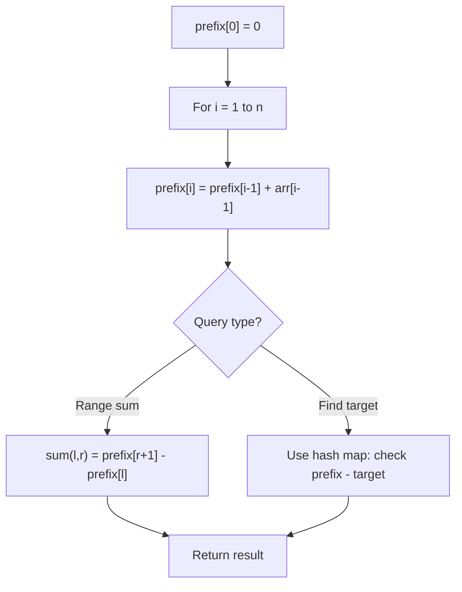

# Problem 2381: Shifting Letters II

**Difficulty:** Medium  
**Tags:** Array, String, Prefix Sum  
**Pattern:** Prefix Sum  
**Link:** [leetcode.com/problems/shifting-letters-ii](https://leetcode.com/problems/shifting-letters-ii/)

## Description

You are given a string `s` of lowercase English letters and a 2D integer array `shifts` where `shifts[i] = [starti, endi, directioni]`. For every `i`, **shift** the characters in `s` from the index `starti` to the index `endi` (**inclusive**) forward if `directioni = 1`, or shift the characters backward if `directioni = 0`.

Shifting a character **forward** means replacing it with the **next** letter in the alphabet (wrapping around so that `'z'` becomes `'a'`). Similarly, shifting a character **backward** means replacing it with the **previous** letter in the alphabet (wrapping around so that `'a'` becomes `'z'`).

Return *the final string after all such shifts to *`s`* are applied*.

 

Example 1:

```

**Input:** s = "abc", shifts = [[0,1,0],[1,2,1],[0,2,1]]
**Output:** "ace"
**Explanation:** Firstly, shift the characters from index 0 to index 1 backward. Now s = "zac".
Secondly, shift the characters from index 1 to index 2 forward. Now s = "zbd".
Finally, shift the characters from index 0 to index 2 forward. Now s = "ace".
```

Example 2:

```

**Input:** s = "dztz", shifts = [[0,0,0],[1,1,1]]
**Output:** "catz"
**Explanation:** Firstly, shift the characters from index 0 to index 0 backward. Now s = "cztz".
Finally, shift the characters from index 1 to index 1 forward. Now s = "catz".

```

 

**Constraints:**

	- `1 <= s.length, shifts.length <= 5 * 10^4`
	- `shifts[i].length == 3`
	- `0 <= starti <= endi < s.length`
	- `0 <= directioni <= 1`
	- `s` consists of lowercase English letters.

## Approach: Prefix Sum

Build a prefix sum array where prefix[i] = sum of elements 0..i-1. Any subarray sum [l..r] = prefix[r+1] - prefix[l]. Combine with hash map for O(n) subarray sum queries.

## Pseudocode

```
1. Build prefix sum array: prefix[0]=0, prefix[i]=prefix[i-1]+arr[i-1]
2. Use prefix sums to answer queries:
   - Subarray sum [l..r] = prefix[r+1] - prefix[l]
   - Or use hash map to find prefix[j]-prefix[i] == target
3. Return result
```

## Algorithm Flow



## Complexity Analysis

- **Time:** O(n)
- **Space:** O(n)

## Solution (Python3)

```python
class Solution:
    def shiftingLetters(self, s: str, shifts: List[List[int]]) -> str:
        # Prefix sum approach - O(n) time, O(n) space
        prefix = {0: -1}
        curr_sum = 0
        result = 0
        target = shifts if isinstance(shifts, int) else 0
        for i, val in enumerate(s):
            curr_sum += val
            if curr_sum - target in prefix:
                result = max(result, i - prefix[curr_sum - target])
            if curr_sum not in prefix:
                prefix[curr_sum] = i
        return result
```

## Solution (C++)

```cpp
#include <algorithm>
#include <string>
#include <unordered_map>
#include <vector>
using namespace std;

class Solution {
public:
    string shiftingLetters(string& s, vector<vector<int>>& shifts) {
        // Prefix sum approach - O(n) time, O(n) space
        unordered_map<int, int> prefix;
        prefix[0] = -1;
        int curr_sum = 0, result = 0;
        int target = shifts;
        for (int i = 0; i < (int)s.size(); i++) {
            curr_sum += s[i];
            if (prefix.count(curr_sum - target)) {
                result = max(result, i - prefix[curr_sum - target]);
            }
            if (!prefix.count(curr_sum)) {
                prefix[curr_sum] = i;
            }
        }
        return result;
    }
};
```
