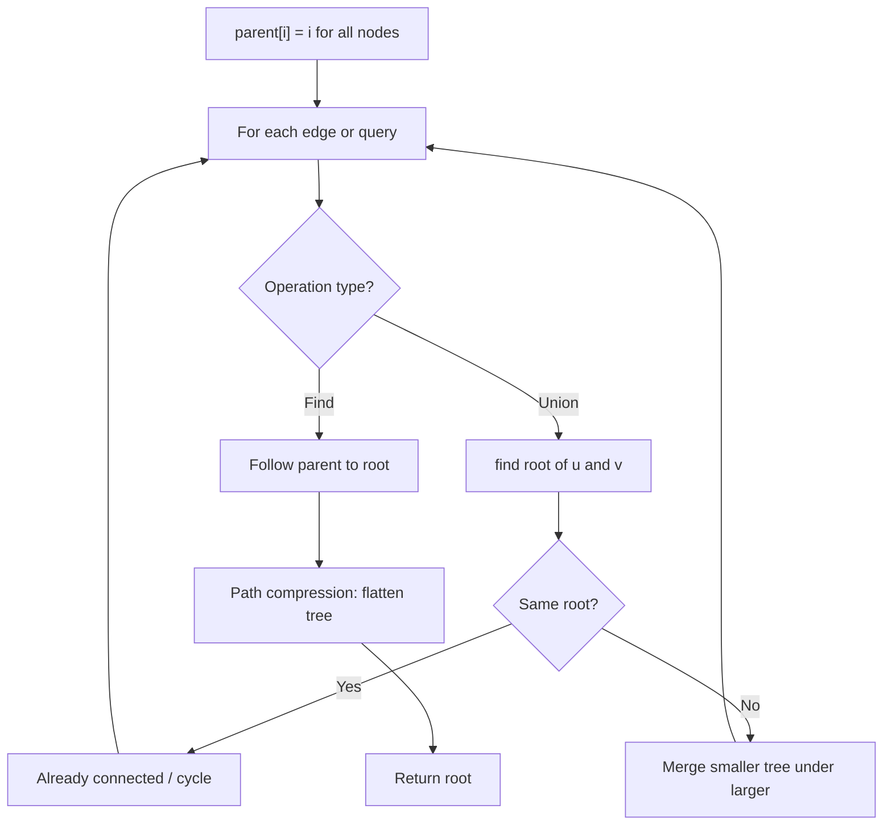
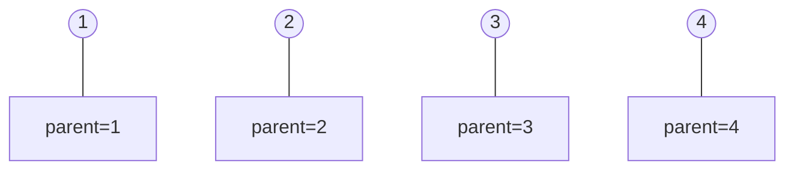
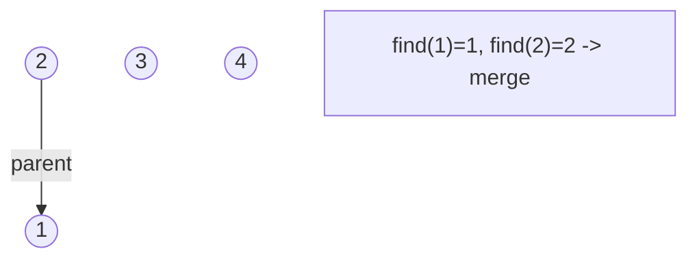
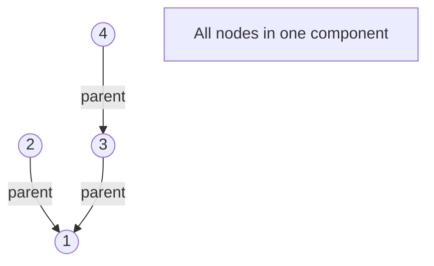
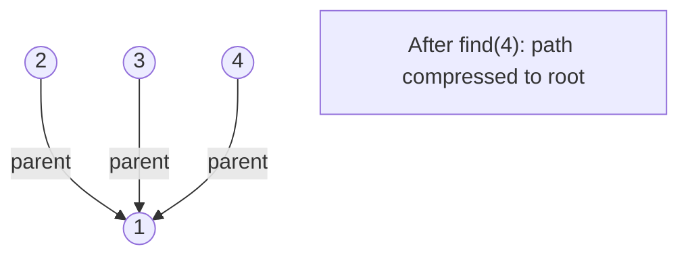

# Problem 2382: Maximum Segment Sum After Removals

**Difficulty:** Hard  
**Tags:** Array, Union-Find, Prefix Sum, Ordered Set  
**Pattern:** Union-Find / Disjoint Set  
**Link:** [leetcode.com/problems/maximum-segment-sum-after-removals](https://leetcode.com/problems/maximum-segment-sum-after-removals/)

## Description

You are given two **0-indexed** integer arrays `nums` and `removeQueries`, both of length `n`. For the `i^th` query, the element in `nums` at the index `removeQueries[i]` is removed, splitting `nums` into different segments.

A **segment** is a contiguous sequence of **positive** integers in `nums`. A **segment sum** is the sum of every element in a segment.

Return* an integer array *`answer`*, of length *`n`*, where *`answer[i]`* is the **maximum** segment sum after applying the *`i^th` *removal.*

**Note:** The same index will **not** be removed more than once.

 

Example 1:

```

**Input:** nums = [1,2,5,6,1], removeQueries = [0,3,2,4,1]
**Output:** [14,7,2,2,0]
**Explanation:** Using 0 to indicate a removed element, the answer is as follows:
Query 1: Remove the 0th element, nums becomes [0,2,5,6,1] and the maximum segment sum is 14 for segment [2,5,6,1].
Query 2: Remove the 3rd element, nums becomes [0,2,5,0,1] and the maximum segment sum is 7 for segment [2,5].
Query 3: Remove the 2nd element, nums becomes [0,2,0,0,1] and the maximum segment sum is 2 for segment [2]. 
Query 4: Remove the 4th element, nums becomes [0,2,0,0,0] and the maximum segment sum is 2 for segment [2]. 
Query 5: Remove the 1st element, nums becomes [0,0,0,0,0] and the maximum segment sum is 0, since there are no segments.
Finally, we return [14,7,2,2,0].
```

Example 2:

```

**Input:** nums = [3,2,11,1], removeQueries = [3,2,1,0]
**Output:** [16,5,3,0]
**Explanation:** Using 0 to indicate a removed element, the answer is as follows:
Query 1: Remove the 3rd element, nums becomes [3,2,11,0] and the maximum segment sum is 16 for segment [3,2,11].
Query 2: Remove the 2nd element, nums becomes [3,2,0,0] and the maximum segment sum is 5 for segment [3,2].
Query 3: Remove the 1st element, nums becomes [3,0,0,0] and the maximum segment sum is 3 for segment [3].
Query 4: Remove the 0th element, nums becomes [0,0,0,0] and the maximum segment sum is 0, since there are no segments.
Finally, we return [16,5,3,0].

```

 

**Constraints:**

	- `n == nums.length == removeQueries.length`
	- `1 <= n <= 10^5`
	- `1 <= nums[i] <= 10^9`
	- `0 <= removeQueries[i] < n`
	- All the values of `removeQueries` are **unique**.

## Approach: Union-Find / Disjoint Set

Use Union-Find with path compression and union by rank to efficiently manage connected components. Find(x) returns the root of x's component; Union(x,y) merges two components.

## Pseudocode

```
1. parent[i] = i for all nodes (each is its own set)
2. find(x): follow parent pointers to root (with path compression)
3. union(x, y): merge sets of x and y by rank
4. Process edges/operations:
   a. For each edge (u, v): union(u, v)
5. Answer queries using find()
```

## Algorithm Flow



## Visual State Transitions

**Union-Find Step-by-Step:**

**Frame 1: Initial - each node is own parent**


**Frame 2: Union(1,2) - merge components**


**Frame 3: Union(3,4) then Union(2,3)**


**Frame 4: Path compression on find(4)**



## Complexity Analysis

- **Time:** O(n * alpha(n))
- **Space:** O(n)

## Solution (Python3)

```python
class Solution:
    def maximumSegmentSum(self, nums: List[int], removeQueries: List[int]) -> List[int]:
        # Union Find (Disjoint Set Union) - O(n * alpha(n))
        parent = list(range(len(nums) + 1 if isinstance(nums, list) else nums + 1))
        rank = [0] * len(parent)
        
        def find(x):
            if parent[x] != x:
                parent[x] = find(parent[x])
            return parent[x]
        
        def union(x, y):
            px, py = find(x), find(y)
            if px == py:
                return False
            if rank[px] < rank[py]:
                px, py = py, px
            parent[py] = px
            if rank[px] == rank[py]:
                rank[px] += 1
            return True
        
        components = len(parent)
        # Process edges/connections
        return components
```

## Solution (C++)

```cpp
#include <functional>
#include <numeric>
#include <string>
#include <vector>
using namespace std;

class Solution {
public:
    vector<int> maximumSegmentSum(vector<int>& nums, vector<int>& removeQueries) {
        // Union Find (DSU) - O(n * alpha(n))
        int n = nums.size();
        vector<int> parent(n + 1), rnk(n + 1, 0);
        iota(parent.begin(), parent.end(), 0);
        function<int(int)> find = [&](int x) -> int {
            return parent[x] == x ? x : parent[x] = find(parent[x]);
        };
        auto unite = [&](int x, int y) -> bool {
            int px = find(x), py = find(y);
            if (px == py) return false;
            if (rnk[px] < rnk[py]) swap(px, py);
            parent[py] = px;
            if (rnk[px] == rnk[py]) rnk[px]++;
            return true;
        };
        int components = n;
        return components;
    }
};
```
