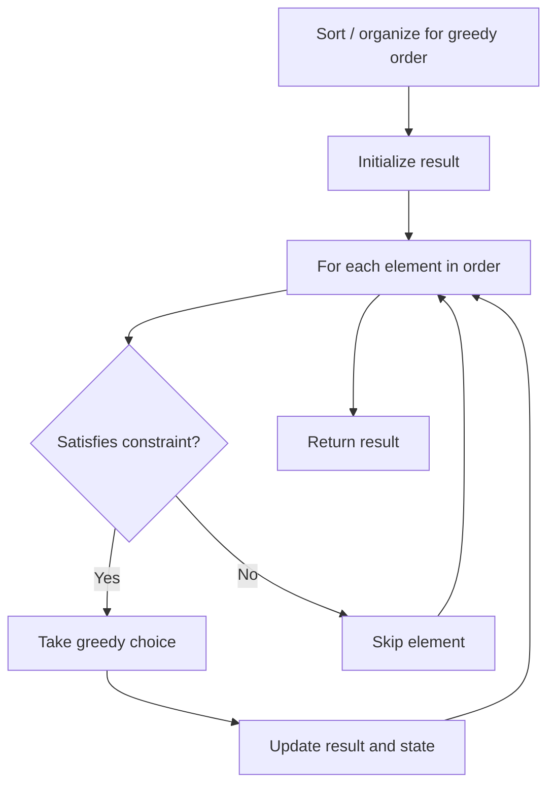

# Problem 2383: Minimum Hours of Training to Win a Competition

**Difficulty:** Easy  
**Tags:** Array, Greedy  
**Pattern:** Greedy  
**Link:** [leetcode.com/problems/minimum-hours-of-training-to-win-a-competition](https://leetcode.com/problems/minimum-hours-of-training-to-win-a-competition/)

## Description

You are entering a competition, and are given two **positive** integers `initialEnergy` and `initialExperience` denoting your initial energy and initial experience respectively.

You are also given two **0-indexed** integer arrays `energy` and `experience`, both of length `n`.

You will face `n` opponents **in order**. The energy and experience of the `i^th` opponent is denoted by `energy[i]` and `experience[i]` respectively. When you face an opponent, you need to have both **strictly** greater experience and energy to defeat them and move to the next opponent if available.

Defeating the `i^th` opponent **increases** your experience by `experience[i]`, but **decreases** your energy by `energy[i]`.

Before starting the competition, you can train for some number of hours. After each hour of training, you can **either** choose to increase your initial experience by one, or increase your initial energy by one.

Return *the **minimum** number of training hours required to defeat all *`n`* opponents*.

 

Example 1:

```

**Input:** initialEnergy = 5, initialExperience = 3, energy = [1,4,3,2], experience = [2,6,3,1]
**Output:** 8
**Explanation:** You can increase your energy to 11 after 6 hours of training, and your experience to 5 after 2 hours of training.
You face the opponents in the following order:
- You have more energy and experience than the 0th opponent so you win.
  Your energy becomes 11 - 1 = 10, and your experience becomes 5 + 2 = 7.
- You have more energy and experience than the 1st opponent so you win.
  Your energy becomes 10 - 4 = 6, and your experience becomes 7 + 6 = 13.
- You have more energy and experience than the 2nd opponent so you win.
  Your energy becomes 6 - 3 = 3, and your experience becomes 13 + 3 = 16.
- You have more energy and experience than the 3rd opponent so you win.
  Your energy becomes 3 - 2 = 1, and your experience becomes 16 + 1 = 17.
You did a total of 6 + 2 = 8 hours of training before the competition, so we return 8.
It can be proven that no smaller answer exists.

```

Example 2:

```

**Input:** initialEnergy = 2, initialExperience = 4, energy = [1], experience = [3]
**Output:** 0
**Explanation:** You do not need any additional energy or experience to win the competition, so we return 0.

```

 

**Constraints:**

	- `n == energy.length == experience.length`
	- `1 <= n <= 100`
	- `1 <= initialEnergy, initialExperience, energy[i], experience[i] <= 100`

## Approach: Greedy

Make the locally optimal choice at each step, trusting it leads to a global optimum. Greedy works when the problem has the greedy-choice property and optimal substructure.

## Pseudocode

```
1. Sort or organize data for greedy ordering
2. Initialize result
3. For each element in greedy order:
   a. If element satisfies constraint:
      - Take the greedy choice
      - Update result and state
4. Return result
```

## Algorithm Flow



## Complexity Analysis

- **Time:** O(n log n)
- **Space:** O(1)

## Solution (Python3)

```python
class Solution:
    def minNumberOfHours(self, initialEnergy: int, initialExperience: int, energy: List[int], experience: List[int]) -> int:
        # Greedy approach - O(n) time
        result = 0
        curr_max = 0
        for i in range(len(initialEnergy)):
            if isinstance(initialEnergy[i], int):
                curr_max = max(curr_max, initialEnergy[i])
                result = max(result, curr_max)
            else:
                result += 1
        return result
```

## Solution (C++)

```cpp
#include <algorithm>
#include <string>
#include <vector>
using namespace std;

class Solution {
public:
    int minNumberOfHours(int initialEnergy, int initialExperience, vector<int>& energy, vector<int>& experience) {
        // Greedy approach - O(n) time
        int result = 0, curr_max = 0;
        for (int i = 0; i < (int)initialEnergy.size(); i++) {
            curr_max = max(curr_max, initialEnergy[i]);
            result = max(result, curr_max);
        }
        return result;
    }
};
```
