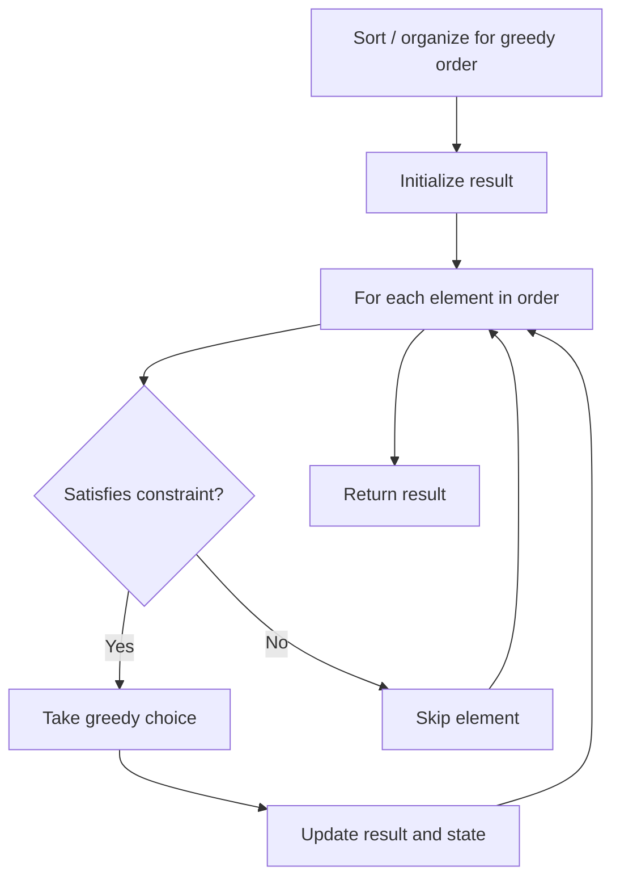

# Problem 2384: Largest Palindromic Number

**Difficulty:** Medium  
**Tags:** Hash Table, String, Greedy, Counting  
**Pattern:** Greedy  
**Link:** [leetcode.com/problems/largest-palindromic-number](https://leetcode.com/problems/largest-palindromic-number/)

## Description

You are given a string `num` consisting of digits only.

Return *the **largest palindromic** integer (in the form of a string) that can be formed using digits taken from *`num`. It should not contain **leading zeroes**.

**Notes:**

	- You do **not** need to use all the digits of `num`, but you must use **at least** one digit.
	- The digits can be reordered.

 

Example 1:

```

**Input:** num = "444947137"
**Output:** "7449447"
**Explanation:** 
Use the digits "4449477" from "**44494****7**13**7**" to form the palindromic integer "7449447".
It can be shown that "7449447" is the largest palindromic integer that can be formed.

```

Example 2:

```

**Input:** num = "00009"
**Output:** "9"
**Explanation:** 
It can be shown that "9" is the largest palindromic integer that can be formed.
Note that the integer returned should not contain leading zeroes.

```

 

**Constraints:**

	- `1 <= num.length <= 10^5`
	- `num` consists of digits.

## Approach: Greedy

Make the locally optimal choice at each step, trusting it leads to a global optimum. Greedy works when the problem has the greedy-choice property and optimal substructure.

## Pseudocode

```
1. Sort or organize data for greedy ordering
2. Initialize result
3. For each element in greedy order:
   a. If element satisfies constraint:
      - Take the greedy choice
      - Update result and state
4. Return result
```

## Algorithm Flow



## Complexity Analysis

- **Time:** O(n log n)
- **Space:** O(1)

## Solution (Python3)

```python
class Solution:
    def largestPalindromic(self, num: str) -> str:
        # Greedy approach - O(n) time
        result = 0
        curr_max = 0
        for i in range(len(num)):
            if isinstance(num[i], int):
                curr_max = max(curr_max, num[i])
                result = max(result, curr_max)
            else:
                result += 1
        return result
```

## Solution (C++)

```cpp
#include <algorithm>
#include <string>
#include <vector>
using namespace std;

class Solution {
public:
    string largestPalindromic(string& num) {
        // Greedy approach - O(n) time
        int result = 0, curr_max = 0;
        for (int i = 0; i < (int)num.size(); i++) {
            curr_max = max(curr_max, num[i]);
            result = max(result, curr_max);
        }
        return result;
    }
};
```
