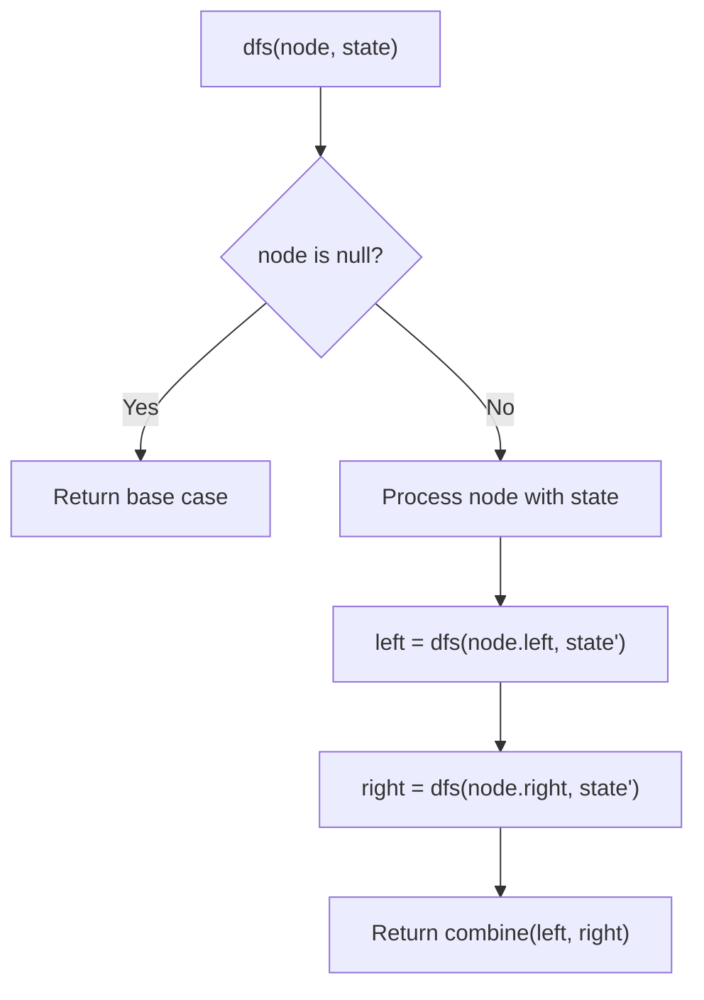
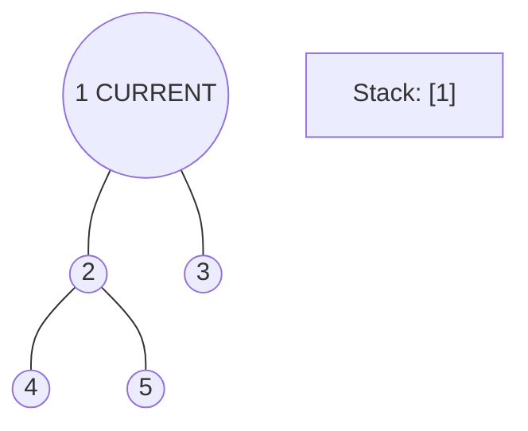
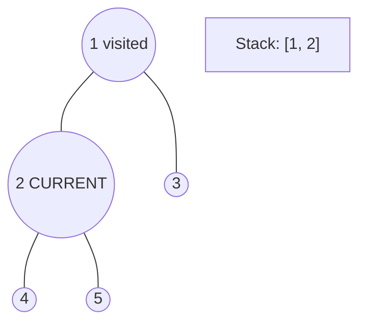
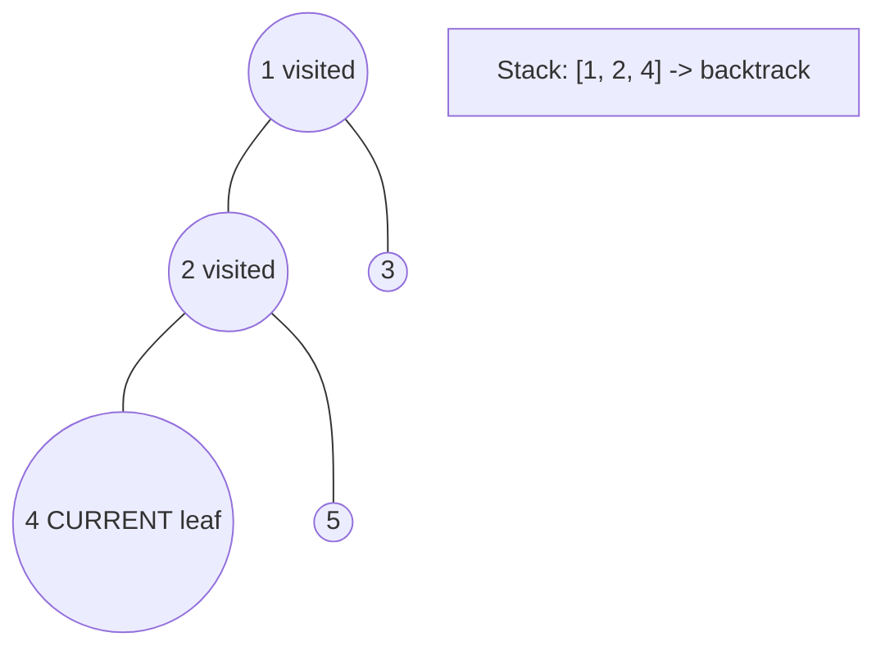
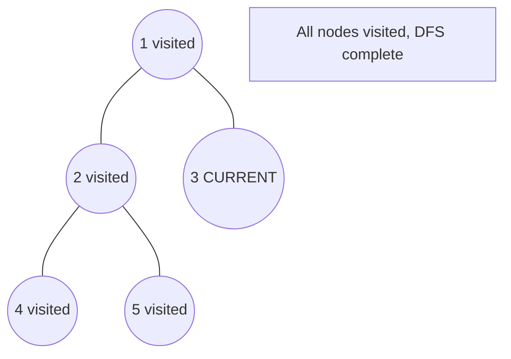

# Problem 2385: Amount of Time for Binary Tree to Be Infected

**Difficulty:** Medium  
**Tags:** Hash Table, Tree, Depth-First Search, Breadth-First Search, Binary Tree  
**Pattern:** DFS Tree Traversal  
**Link:** [leetcode.com/problems/amount-of-time-for-binary-tree-to-be-infected](https://leetcode.com/problems/amount-of-time-for-binary-tree-to-be-infected/)

## Description

You are given the `root` of a binary tree with **unique** values, and an integer `start`. At minute `0`, an **infection** starts from the node with value `start`.

Each minute, a node becomes infected if:

	- The node is currently uninfected.
	- The node is adjacent to an infected node.

Return *the number of minutes needed for the entire tree to be infected.*

 

Example 1:

```

**Input:** root = [1,5,3,null,4,10,6,9,2], start = 3
**Output:** 4
**Explanation:** The following nodes are infected during:
- Minute 0: Node 3
- Minute 1: Nodes 1, 10 and 6
- Minute 2: Node 5
- Minute 3: Node 4
- Minute 4: Nodes 9 and 2
It takes 4 minutes for the whole tree to be infected so we return 4.

```

Example 2:

```

**Input:** root = [1], start = 1
**Output:** 0
**Explanation:** At minute 0, the only node in the tree is infected so we return 0.

```

 

**Constraints:**

	- The number of nodes in the tree is in the range `[1, 10^5]`.
	- `1 <= Node.val <= 10^5`
	- Each node has a **unique** value.
	- A node with a value of `start` exists in the tree.

## Approach: DFS Tree Traversal

Perform depth-first search on the tree. Recurse on left and right subtrees, combining results bottom-up. Track state (path, depth, sum) during traversal.

## Pseudocode

```
1. Define dfs(node, state):
   a. Base case: if null, return default
   b. Process node with current state
   c. left_result = dfs(node.left, updated_state)
   d. right_result = dfs(node.right, updated_state)
   e. Return combine(left_result, right_result)
2. Return dfs(root, initial_state)
```

## Algorithm Flow



## Visual State Transitions

**DFS Tree Traversal Step-by-Step:**

**Frame 1: Start at root**


**Frame 2: Go left - visit node 2**


**Frame 3: Go left - visit node 4 (leaf)**


**Frame 4: Backtrack, visit node 5, then node 3**



## Complexity Analysis

- **Time:** O(n)
- **Space:** O(h)

## Solution (Python3)

```python
class Solution:
    def amountOfTime(self, root: Optional[TreeNode], start: int) -> int:
        # DFS on binary tree - O(n) time, O(h) space
        def dfs(node):
            if not node:
                return 0
            left = dfs(node.left)
            right = dfs(node.right)
            return 1 + max(left, right)
        
        result = dfs(root)
        return result
```

## Solution (C++)

```cpp
#include <algorithm>
#include <functional>
#include <string>
#include <vector>
using namespace std;

class Solution {
public:
    int amountOfTime(TreeNode* root, int start) {
        // DFS on binary tree - O(n) time, O(h) space
        function<int(TreeNode*)> dfs = [&](TreeNode* node) -> int {
            if (!node) return 0;
            int left = dfs(node->left);
            int right = dfs(node->right);
            return 1 + max(left, right);
        };
        return dfs(root);
    }
};
```
