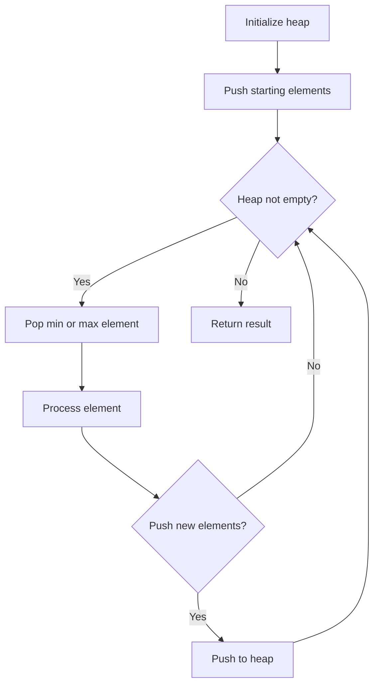
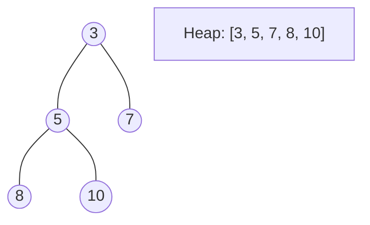
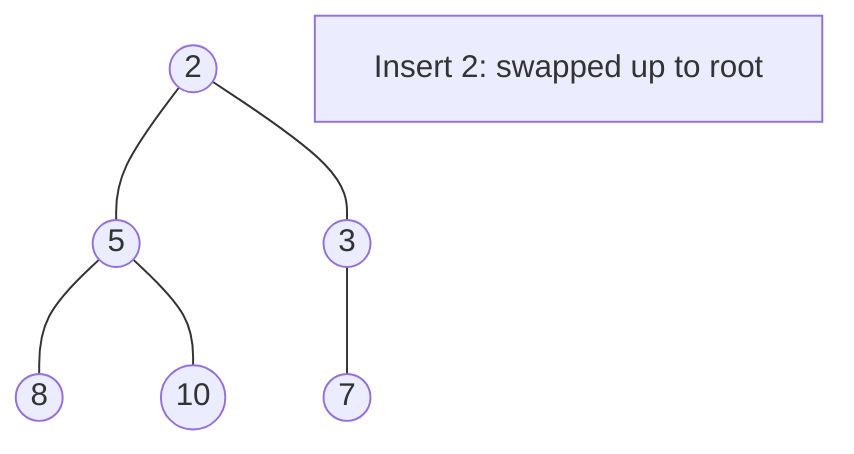
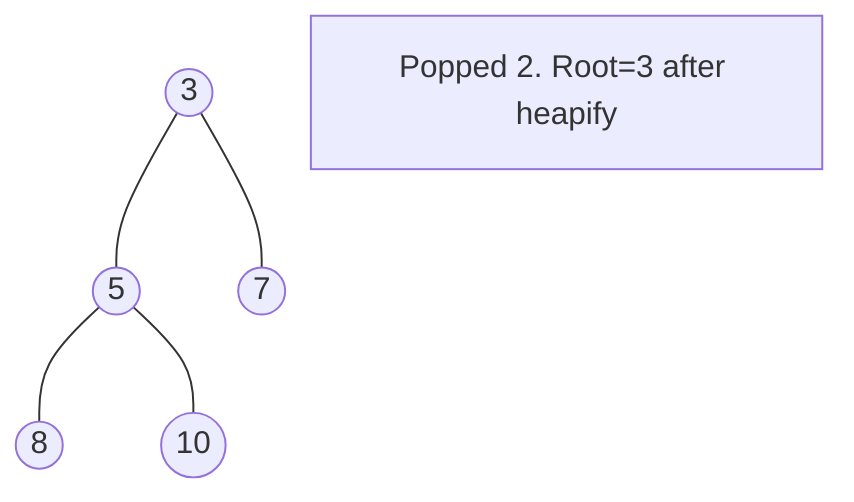

# Problem 2386: Find the K-Sum of an Array

**Difficulty:** Hard  
**Tags:** Array, Sorting, Heap (Priority Queue)  
**Pattern:** Heap / Priority Queue  
**Link:** [leetcode.com/problems/find-the-k-sum-of-an-array](https://leetcode.com/problems/find-the-k-sum-of-an-array/)

## Description

You are given an integer array `nums` and a **positive** integer `k`. You can choose any **subsequence** of the array and sum all of its elements together.

We define the **K-Sum** of the array as the `k^th` **largest** subsequence sum that can be obtained (**not** necessarily distinct).

Return *the K-Sum of the array*.

A **subsequence** is an array that can be derived from another array by deleting some or no elements without changing the order of the remaining elements.

**Note** that the empty subsequence is considered to have a sum of `0`.

 

Example 1:

```

**Input:** nums = [2,4,-2], k = 5
**Output:** 2
**Explanation:** All the possible subsequence sums that we can obtain are the following sorted in decreasing order:
6, 4, 4, 2, 2, 0, 0, -2.
The 5-Sum of the array is 2.

```

Example 2:

```

**Input:** nums = [1,-2,3,4,-10,12], k = 16
**Output:** 10
**Explanation:** The 16-Sum of the array is 10.

```

 

**Constraints:**

	- `n == nums.length`
	- `1 <= n <= 10^5`
	- `-10^9 <= nums[i] <= 10^9`
	- `1 <= k <= min(2000, 2^n)`

## Approach: Heap / Priority Queue

Use a min-heap or max-heap to efficiently access the smallest/largest element. Push elements and pop the top to process in priority order.

## Pseudocode

```
1. Initialize heap (min or max)
2. Push initial elements onto heap
3. While heap not empty and condition:
   a. Pop top element (min or max)
   b. Process element
   c. Push new elements if needed
4. Return result
```

## Algorithm Flow



## Visual State Transitions

**Heap Operations (Min-Heap):**

**Frame 1: Initial heap**


**Frame 2: Insert 2 - bubble up**


**Frame 3: Pop minimum (2) - heapify down**



## Complexity Analysis

- **Time:** O(n log n)
- **Space:** O(n)

## Solution (Python3)

```python
class Solution:
    def kSum(self, nums: List[int], k: int) -> int:
        # Heap/Priority Queue - O(n log k) time
        import heapq
        if not nums:
            return 0
        # Min heap (negate for max heap)
        heap = []
        for val in nums:
            heapq.heappush(heap, val)
            if len(heap) > (k if isinstance(k, int) else len(nums)):
                heapq.heappop(heap)
        return heap[0] if heap else 0
```

## Solution (C++)

```cpp
#include <queue>
#include <string>
#include <vector>
using namespace std;

class Solution {
public:
    int kSum(vector<int>& nums, int k) {
        // Heap/Priority Queue - O(n log k) time
        priority_queue<int, vector<int>, greater<int>> pq;
        for (int val : nums) {
            pq.push(val);
            if ((int)pq.size() > k)
                pq.pop();
        }
        return pq.empty() ? 0 : pq.top();
    }
};
```
