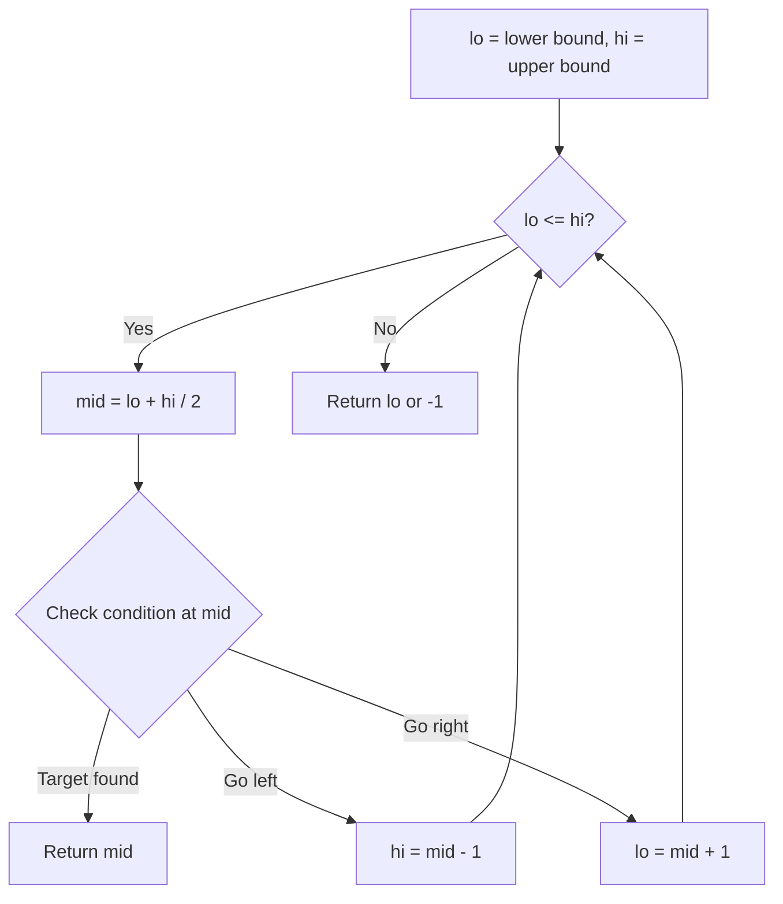
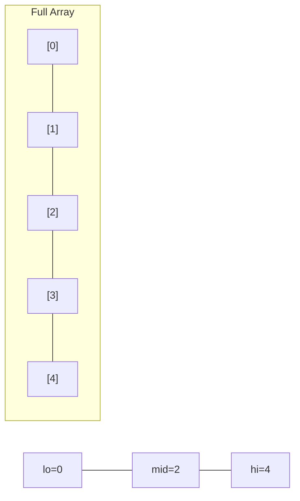
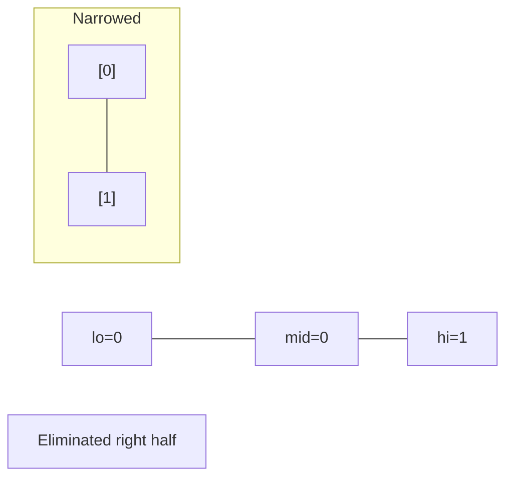
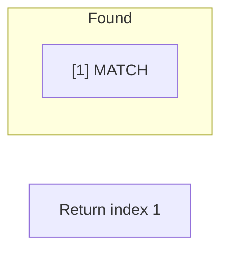

# Problem 2389: Longest Subsequence With Limited Sum

**Difficulty:** Easy  
**Tags:** Array, Binary Search, Greedy, Sorting, Prefix Sum  
**Pattern:** Binary Search  
**Link:** [leetcode.com/problems/longest-subsequence-with-limited-sum](https://leetcode.com/problems/longest-subsequence-with-limited-sum/)

## Description

You are given an integer array `nums` of length `n`, and an integer array `queries` of length `m`.

Return *an array *`answer`* of length *`m`* where *`answer[i]`* is the **maximum** size of a **subsequence** that you can take from *`nums`* such that the **sum** of its elements is less than or equal to *`queries[i]`.

A **subsequence** is an array that can be derived from another array by deleting some or no elements without changing the order of the remaining elements.

 

Example 1:

```

**Input:** nums = [4,5,2,1], queries = [3,10,21]
**Output:** [2,3,4]
**Explanation:** We answer the queries as follows:
- The subsequence [2,1] has a sum less than or equal to 3. It can be proven that 2 is the maximum size of such a subsequence, so answer[0] = 2.
- The subsequence [4,5,1] has a sum less than or equal to 10. It can be proven that 3 is the maximum size of such a subsequence, so answer[1] = 3.
- The subsequence [4,5,2,1] has a sum less than or equal to 21. It can be proven that 4 is the maximum size of such a subsequence, so answer[2] = 4.

```

Example 2:

```

**Input:** nums = [2,3,4,5], queries = [1]
**Output:** [0]
**Explanation:** The empty subsequence is the only subsequence that has a sum less than or equal to 1, so answer[0] = 0.
```

 

**Constraints:**

	- `n == nums.length`
	- `m == queries.length`
	- `1 <= n, m <= 1000`
	- `1 <= nums[i], queries[i] <= 10^6`

## Approach: Binary Search

Use binary search to halve the search space each iteration. Define the search range [lo, hi], compute mid, and decide which half to keep based on the problem's monotonic condition.

## Pseudocode

```
1. lo = lower_bound, hi = upper_bound
2. While lo <= hi (or lo < hi):
   a. mid = (lo + hi) // 2
   b. If condition(mid) is satisfied: record answer, search left half
   c. Else: search right half
3. Return answer
```

## Algorithm Flow



## Visual State Transitions

**Binary Search Step-by-Step:**

**Frame 1: Initial search space**


**Frame 2: Compare mid, narrow search**


**Frame 3: Found target**



## Complexity Analysis

- **Time:** O(log n)
- **Space:** O(1)

## Solution (Python3)

```python
class Solution:
    def answerQueries(self, nums: List[int], queries: List[int]) -> List[int]:
        # Binary search - O(log n) time, O(1) space
        lo, hi = 0, len(nums) - 1
        while lo <= hi:
            mid = lo + (hi - lo) // 2
            if nums[mid] == queries:
                return mid
            elif nums[mid] < queries:
                lo = mid + 1
            else:
                hi = mid - 1
        return []
```

## Solution (C++)

```cpp
#include <string>
#include <vector>
using namespace std;

class Solution {
public:
    vector<int> answerQueries(vector<int>& nums, vector<int>& queries) {
        // Binary search - O(log n) time, O(1) space
        int lo = 0, hi = nums.size() - 1;
        while (lo <= hi) {
            int mid = lo + (hi - lo) / 2;
            if (nums[mid] == queries) {
                return mid;
            } else if (nums[mid] < queries) {
                lo = mid + 1;
            } else {
                hi = mid - 1;
            }
        }
        return {};
    }
};
```
