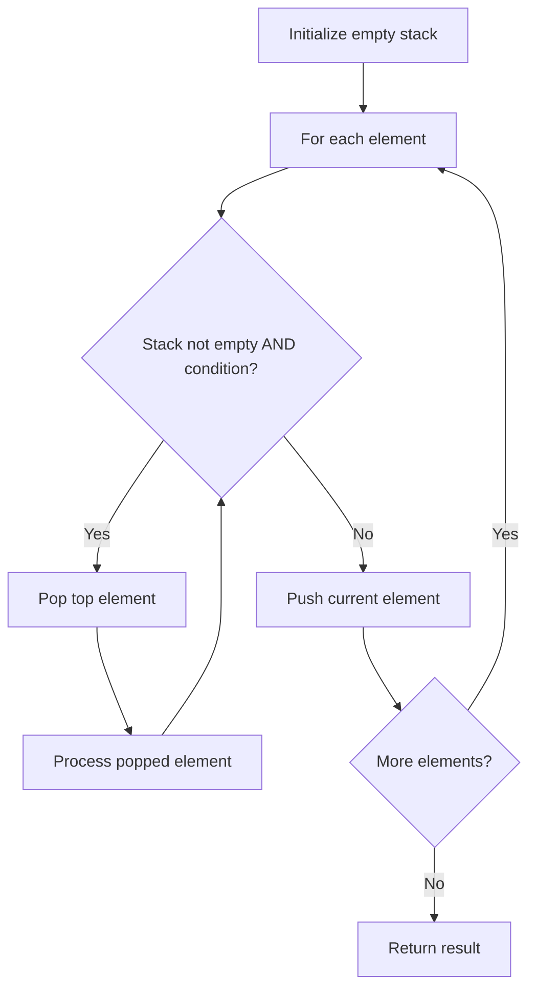

# Problem 2390: Removing Stars From a String

**Difficulty:** Medium  
**Tags:** String, Stack, Simulation  
**Pattern:** Stack  
**Link:** [leetcode.com/problems/removing-stars-from-a-string](https://leetcode.com/problems/removing-stars-from-a-string/)

## Description

You are given a string `s`, which contains stars `*`.

In one operation, you can:

	- Choose a star in `s`.
	- Remove the closest **non-star** character to its **left**, as well as remove the star itself.

Return *the string after **all** stars have been removed*.

**Note:**

	- The input will be generated such that the operation is always possible.
	- It can be shown that the resulting string will always be unique.

 

Example 1:

```

**Input:** s = "leet**cod*e"
**Output:** "lecoe"
**Explanation:** Performing the removals from left to right:
- The closest character to the 1st star is 't' in "lee**t****cod*e". s becomes "lee*cod*e".
- The closest character to the 2nd star is 'e' in "le**e***cod*e". s becomes "lecod*e".
- The closest character to the 3rd star is 'd' in "leco**d***e". s becomes "lecoe".
There are no more stars, so we return "lecoe".
```

Example 2:

```

**Input:** s = "erase*****"
**Output:** ""
**Explanation:** The entire string is removed, so we return an empty string.

```

 

**Constraints:**

	- `1 <= s.length <= 10^5`
	- `s` consists of lowercase English letters and stars `*`.
	- The operation above can be performed on `s`.

## Approach: Stack

Stack: push non-star chars, pop on star.

## Pseudocode

```
1. Initialize empty stack
2. For each element:
   a. While stack is not empty and condition met:
      - Pop and process top element
   b. Push current element onto stack
3. Process remaining elements in stack if needed
4. Return result
```

## Algorithm Flow



## Complexity Analysis

- **Time:** O(n)
- **Space:** O(n)

## Solution (Python3)

```python
class Solution:
    def removeStars(self, s: str) -> str:
        stack = []
        for c in s:
            if c == '*':
                if stack:
                    stack.pop()
            else:
                stack.append(c)
        return ''.join(stack)
```

## Solution (C++)

```cpp
#include <stack>
#include <string>
#include <unordered_map>
#include <vector>
using namespace std;

class Solution {
public:
    string removeStars(string& s) {
        // Stack-based approach - O(n) time
        stack<char> st;
        unordered_map<char, char> pairs = {{'(', ')'}, {'[', ']'}, {'{', '}'}};
        for (char ch : s) {
            if (!st.empty() && pairs.count(st.top()) && pairs[st.top()] == ch) {
                st.pop();
            } else {
                st.push(ch);
            }
        }
        return st.empty();
    }
};
```
