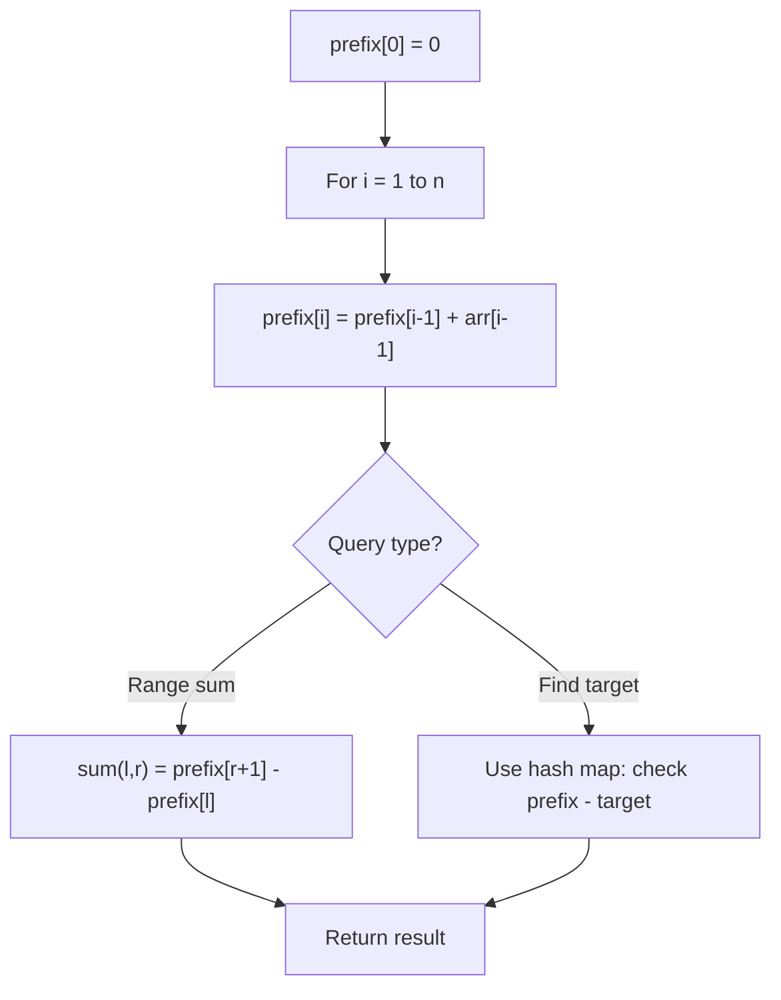

# Problem 2391: Minimum Amount of Time to Collect Garbage

**Difficulty:** Medium  
**Tags:** Array, String, Prefix Sum  
**Pattern:** Prefix Sum  
**Link:** [leetcode.com/problems/minimum-amount-of-time-to-collect-garbage](https://leetcode.com/problems/minimum-amount-of-time-to-collect-garbage/)

## Description

You are given a **0-indexed** array of strings `garbage` where `garbage[i]` represents the assortment of garbage at the `i^th` house. `garbage[i]` consists only of the characters `'M'`, `'P'` and `'G'` representing one unit of metal, paper and glass garbage respectively. Picking up **one** unit of any type of garbage takes `1` minute.

You are also given a **0-indexed** integer array `travel` where `travel[i]` is the number of minutes needed to go from house `i` to house `i + 1`.

There are three garbage trucks in the city, each responsible for picking up one type of garbage. Each garbage truck starts at house `0` and must visit each house **in order**; however, they do **not** need to visit every house.

Only **one** garbage truck may be used at any given moment. While one truck is driving or picking up garbage, the other two trucks **cannot** do anything.

Return* the **minimum** number of minutes needed to pick up all the garbage.*

 

Example 1:

```

**Input:** garbage = ["G","P","GP","GG"], travel = [2,4,3]
**Output:** 21
**Explanation:**
The paper garbage truck:
1. Travels from house 0 to house 1
2. Collects the paper garbage at house 1
3. Travels from house 1 to house 2
4. Collects the paper garbage at house 2
Altogether, it takes 8 minutes to pick up all the paper garbage.
The glass garbage truck:
1. Collects the glass garbage at house 0
2. Travels from house 0 to house 1
3. Travels from house 1 to house 2
4. Collects the glass garbage at house 2
5. Travels from house 2 to house 3
6. Collects the glass garbage at house 3
Altogether, it takes 13 minutes to pick up all the glass garbage.
Since there is no metal garbage, we do not need to consider the metal garbage truck.
Therefore, it takes a total of 8 + 13 = 21 minutes to collect all the garbage.

```

Example 2:

```

**Input:** garbage = ["MMM","PGM","GP"], travel = [3,10]
**Output:** 37
**Explanation:**
The metal garbage truck takes 7 minutes to pick up all the metal garbage.
The paper garbage truck takes 15 minutes to pick up all the paper garbage.
The glass garbage truck takes 15 minutes to pick up all the glass garbage.
It takes a total of 7 + 15 + 15 = 37 minutes to collect all the garbage.

```

 

**Constraints:**

	- `2 <= garbage.length <= 10^5`
	- `garbage[i]` consists of only the letters `'M'`, `'P'`, and `'G'`.
	- `1 <= garbage[i].length <= 10`
	- `travel.length == garbage.length - 1`
	- `1 <= travel[i] <= 100`

## Approach: Prefix Sum

Build a prefix sum array where prefix[i] = sum of elements 0..i-1. Any subarray sum [l..r] = prefix[r+1] - prefix[l]. Combine with hash map for O(n) subarray sum queries.

## Pseudocode

```
1. Build prefix sum array: prefix[0]=0, prefix[i]=prefix[i-1]+arr[i-1]
2. Use prefix sums to answer queries:
   - Subarray sum [l..r] = prefix[r+1] - prefix[l]
   - Or use hash map to find prefix[j]-prefix[i] == target
3. Return result
```

## Algorithm Flow



## Complexity Analysis

- **Time:** O(n)
- **Space:** O(n)

## Solution (Python3)

```python
class Solution:
    def garbageCollection(self, garbage: List[str], travel: List[int]) -> int:
        # Prefix sum approach - O(n) time, O(n) space
        prefix = {0: -1}
        curr_sum = 0
        result = 0
        target = travel if isinstance(travel, int) else 0
        for i, val in enumerate(garbage):
            curr_sum += val
            if curr_sum - target in prefix:
                result = max(result, i - prefix[curr_sum - target])
            if curr_sum not in prefix:
                prefix[curr_sum] = i
        return result
```

## Solution (C++)

```cpp
#include <algorithm>
#include <string>
#include <unordered_map>
#include <vector>
using namespace std;

class Solution {
public:
    int garbageCollection(vector<string>& garbage, vector<int>& travel) {
        // Prefix sum approach - O(n) time, O(n) space
        unordered_map<int, int> prefix;
        prefix[0] = -1;
        int curr_sum = 0, result = 0;
        int target = travel;
        for (int i = 0; i < (int)garbage.size(); i++) {
            curr_sum += garbage[i];
            if (prefix.count(curr_sum - target)) {
                result = max(result, i - prefix[curr_sum - target]);
            }
            if (!prefix.count(curr_sum)) {
                prefix[curr_sum] = i;
            }
        }
        return result;
    }
};
```
